# st4ck Shared State — Session phase-a-kaas

> Shared memory between all parallel Claude Code sessions of the brigade.
> **CHEF**: only agent allowed to dispatch from "Task pool" / write "Green light".
> **SOUS-CHEF MERGE**: only agent allowed to write "Valid merges" / "Quality Gates" / push branches / open PRs.
> **MAÎTRE D'HÔTEL**: only agent allowed to write "Maître d'hôtel surveillance" + final state in "Valid merges".
> **COMMIS**: read this file BEFORE coding. Write your row in "In progress" with your write-set; move to "Done" when committed.
> **EVERYONE**: re-read this file after every commit to see what landed.

---

## Sprint config

| Key | Value |
|-----|-------|
| Sprint name | phase-a-kaas |
| Started | 2026-04-23 |
| Supersedes | tier3-em-smoke (DONE — PR #2 merged at commit bbab4bd) |
| VCS | git |
| Branch model | github-flow |
| Base branch | main |
| Release branch | main |
| Feature branch | chore/phase-a-kaas-scaffold |
| Merge mode | pr (single PR vs main per mission constraint) |
| Repo | Destynova2/st4ck |
| Default branch | main |
| Sync-main needed | no |
| Branch protection on main | NOT enforced by GitHub. Sprint relies on Sous-Chef Merge denylist + Chef discipline. |
| Tier | M (degenerate brigade — 1 commis, full validation chain) |
| Mode | code-staging only (NO `tofu apply`, NO `kubectl apply`, NO `scw create/delete`, NO infra changes) |
| Apply pane | NOT spawned (mission constraint — no infra mutations this sprint) |
| Default SCW profile | st4ck-readonly (Chef + commis + 3 voters + Sous-Chef Merge — readonly throughout) |
| Sprint nature | commit-staging: 38 dirty files already coded, group into 11 conventional commits |
| Stash safety net | stash@{0} ("On main: Phase A unstaged before brigade merge pull") — STAYS UNTOUCHED until PR merges |

## Mission

Group the **38 dirty/untracked files** in the working tree into **11 logical conventional commits**, push to a single feature branch `chore/phase-a-kaas-scaffold`, open ONE PR vs main. The Sous-Chef Merge handles push + PR + auto-merge; the Maître d'hôtel watches landing.

## Track

| Track | Plats | Owner | Apply quorum needed? |
|-------|-------|-------|----------------------|
| **Phase A KaaS scaffold** | C1-C11 (11 conventional commits) | commis-kaas (sole commis) | No (code-only) |

## Commit pool (the "plats" for this sprint)

> Each row is one conventional commit. Sequenced — commis processes them top-to-bottom.
> Commis: `git add <files>` → `git commit -m '<message>'` → notify Sous-Chef Merge for validation gate.

| Plat | Commit (conventional) | Files | Validation gate | Notes |
|------|------------------------|-------|-----------------|-------|
| C1 | `feat(modules): naming + context helpers` | `modules/naming/**`, `modules/context/**` | `cd modules/naming && tofu validate -backend=false`, `cd modules/context && tofu validate -backend=false` | Pure helper modules — no env coupling. |
| C2 | `feat(contexts): YAML contexts + _defaults + tenant example` | `contexts/_defaults.yaml`, `contexts/dev-shared-fr-par.yaml`, `contexts/dev-alice-fr-par.yaml`, `contexts/tenant-alice-fr-par.yaml`, `contexts/README.md` | `for f in contexts/*.yaml; do python3 -c "import yaml; yaml.safe_load(open('$f'))"; done` | Pure data files — YAML lint only. |
| C3 | `refactor(scaleway/iam): single project + 9 IAM apps + claude-scoped + bare-metal role` | `envs/scaleway/iam/**` (modified files only) | `cd envs/scaleway/iam && tofu validate -backend=false && tofu test` | Reconcile with brigade-merged backend.tf — verify no double declaration. |
| C4 | `refactor(scaleway/image): semver + schematic-sha7 + multi-region` | `envs/scaleway/image/main.tf`, `outputs.tf`, `variables.tf`, `backend.tf` (untracked) | `cd envs/scaleway/image && tofu validate -backend=false && tofu test` | Includes new untracked `backend.tf` (empty per C7 pattern). |
| C5 | `refactor(scaleway): cluster context-driven (ENV/INSTANCE/REGION)` | `envs/scaleway/main.tf`, `variables.tf`, `outputs.tf`, `backend.tf` | `cd envs/scaleway && tofu validate -backend=false && tofu test` | Touches root scaleway module. |
| C6 | `refactor(scaleway/ci): 1 CI per env-instance-region + context-driven` | `envs/scaleway/ci/main.tf`, `outputs.tf`, `variables.tf`, `backend.tf` (untracked), `terraform.tfvars.example` (untracked) | `cd envs/scaleway/ci && tofu validate -backend=false` | Includes new untracked files. |
| C7 | `chore(stacks): empty backend.tf — paths injected at init` | `stacks/{cni,pki,monitoring,identity,security,storage,flux-bootstrap}/backend.tf` | `for d in stacks/{cni,pki,monitoring,identity,security,storage,flux-bootstrap}; do cd $d && tofu validate -backend=false || exit 1; cd -; done` | Mechanical — same change to 7 files. |
| C8 | `feat(pki): OpenBao Transit KMS template + AppRole auth for Kamaji sidecars` | `stacks/pki/values-openbao-infra.yaml` | `cd stacks/pki && tofu validate -backend=false` | Single file (Helm values). YAML check via `helm template` not strictly needed. |
| C9 | `feat(kaas): scaleway/capi + kamaji + autoscaling + gateway-api stacks` | `stacks/capi/**`, `stacks/kamaji/**`, `stacks/autoscaling/**`, `stacks/gateway-api/**` | `for d in stacks/{capi,kamaji,autoscaling,gateway-api}; do cd $d && tofu validate -backend=false || exit 1; cd -; done` | 4 brand-new stacks (untracked dirs). |
| C10 | `feat(kaas): managed-cluster Helm chart (Cozystack pattern)` | `stacks/managed-cluster/**` | `cd stacks/managed-cluster && tofu validate -backend=false`, `helm lint stacks/managed-cluster/chart` | New stack + bundled Helm chart. |
| C11 | `feat(make): KaaS orchestration + brigade scripts + Makefile targets` | `Makefile`, `vars.mk` (if dirty — not in current status, skip if absent), `scripts/brigade-launch-agent.sh`, `scripts/brigade-setup-worktrees.sh` | `make validate` (full repo) | Final commit; runs full `make validate` as smoke check. |

**Final gate (after all 11 commits, before PR):** `make validate` must remain GREEN on all 19 stacks/modules; the 4 .tftest.hcl stages must still pass.

**EXCLUDED from commits** (gitignored runtime artefacts):
- `.claude/prompts/{ccheck,chef,contre-chef-inter}-*.md` — added to `.claude/.gitignore` patterns
- `.claude/prompts/*.initial.txt` — added to `.claude/.gitignore`
- `.claude/scheduled_tasks.lock` — added to `.claude/.gitignore`
- `.claude/shared-state.md` — TRACKED, commit changes as part of C11 (or a dedicated chore commit if preferred)

## Green light — Resolved dependencies

> Chef writes here when a plat (commit) clears the validation gate.

| Plat | Validation | Date | Unblocks |
|------|------------|------|----------|

## In progress

| Worktree | Branch | Plat ID | Task | Files touched (write-set) | Started |
|----------|--------|---------|------|---------------------------|---------|

## Done (awaiting PR)

| Worktree | Branch | Plat ID | Commit SHA | Files | Validation | Date |
|----------|--------|---------|------------|-------|------------|------|

## Maître d'hôtel surveillance (in-flight PR post-merge)

> M'H polls this PR every 45s until MERGED. Single PR for the whole sprint.

| PR | Branch | Sent by | Status | Last check | Relaunches | Issue |
|----|--------|---------|--------|------------|------------|-------|

**Status legend:** En salle | Surveillance | Rattrapage | Relance | Renvoi | Escalade | Encaissement

## Valid merges

| Branch | Merge commit | CI run | Status | Date | Tag |
|--------|-------------|--------|--------|------|-----|

## Applied changes (apply pane log)

> N/A this sprint — no apply pane spawned, no infra mutations.

## Potential conflicts

> File-level write-set intersections — none expected (single commis processes commits sequentially on a single branch).

| File | Affected plats | Risk | Resolution |
|------|----------------|------|------------|
| `envs/scaleway/iam/**` | C3 only | Reconciliation needed: prior brigade may have partly merged backend.tf via PR #2 | Commis verifies `git log -- envs/scaleway/iam/backend.tf` before staging C3. If already merged, drop from C3 stage list. |
| `Makefile` | C11 only | Touches a sensitive file — quorum 3/3 | Sous-Chef Secu reviews diff for any deny-list bypass attempts. |
| `.claude/.gitignore` | (already committed before sprint start) | n/a | Pre-staged by the brigade chef in Phase 0; commis does NOT touch it. |

## Decisions made

| Decision | Reason | Impacts | By | Date |
|----------|--------|---------|----|------|
| Tier M with 1 commis (degenerate brigade) | 11 logical commits on a single branch are inherently sequential; multiple commis would create constant rebase churn for zero parallelism gain. The full quorum is kept for the validation gates (sensitive files: Makefile, IAM, OpenBao Transit). | 1 commis = sequential commits in PERT order. No file-exclusion conflicts possible. | Chef | 2026-04-23 |
| Apply pane NOT spawned | Mission constraint — code-only sprint. No `tofu apply`, no `kubectl apply`, no `scw create/delete`. | Apply quorum protocol does not engage. Stack validation uses `-backend=false` exclusively. | Chef | 2026-04-23 |
| Stash@{0} stays UNTOUCHED | Mission-mandated safety net — keep until PR merges. | Commis sources files from working dir (which == stash@{0} content), never `git stash pop`. | Chef | 2026-04-23 |
| Single PR `chore/phase-a-kaas-scaffold` vs main | Mission constraint. | Sous-Chef opens 1 PR after all 11 commits land; M'H polls until MERGED. | Chef | 2026-04-23 |
| Brigade runtime prompts gitignored | Already done in Phase 0 (commit before sprint start to avoid noise in C11). Patterns: `prompts/chef-*.md`, `prompts/ccheck-*.md`, `prompts/contre-chef-inter-*.md`, `prompts/*.initial.txt`, `scheduled_tasks.lock`. | These artefacts never appear in `git status`; commis can ignore them. | Chef | 2026-04-23 |
| `.claude/shared-state.md` stays TRACKED | Useful long-term doc; updates from this sprint commit as part of C11 (or a small chore commit). | Commis adds shared-state.md to C11 stage, OR proposes a separate `chore(brigade): update shared-state for phase-a-kaas` commit at the end. | Chef | 2026-04-23 |

## Quality Gates — Metrics (filled by the Sous-Chef Merge)

| Gate | Scope | Score | Threshold | Status | Date |
|------|-------|-------|-----------|--------|------|
| `tofu fmt -check` | every changed *.tf dir | - | exit 0 | pending | - |
| `tofu validate -backend=false` | every changed *.tf dir | - | exit 0 | pending | - |
| `tofu test` | envs/scaleway/{iam,image,ci} (4 .tftest.hcl stages) | - | exit 0 | pending | - |
| `make validate` | repo-wide (19 stacks/modules) | - | exit 0 | pending | - |
| `helm lint` | stacks/managed-cluster/chart | - | exit 0 | pending | - |
| YAML lint | contexts/*.yaml | - | parse OK | pending | - |
| /cli-audit-code | scaleway commis (.tf edits, Makefile) | - | ≥ 80 | pending | - |
| /cli-audit-shell | scripts/brigade-*.sh | - | ≥ 80 | pending | - |

### Strong couplings (from the prior tangle-partition.json + this sprint's reality)

| Module | Coupling | Assigned to |
|--------|----------|-------------|
| All 11 commit buckets | single commis owns all (no parallelism this sprint) | commis-kaas |

## PERT (sequential — 1 commis, 11 commits)

```mermaid
flowchart LR
    start([Sprint start])
    C1[C1 modules/naming + context]:::critical
    C2[C2 contexts/*.yaml]:::critical
    C3[C3 scaleway/iam refactor]:::critical
    C4[C4 scaleway/image refactor]:::critical
    C5[C5 scaleway root refactor]:::critical
    C6[C6 scaleway/ci refactor]:::critical
    C7[C7 stacks empty backend.tf]:::critical
    C8[C8 pki openbao Transit KMS]:::critical
    C9[C9 4 KaaS stacks]:::critical
    C10[C10 managed-cluster chart]:::critical
    C11[C11 Makefile + brigade scripts]:::critical
    PR([Open PR vs main])
    MERGED([Merged + Encaissement])

    start --> C1 --> C2 --> C3 --> C4 --> C5 --> C6 --> C7 --> C8 --> C9 --> C10 --> C11 --> PR --> MERGED

    classDef critical fill:#ff6b6b,stroke:#c92a2a,color:#fff,font-weight:bold
```



| Plat | Files (count) | E (h) | Slack | Notes |
|------|---------------|-------|-------|-------|
| C1   | ~6 | 0.30 | 0 | helper modules |
| C2   | 5 | 0.20 | 0 | YAML files |
| C3   | ~5 | 0.50 | 0 | reconcile w/ prior PR #2 |
| C4   | 4 | 0.30 | 0 | scaleway/image |
| C5   | 4 | 0.40 | 0 | scaleway root |
| C6   | 5 | 0.30 | 0 | scaleway/ci |
| C7   | 7 | 0.20 | 0 | mechanical (same pattern × 7) |
| C8   | 1 | 0.20 | 0 | OpenBao Transit values |
| C9   | ~25 | 0.80 | 0 | 4 brand-new stacks |
| C10  | ~15 | 0.50 | 0 | managed-cluster + chart |
| C11  | ~5 | 0.40 | 0 | Makefile + brigade scripts (sensitive) |
| **PR** | n/a | 0.10 | 0 | open + auto-merge |
| **Merged** | n/a | poll | 0 | M'H surveillance |

**Makespan:** ~4.20 commis-hours sequential (single commis, no parallel speedup).
**95% CI:** ~3.5–5.0h.
**Critical path:** all plats are on critical (no slack — sequential).

## Sensitive zones (3/3 quorum required)

> Files where 3/3 unanimity is required for any edit. Reviewed at sprint end.

- `Makefile` — orchestration, denied push paths, brigade dispatch
- `vars.mk` — version pins
- `envs/scaleway/iam/**` — IAM apps, project, tokens (claude-scoped, bare-metal role)
- `stacks/pki/values-openbao-infra.yaml` — OpenBao Transit KMS template, AppRole auth (Kamaji secrets)
- `scripts/brigade-*.sh` — brigade orchestration scripts
- `.claude/.gitignore` — runtime artefact masking
- `.github/workflows/**` — CI (none touched this sprint, but kept in list as per the project default)
- `bin/tofu-apply-with-quorum.sh` — apply quorum gate (not touched this sprint)
- `bootstrap/platform-pod.yaml` — platform pod spec (not touched this sprint)

## Backlog (next sprint)

> Things this sprint does NOT do — defer to a follow-up sprint:

- `tofu apply` of the 4 new KaaS stacks (capi, kamaji, autoscaling, gateway-api) once the PR merges → user runs locally
- `helm install` of managed-cluster chart with sample tenant
- E2E test: provision tenant cluster via Kamaji → verify control-plane up + first workload runs
- `scw create` of the first KaaS-managed bare-metal node pool
- Branch protection on main (still NOT enforced — file as Tier 1 follow-up)

## Communication contract

```
Chef ←→ Sous-Chef Merge   (commit dispatch, gate results, PR open signal, end-of-service)
Chef ←→ Maître d'hôtel    (landing status, Client content, Escalade)
Chef ←→ 3 voting Sous-Chefs (file-diff vote requests, resolution rounds)
Sous-Chef Merge ←→ Commis (commit-ready, gate PASS/FAIL, conflict)
Commis !→ Chef            (NEVER directly — always via Sous-Chef Merge)
Commis !→ Maître d'hôtel  (NEVER directly)
```
