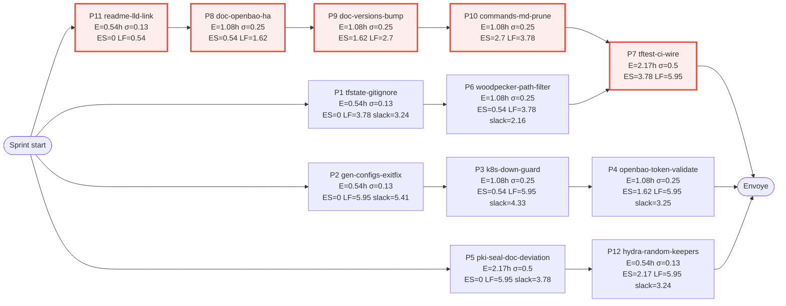
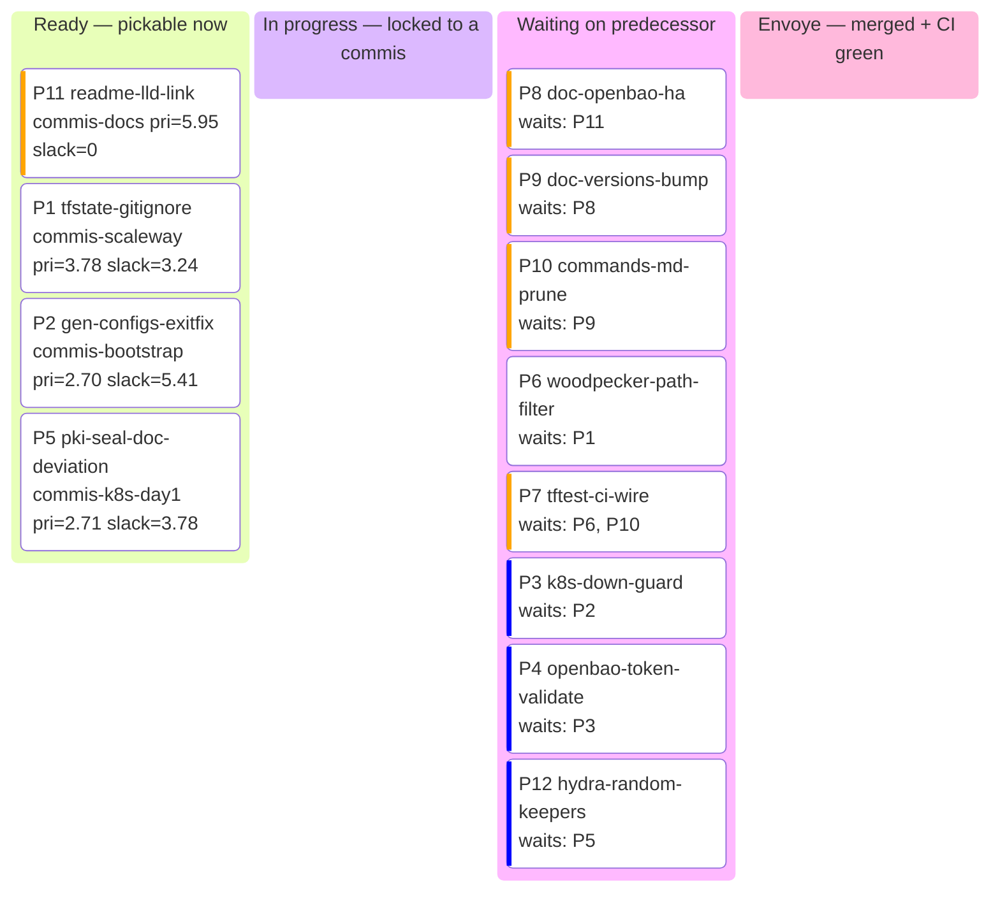

# st4ck Shared State — Session tier3-pass1

> Shared memory between all parallel Claude Code sessions of the brigade.
> **CHEF**: only agent allowed to dispatch from "Task pool" / write "Green light".
> **SOUS-CHEF MERGE**: only agent allowed to write "Valid merges" / "Quality Gates".
> **MAÎTRE D'HÔTEL**: only agent allowed to write "Maître d'hôtel surveillance" / "Valid merges" (final state).
> **COMMIS**: read this file BEFORE coding. Write your row in "In progress" with your write-set; move to "Done" when committed.
> **EVERYONE**: re-read this file after every merge to see what changed.

---

## Sprint config

| Key | Value |
|-----|-------|
| Sprint name | tier3-pass1 |
| Started | 2026-04-21 |
| VCS | git |
| Branch model | github-flow |
| Base branch | main |
| Release branch | main |
| Feature branch | chore/tier3-cycle-pass1 |
| Merge mode | pr (branch protection requires PR) |
| Repo | Destynova2/st4ck |
| Default branch | main |
| Sync-main needed | no |
| Mode | code-only (NO `tofu apply`, NO `kubectl apply`, NO Scaleway writes) |
| SCW profile | st4ck-readonly (bombs-proof) |
| Reference report | docs/reviews/2026-04-22-cycle-pass1.md |

## Green light — Resolved dependencies

> Chef writes here when a Sous-Chef merge is validated and dependents can continue.

| Merged branch | Tests | CI | Date | Unblocks |
|---------------|-------|----|------|----------|

## In progress

| Worktree | Branch | Plat ID | Task | Files touched (write-set) | Started |
|----------|--------|---------|------|---------------------------|---------|

## Done (awaiting merge)

| Worktree | Branch | Plat ID | Task | Result | Tests | Files modified | Date |
|----------|--------|---------|------|--------|-------|-----------------|------|

## Maître d'hôtel surveillance (in-flight PRs post-merge)

> The Maître d'hôtel owns this section. Sous-Chef appends a new row when handing off a PR;
> M'H updates Status on every 45 s poll; M'H moves the row to "Valid merges" on Encaissement.

| PR | Branch | Sent by | Status | Last check | Relaunches | Issue |
|----|--------|---------|--------|------------|------------|-------|

**Status legend:** En salle | Surveillance | Rattrapage | Relance | Renvoi | Escalade | Encaissement

## Valid merges

| Branch | Merge commit | CI run | Status | Date | Tag |
|--------|-------------|--------|--------|------|-----|

## Potential conflicts

> File-level write-set intersections (read this before claiming a plat).

| File | Affected plats | Risk | Resolution |
|------|----------------|------|------------|
| `.woodpecker.yml` | P6, P7 | W/W (same file) | Sequenced: P6 lands first, P7 rebases |
| `Makefile` | P7, P10 | W/W (same file) | Sequenced: P10 lands first (docs), P7 rebases |
| `stacks/identity/main.tf` | P12 | none (single plat) | n/a |
| `stacks/pki/{main,secrets}.tf` | P5 | none (P5 only edits comments + ADR) | n/a |

## Decisions made

| Decision | Reason | Impacts | By | Date |
|----------|--------|---------|----|------|
| P5 takes the deferral path (option C, document deviation) | KMS wrap requires infra work outside this code-only sprint | ADR-014 status moves to "tracked drift" | Chef | 2026-04-21 |
| 4 commis (one per Fiedler cluster + docs) | tangle-partition.json shows 3 source clusters; docs is cross-cluster low-risk | Zero file-level intersection except `.woodpecker.yml` and `Makefile` (sequenced) | Chef | 2026-04-21 |

## Quality Gates — Metrics (filled by the Sous-Chef Merge)

| Gate | Scope | Score | Threshold | Status | Date |
|------|-------|-------|-----------|--------|------|
| /cli-audit-shell | bootstrap commis (gen-configs.sh, k8s-down) | - | ≥ 80 | pending | - |
| /cli-audit-code | scaleway commis (.tf edits) | - | ≥ 80 | pending | - |
| /cli-audit-drift | k8s-day1 commis (vs ADR-014) | - | no new drift | pending | - |
| /cli-audit-sync | docs commis (vs vars.mk + Makefile) | - | no broken links | pending | - |
| `tofu validate` | every changed *.tf dir | - | exit 0 | pending | - |
| `make validate` | repo-wide | - | exit 0 | pending | - |

### Strong couplings (from /cli-audit-tangle, .claude/tangle-partition.json)

| Module | Coupling | Assigned to |
|--------|----------|-------------|
| cluster-0 platform-core (bootstrap/) | one commis owns this cluster | commis-bootstrap |
| cluster-1 scaleway-pipeline (envs/scaleway/) | one commis owns this cluster | commis-scaleway |
| cluster-2 k8s-day1-stacks (stacks/{cni,pki,monitoring,identity,security,storage,flux-bootstrap}/) | split per audit hint, but tier3 only touches pki + identity | commis-k8s-day1 |
| docs (cross-cluster) | low-risk doc edits | commis-docs |

## PERT (computed in Phase 0.5 — see references/pert-computation.md)

> Scheduling contract for the sprint. Recomputed only on apoptosis / DENY past P / new plat.



| Plat | O | M | P | E | σ | ES | EF | LS | LF | slack | critical |
|------|---|---|---|---|---|----|----|----|----|-------|----------|
| P1 tfstate-gitignore | 0.25 | 0.5 | 1 | 0.54 | 0.13 | 0 | 0.54 | 3.24 | 3.78 | 3.24 |   |
| P2 gen-configs-exitfix | 0.25 | 0.5 | 1 | 0.54 | 0.13 | 0 | 0.54 | 5.41 | 5.95 | 5.41 |   |
| P3 k8s-down-guard | 0.5 | 1 | 2 | 1.08 | 0.25 | 0.54 | 1.62 | 4.87 | 5.95 | 4.33 |   |
| P4 openbao-token-validate | 0.5 | 1 | 2 | 1.08 | 0.25 | 1.62 | 2.70 | 4.87 | 5.95 | 3.25 |   |
| P5 pki-seal-doc-deviation | 1 | 2 | 4 | 2.17 | 0.5 | 0 | 2.17 | 3.78 | 5.95 | 3.78 |   |
| P6 woodpecker-path-filter | 0.5 | 1 | 2 | 1.08 | 0.25 | 0.54 | 1.62 | 2.70 | 3.78 | 2.16 |   |
| P7 tftest-ci-wire | 1 | 2 | 4 | 2.17 | 0.5 | 3.78 | 5.95 | 3.78 | 5.95 | 0 | ✓ |
| P8 doc-openbao-ha | 0.5 | 1 | 2 | 1.08 | 0.25 | 0.54 | 1.62 | 0.54 | 1.62 | 0 | ✓ |
| P9 doc-versions-bump | 0.5 | 1 | 2 | 1.08 | 0.25 | 1.62 | 2.70 | 1.62 | 2.70 | 0 | ✓ |
| P10 commands-md-prune | 0.5 | 1 | 2 | 1.08 | 0.25 | 2.70 | 3.78 | 2.70 | 3.78 | 0 | ✓ |
| P11 readme-lld-link | 0.25 | 0.5 | 1 | 0.54 | 0.13 | 0 | 0.54 | 0 | 0.54 | 0 | ✓ |
| P12 hydra-random-keepers | 0.25 | 0.5 | 1 | 0.54 | 0.13 | 2.17 | 2.71 | 5.41 | 5.95 | 3.24 |   |

**Makespan:** 5.95 commis-hours on the critical path (P11 → P8 → P9 → P10 → P7).
**95% CI:** 5.95 ± 1.02 commis-hours.
**Critical path:** P11 → P8 → P9 → P10 → P7.

### Triage quadrant

```mermaid
quadrantChart
    title Plat triage — priority vs slack
    x-axis Low slack --> High slack
    y-axis Low priority --> High priority
    quadrant-1 Buffered critical (watch but safe)
    quadrant-2 Critical path (protect: best commis here)
    quadrant-3 Idle (deprioritize)
    quadrant-4 Slack tail (fill-in work)
    P11: [0.05, 0.95]
    P8: [0.05, 0.85]
    P9: [0.05, 0.75]
    P10: [0.05, 0.65]
    P7: [0.05, 0.55]
    P5: [0.65, 0.55]
    P6: [0.40, 0.30]
    P1: [0.55, 0.20]
    P12: [0.55, 0.15]
    P4: [0.55, 0.30]
    P3: [0.75, 0.25]
    P2: [0.95, 0.10]
```

## Task pool (dispatch queue — consumed by free commis)



| Plat | Ready | Priority | Slack | Write-set | Commis |
|------|-------|----------|-------|-----------|--------|
| P11 | 1 | 5.95 | 0 | README.md, docs/lld/README.md | commis-docs |
| P1 | 1 | 3.78 | 3.24 | .gitignore, envs/scaleway/iam/terraform.tfstate* | commis-scaleway |
| P2 | 1 | 2.70 | 5.41 | envs/vmware-airgap/scripts/gen-configs.sh | commis-bootstrap |
| P5 | 1 | 2.71 | 3.78 | docs/adr/014-*.md, stacks/pki/{main,secrets}.tf (comments only) | commis-k8s-day1 |
| P8 | 0 | 4.87 | 0 | docs/explanation/*.md, docs/hld-talos-platform.md | commis-docs |
| P9 | 0 | 3.78 | 0 | docs/**/*.md (~9 files) | commis-docs |
| P10 | 0 | 2.70 | 0 | docs/reference/commands.md, Makefile (read-only check) | commis-docs |
| P6 | 0 | 2.70 | 2.16 | .woodpecker.yml | commis-scaleway |
| P7 | 0 | 2.17 | 0 | .woodpecker.yml, Makefile | commis-scaleway |
| P3 | 0 | 2.16 | 4.33 | bootstrap/Makefile or scripts/k8s-down.sh (locate first) | commis-bootstrap |
| P4 | 0 | 1.08 | 3.25 | bootstrap/tofu/{vault,providers,variables}.tf | commis-bootstrap |
| P12 | 0 | 0.54 | 3.24 | stacks/identity/main.tf | commis-k8s-day1 |

## Sensitive zones (3/3 unanimity quorum)

> Tier3-pass1 sensitive zones include CI (P6, P7 touch .woodpecker.yml), deps (none in this sprint), secrets (P4 touches OpenBao token, P5 touches seal key — both 3/3), gitignore (P1 — 3/3 because removing gitignore protection has supply-chain blast radius).

<!-- BOSS_SENSITIVE_PATHS:START -->
```sensitive-paths
# One glob pattern per line. Lines starting with # are comments.
# Parsed by ccheck and the Chef shutdown protocol.
# Format: <glob>    # <reason>
.woodpecker.yml               # CI pipeline = global impact (P6, P7)
.github/workflows/**          # CI = global impact
.gitignore                    # Removing gitignore protection has supply-chain blast (P1)
**/terraform.tfstate*         # NEVER edit by hand; only `git rm --cached` allowed (P1)
bootstrap/tofu/vault.tf       # OpenBao token wiring (P4)
bootstrap/tofu/providers.tf   # provider auth (P4)
bootstrap/tofu/variables.tf   # secret variable definitions (P4)
stacks/pki/secrets.tf         # OpenBao seal key (P5)
stacks/pki/main.tf            # KMS wrap path (P5)
docs/adr/014-*.md             # ADR-014 status change (P5)
**/Cargo.toml                 # Supply chain risk (Rust deps)
**/package.json               # Supply chain risk (npm deps)
**/go.mod                     # Supply chain risk (Go deps)
**/pyproject.toml             # Supply chain risk (Python deps)
**/requirements*.txt          # Supply chain risk (Python deps)
.env                          # Secrets
**/*.secret                   # Secrets
**/credentials*               # Secrets
CONTRIBUTING.md               # Project rules
CLAUDE.md                     # Project instructions
```
<!-- BOSS_SENSITIVE_PATHS:END -->

### Hallucination history

> If a Sous-Chef APPROVEd a diff that caused a problem, record it here.

| Sprint | Sous-Chef | File | What happened | Fix applied |
|--------|-----------|------|----------------|-------------|

## Shared context

> Information every commis must know.

- **Reference report**: `docs/reviews/2026-04-22-cycle-pass1.md` — every fix has a section there with concrete fix patterns. ALWAYS read your section before coding.
- **Code-only mode**: NO `tofu apply`, NO `kubectl apply`, NO Scaleway API writes. Only `tofu init -backend=false`, `tofu validate`, `tofu fmt`, `make validate` (whatever the local equivalent is — verify in Makefile).
- **SCW profile**: `st4ck-readonly` — even if you tried, the Scaleway API would deny writes.
- **Single PR at the end**: every commis pushes to `chore/tier3-cycle-pass1` (NOT to a per-plat branch). Sous-Chef batches commits and opens a single PR vs. main when all plats are Done.
- **vars.mk is the version source of truth**: `TALOS_VERSION=v1.12.6`, `KUBERNETES_VERSION=1.35.4`. P9 must align all docs to these values.
- **Tangle artefact**: `.claude/tangle-partition.json` — Fiedler clusters are the assignment contract. Stay in your cluster.
- **Audit input file path drift**: the audit report cites a few paths that don't match repo state (e.g., `.woodpecker/scaleway-build.yml` is actually `.woodpecker.yml`; `bootstrap/tofu/main.tf` is split across `vault.tf`/`providers.tf`/`variables.tf`; `scripts/k8s-down.sh` not present, search where the destructive `kubectl delete ns --all` actually lives). Each commis MUST `grep` the actual location before editing. The reference report flags these.
- **Commits**: use `/cli-git-conventional` — ghostwriter style, zero AI marker, English (project language).
