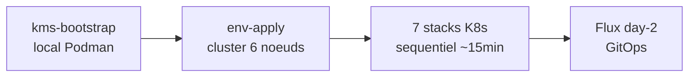

# Talos Linux Multi-Environment Deployment Platform

Sovereign, air-gap-capable Kubernetes platform built on [Talos Linux](https://www.talos.dev/) v1.12. Deploys a production-grade management cluster with full observability, PKI, zero-trust identity, runtime security, S3-compatible storage, and GitOps -- all orchestrated by a single Makefile.

## What it does

Automates the deployment of a hardened Kubernetes platform across multiple environments (Scaleway, libvirt/KVM, Outscale, VMware air-gap). From bare infrastructure to a fully operational platform with 27 Helm components in under 15 minutes.

**Key capabilities:**

- Immutable OS: Talos Linux (no SSH, no shell, no systemd)
- eBPF networking: Cilium replaces kube-proxy, provides L7 policies and mTLS
- PKI: 3-tier CA hierarchy with cert-manager ClusterIssuer
- Zero-trust identity: Ory Kratos + Hydra + Pomerium (OIDC/SSO)
- Secrets: OpenBao (2 instances), auto-generated via `random_id` Terraform, zero secrets in Git
- Monitoring: VictoriaMetrics + VictoriaLogs + Grafana + Headlamp
- Security: Trivy + Tetragon + Kyverno + Cosign image verification
- Storage: Garage S3 + Velero backup + Harbor registry
- GitOps: Flux v2 for day-2 reconciliation
- State: OpenBao KV v2 as Terraform state backend (no cloud dependency)

## Quick start

```bash
# Prerequisites: opentofu, podman, kubectl, jq, helm

# 1. Bootstrap platform (once, needs podman)
make bootstrap          # OpenBao KMS + Gitea + Woodpecker
make bootstrap-export   # Copy tokens to kms-output/

# 2. Configure Scaleway credentials (if deploying to Scaleway)
scw init                # or: scw config set access-key=... secret-key=...
scw iam api-key create description="talos-admin"
# Copy access_key + secret_key to envs/scaleway/iam/secret.tfvars
make scaleway-iam-apply

# 3. Deploy a cluster (pick your provider)
make scaleway-up        # Cloud (Scaleway)
make ENV=local local-up # Local (libvirt/KVM VMs)

# 4. Access dashboards
make scaleway-headlamp  # Kubernetes UI (token in clipboard)
make scaleway-grafana   # Metrics and logs
make scaleway-harbor    # Container registry
```

### Scaleway CLI setup

Install the [Scaleway CLI](https://github.com/scaleway/scaleway-cli):

```bash
brew install scw        # macOS
# or: curl -s https://raw.githubusercontent.com/scaleway/scaleway-cli/master/scripts/get.sh | sh
```

Configure credentials:

```bash
scw init                # Interactive setup (access key, secret key, org, project)
```

Create an API key for Terraform:

```bash
scw iam api-key create description="talos-admin"
```

Then update `envs/scaleway/iam/secret.tfvars`:

```hcl
organization_id = "<your-org-id>"       # scw account list
access_key      = "<from api-key create>"
secret_key      = "<from api-key create>"
```

## Supported environments

| Environment | Provider | Method |
|-------------|----------|--------|
| Scaleway | scaleway | OpenTofu (4 stages: IAM, image, cluster, CI) |
| Local | libvirt/KVM | OpenTofu (QEMU VMs) |
| Outscale | outscale | OpenTofu |
| VMware air-gap | Shell scripts | OVA with embedded image cache, static IPs |

## Architecture

Two-phase deployment: OpenTofu bootstraps infrastructure and 7 Kubernetes stacks in strict sequential order, then Flux v2 takes over day-2 GitOps reconciliation.



All Terraform states stored in OpenBao KV v2 via vault-backend. No cloud state backend dependency.

See [Bootstrap mechanics](docs/explanation/bootstrap.md) for the chicken-and-egg resolution strategies.

## Documentation

| Need | Go to |
|------|-------|
| Step-by-step first deployment | [Getting Started](docs/tutorials/getting-started.md) |
| Deploy to a specific environment | [How to Deploy](docs/how-to/deploy.md) |
| All Makefile targets and options | [Command Reference](docs/reference/commands.md) |
| All configurable parameters | [Configuration Reference](docs/reference/config.md) |
| CI/CD pipeline details | [CI/CD Reference](docs/reference/ci-cd.md) |
| Architecture deep dive | [Architecture](docs/explanation/architecture.md) |
| Bootstrap chicken-and-egg problems | [Bootstrap Mechanics](docs/explanation/bootstrap.md) |
| Security model and policies | [Security Model](docs/explanation/security.md) |
| Troubleshoot a problem | [Troubleshooting](docs/how-to/troubleshoot.md) |
| Full component inventory | [Technology Stack](docs/techno.md) |
| Architecture decisions (ADRs) | [docs/adr/](docs/adr/) |
| AI agent context | [AGENTS.md](AGENTS.md) |

## Technology stack

| Layer | Components |
|-------|-----------|
| OS | Talos Linux v1.12.4 |
| Kubernetes | v1.35.0 (3 CP + 3 workers) |
| CNI | Cilium 1.17.13 (eBPF) |
| PKI | OpenBao + cert-manager |
| Identity | Ory Kratos + Hydra + Pomerium |
| Monitoring | VictoriaMetrics + VictoriaLogs + Grafana + Headlamp |
| Security | Trivy + Tetragon + Kyverno + Cosign |
| Storage | local-path + Garage S3 + Velero + Harbor |
| GitOps | Flux v2 |
| CI/CD | Woodpecker CI + Gitea |
| IaC | OpenTofu + Makefile orchestration |

## Teardown

```bash
make scaleway-down    # Destroy k8s stacks + cluster
make kms-stop         # Stop local KMS pod
make scaleway-nuke    # Destroy EVERYTHING (requires confirmation)
```

## Contributing

See [CONTRIBUTING.md](CONTRIBUTING.md) for guidelines.

## License

See [LICENSE](LICENSE) for details.
