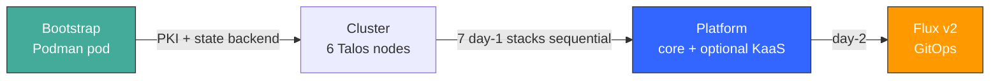

# St4ck

> Sovereign Kubernetes platform on Talos Linux — staged deployment with OpenBao-backed state, PKI, secrets, and GitOps.

[](https://www.talos.dev/)
[](https://kubernetes.io/)
[](LICENSE)


```mermaid
graph LR
    B[Bootstrap<br/>Podman pod] -->|PKI + state backend| C[Cluster<br/>6 Talos nodes]
    C -->|7 day-1 stacks sequential| K[Platform<br/>core + optional KaaS]
    K -->|day-2| F[Flux v2<br/>GitOps]

    style B fill:#4a9,stroke:#333,color:#fff
    style K fill:#36f,stroke:#333,color:#fff
    style F fill:#f90,stroke:#333,color:#fff
```

## Quickstart

```bash
# Prerequisites: opentofu, podman, kubectl, scw, jq, helm
make bootstrap && make bootstrap-export                         # Platform pod
make scaleway-iam-apply                                         # IAM stage
make scaleway-image-apply REGION=fr-par                         # Talos image
make scaleway-bootstrap-vm ENV=dev INSTANCE=shared REGION=fr-par # CI/shared PN
make scaleway-up ENV=dev INSTANCE=mgmt REGION=fr-par             # Cluster + stacks
make scaleway-headlamp ENV=dev INSTANCE=mgmt REGION=fr-par       # Dashboard
```

## What you get

| Stack | Components | Deploy time |
|-------|-----------|-------------|
| **CNI** | Cilium + local-path default StorageClass | ~30s |
| **PKI** | OpenBao x2 + cert-manager + 3-tier CA | ~3-10min |
| **Monitoring** | VictoriaMetrics + VictoriaLogs + Grafana + Headlamp | ~2min |
| **Identity** | Ory Kratos + Hydra + Pomerium (OIDC/SSO) | ~1min |
| **Security** | Trivy + Tetragon + Kyverno + Cosign | ~2min |
| **Storage** | Garage S3 + Velero + Harbor | ~3min |
| **GitOps** | Flux v2 (SSH → Gitea) | ~30s |

Zero secrets in Git. Values are generated by Terraform, stored in the bootstrap OpenBao KMS, seeded into OpenBao Infra, then synced to Kubernetes by ESO.

## Supported environments

| Environment | Provider | Method |
|-------------|----------|--------|
| Scaleway | `scaleway/scaleway` | OpenTofu (IAM → image → CI/shared PN → cluster → stacks) |
| Local | `dmacvicar/libvirt` | OpenTofu (Linux libvirt/KVM VMs) |
| VMware air-gap | Shell scripts | Legacy/manual OVA + embedded image cache + static IPs |

```bash
make scaleway-up ENV=dev INSTANCE=mgmt REGION=fr-par  # Cloud
make local-up                                         # Local KVM
```

## Architecture

```
bootstrap (podman pod, local or remote VM)
    ├── OpenBao KMS (single-node Raft) → state backend + PKI CA chain
    ├── vault-backend :8080 → HTTP backend for OpenTofu state
    ├── Gitea :3000 → Git server
    └── Woodpecker :8000 → CI/CD

        ↓ kms-output/ (certs + tokens)

cluster (3 CP + 3 workers, Talos Linux)
    ├── stacks/cni/         → Cilium
    ├── stacks/pki/         → OpenBao Infra + App + cert-manager + ESO source secrets
    ├── stacks/monitoring/  → VictoriaMetrics + VictoriaLogs + Headlamp
    ├── stacks/identity/    → Kratos + Hydra + Pomerium
    ├── stacks/security/    → Trivy + Tetragon + Kyverno + Cosign
    ├── stacks/storage/     → Garage S3 + Velero + Harbor
    └── stacks/flux-bootstrap/ → Flux v2 → clusters/management/

        ↓ day-2

Flux reconciles HelmReleases from Git (Gitea → flux-system)
ESO syncs secrets from in-cluster OpenBao → K8s Secrets
```

Each stack co-locates Terraform code, Helm values, and Flux manifests in one folder.

## Scaleway CLI setup

```bash
brew install scw                                    # macOS
scw init                                            # Interactive setup
scw iam api-key create user-id=<uid> description="talos-admin"
```

Then create `envs/scaleway/iam/secret.tfvars`:

```hcl
scw_access_key      = "<from api-key create>"
scw_secret_key      = "<from api-key create>"
scw_organization_id = "<your-org-id>"
```

## Documentation

| Need | Go to |
|------|-------|
| First deployment walkthrough | [Getting Started](docs/tutorials/getting-started.md) |
| Deploy to a specific environment | [How to Deploy](docs/how-to/deploy.md) |
| Upgrade an existing deployment | [Upgrade Guide](docs/how-to/upgrade.md) |
| Troubleshoot a problem | [Troubleshooting](docs/how-to/troubleshoot.md) |
| All Makefile targets | [Command Reference](docs/reference/commands.md) |
| Configuration parameters | [Configuration Reference](docs/reference/config.md) |
| CI/CD pipeline details | [CI/CD Reference](docs/reference/ci-cd.md) |
| Architecture deep dive | [Architecture](docs/explanation/architecture.md) |
| Bootstrap mechanics | [Bootstrap Mechanics](docs/explanation/bootstrap.md) |
| Security model | [Security Model](docs/explanation/security.md) |
| High-level design | [HLD](docs/hld-talos-platform.md) |
| Low-level designs | [LLDs](docs/lld/) |
| Component inventory | [Technology Stack](docs/techno.md) |
| Architecture decisions | [ADRs](docs/adr/) (30 ADRs) |
| AI agent context | [AGENTS.md](AGENTS.md) |

## Project structure

```
st4ck/
├── bootstrap/          # Platform pod: OpenBao + Gitea + Woodpecker
├── contexts/           # One YAML context per env/instance/region
├── envs/               # Provider-specific infra (Scaleway, local libvirt, legacy VMware airgap)
├── modules/            # Shared Terraform module (talos-cluster)
├── stacks/             # 1 stack = 1 folder (TF + values + flux/)
├── clusters/management # Thin kustomization → stacks/*/flux/
├── patches/            # Machine config patches (Cilium, registry mirror)
├── docs/               # Diátaxis structure (tutorials, how-to, reference, explanation)
├── scripts/            # Day-2 operations
└── tests/              # Cross-stack and E2E checks
```

## Teardown

```bash
make scaleway-down      # Destroy k8s stacks + cluster (correct order)
make bootstrap-stop     # Stop local platform pod
make scaleway-nuke      # Destroy EVERYTHING including IAM (requires confirmation)
```

## Contributing

See [CONTRIBUTING.md](CONTRIBUTING.md).

## License

[Apache 2.0](LICENSE)
