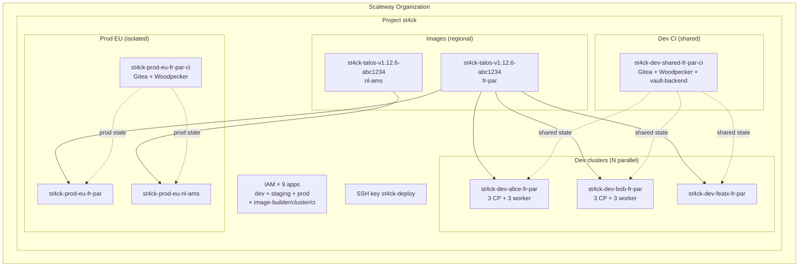

# Multi-env workflow

This repo supports **N parallel environments** (dev/staging/prod) across **any Scaleway region**, all within a **single Scaleway project** (`st4ck`).

## Mental model

```
Scaleway organization
└── Project "st4ck"                          ← single project, all envs
    ├── IAM (9 apps — 3 roles × 3 env classes)
    │   ├── st4ck-dev-image-builder    + api-key
    │   ├── st4ck-dev-cluster          + api-key
    │   ├── st4ck-dev-ci               + api-key
    │   ├── st4ck-staging-*            × 3
    │   └── st4ck-prod-*               × 3
    │
    ├── SSH key: st4ck-deploy (~/.ssh/talos_scaleway)
    │
    ├── Images (per region, immutable):
    │   ├── st4ck-talos-v1.12.6-{sha7}   (fr-par)
    │   ├── st4ck-talos-v1.12.6-{sha7}   (nl-ams)
    │   └── st4ck-talos-v1.12.6-{sha7}   (pl-waw)
    │
    └── N clusters = N × (env, instance, region):
        ├── st4ck-dev-alice-fr-par    (Alice's sandbox)
        ├── st4ck-dev-bob-fr-par      (Bob's sandbox)
        ├── st4ck-dev-feature-x-fr-par
        ├── st4ck-prod-eu-fr-par
        ├── st4ck-prod-eu-nl-ams      (same logical prod, diff region)
        └── st4ck-prod-us-pl-waw
```

## Invocation

Every cluster-scoped target takes three parameters: `ENV`, `INSTANCE`, `REGION`.

```bash
# Show current context
make context

# Bootstrap once per org — creates the project + 9 IAM apps + SSH key
cp envs/scaleway/iam/secret.tfvars.example envs/scaleway/iam/secret.tfvars
# (fill secret.tfvars with admin credentials)
make scaleway-iam-apply

# Build a Talos image (one per region — run once per region)
make scaleway-image-apply REGION=fr-par
make scaleway-image-apply REGION=nl-ams

# Deploy the SHARED dev CI VM (hosts platform pod for all devs)
make scaleway-ci-apply ENV=dev INSTANCE=shared REGION=fr-par

# Point subsequent commands at the remote vault-backend:
make bootstrap-tunnel VB_HOST=root@<ci-public-ip>     # separate terminal
export VB_HOST=root@<ci-public-ip>

# Alice's dev cluster
make scaleway-up ENV=dev INSTANCE=alice REGION=fr-par

# Bob's dev cluster (parallel — independent state + resources)
make scaleway-up ENV=dev INSTANCE=bob REGION=fr-par

# Prod EU — dedicated CI VM + cluster
make scaleway-ci-apply ENV=prod INSTANCE=eu REGION=fr-par
make scaleway-up ENV=prod INSTANCE=eu REGION=fr-par
make scaleway-up ENV=prod INSTANCE=eu REGION=nl-ams   # second region for same prod

# Destroy — scoped by context (doesn't touch others)
make scaleway-down ENV=dev INSTANCE=alice REGION=fr-par
```

## State isolation

Every stage writes to its own path in OpenBao KV v2, under a strict hierarchy:

```
/state/st4ck/
├── _image/{region}/                            # Talos image (one per region)
├── {env}/{instance}/{region}/
│   ├── cluster      # Talos + VPC + LB + SG + nodes
│   ├── ci           # Gitea + Woodpecker + platform pod (same context only if shared CI)
│   ├── cni          # Cilium
│   ├── pki          # OpenBao + cert-manager
│   ├── monitoring
│   ├── identity
│   ├── security
│   ├── storage
│   └── flux-bootstrap
```

The Makefile computes the state path from `ENV / INSTANCE / REGION` and injects it into `tofu init` via `-backend-config`. `backend.tf` stays empty — no hard-coded paths.

## Flow for a new engineer

```bash
# 1. Clone the repo
git clone https://github.com/Destynova2/st4ck.git && cd st4ck

# 2. Generate a personal SSH key (only for your laptop — gitignored)
ssh-keygen -t ed25519 -f ~/.ssh/talos_scaleway -N ""

# 3. Ask the maintainer to:
#    - add your pubkey to the Scaleway 'st4ck-deploy' SSH key (OR use your own)
#    - add your public IP to contexts/dev-shared-fr-par.yaml (management_cidrs)

# 4. Create your personal context
cp contexts/dev-alice-fr-par.yaml contexts/dev-$USER-fr-par.yaml
$EDITOR contexts/dev-$USER-fr-par.yaml   # set instance=$USER, owner=$USER

# 5. Tunnel to the shared dev CI VM (get kms-output/ + vault-backend access)
make bootstrap-export-remote VB_HOST=root@<ci-ip>
make bootstrap-tunnel        VB_HOST=root@<ci-ip>   # keep running

# 6. In another terminal — deploy
make scaleway-up ENV=dev INSTANCE=$USER REGION=fr-par
```

## Destroying / leaving

```bash
# Tear down your personal cluster + k8s stacks (keeps IAM + image + CI)
make scaleway-teardown ENV=dev INSTANCE=$USER REGION=fr-par

# Full nuke (requires confirmation, affects everyone)
make scaleway-nuke
```

## Diagram


