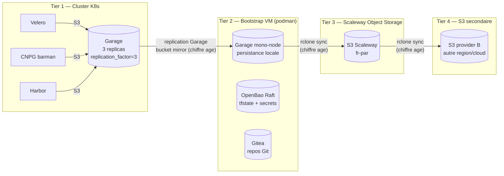
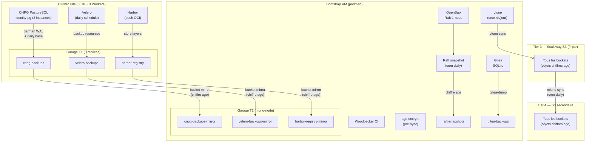
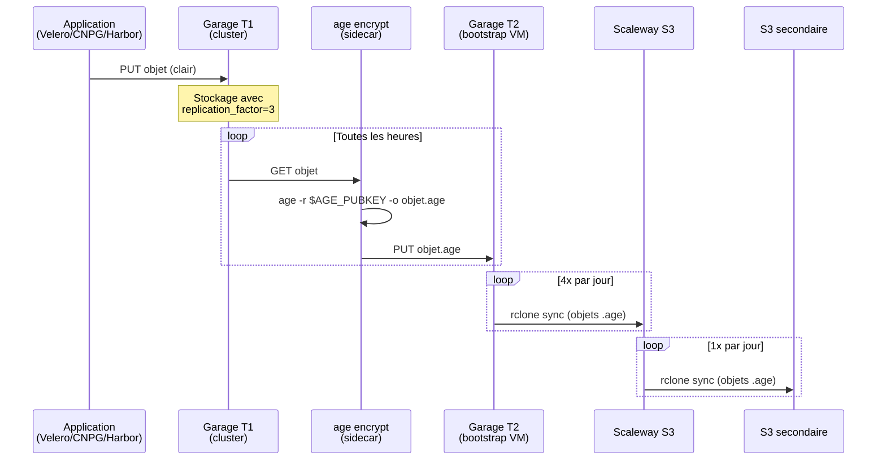
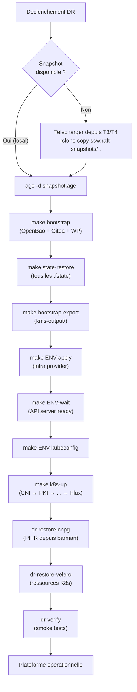
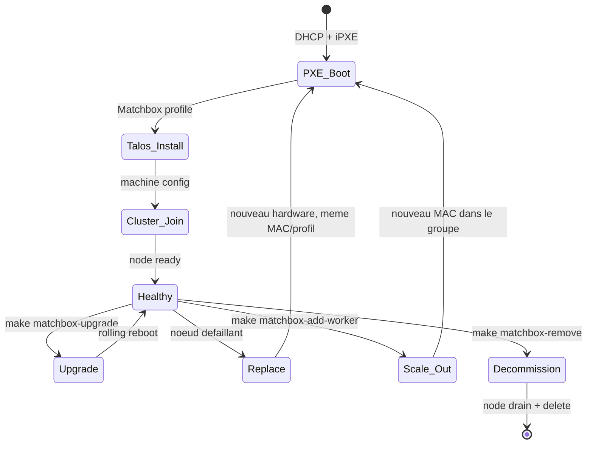
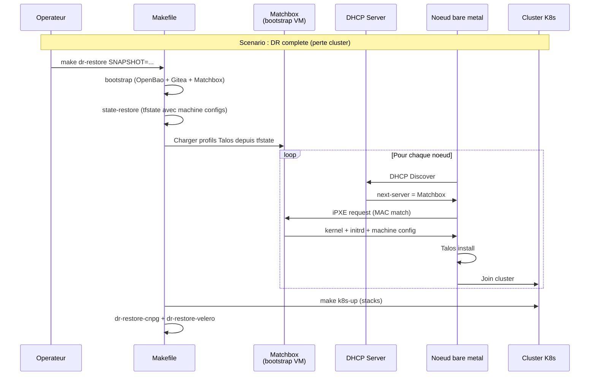
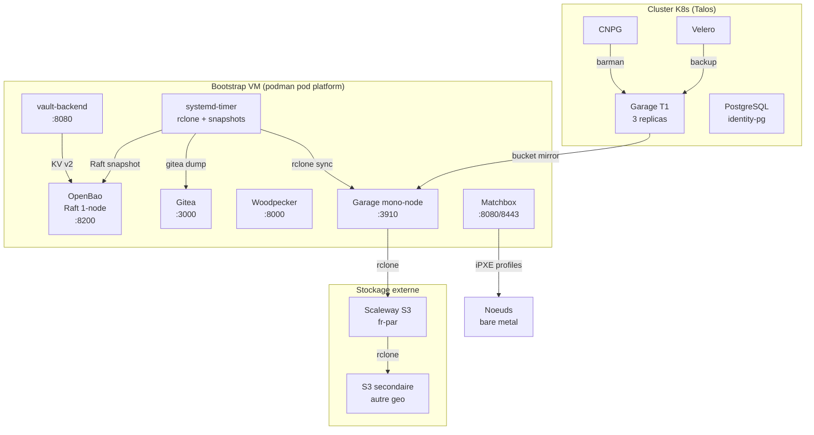

# ADR-023 : Architecture Disaster Recovery — Chaine de sauvegarde Garage multi-tiers

**Date** : 2026-03-20
**Statut** : Propose
**Decideurs** : Equipe plateforme

---

## 1. Resume executif

Ce document definit l'architecture de Disaster Recovery (DR) pour la plateforme st4ck. L'objectif : reconstruire l'integralite de la plateforme (infrastructure + donnees) a partir d'une seule commande (`make bootstrap && make dr-restore`), en s'appuyant sur une chaine de sauvegarde chiffree a 4 tiers basee sur Garage S3. Le bootstrap VM (podman) est le point de recovery unique : il contient les secrets KMS, les etats Terraform (Raft), les repos Git (Gitea) et orchestre la reconstruction.

---

## 2. Contexte

### Etat actuel

La plateforme dispose deja de mecanismes de sauvegarde partiels :

- **Raft snapshot** (`make state-snapshot`) : sauvegarde tous les etats Terraform via OpenBao
- **Velero** : backup des ressources K8s vers Garage S3 in-cluster (`velero-backups`)
- **CNPG barman** : backup PostgreSQL (Kratos/Hydra) vers Garage S3 (`cnpg-backups`)
- **`make dr-backup`** : sauvegarde manuelle kms-output + Raft + CNPG trigger
- **Harbor** : images OCI stockees sur Garage S3 (`harbor-registry`)

### Ce qui manque

| Lacune | Risque |
|--------|--------|
| Pas de replication off-site des donnees Garage | Perte totale si le cluster K8s + ses disques sont detruits |
| Pas de chiffrement des sauvegardes | Exposition des secrets en cas de compromission du stockage |
| Pas de restauration automatisee | RTO mesure en heures/jours (procedures manuelles) |
| Garage S3 in-cluster = SPOF pour toutes les donnees | Velero, Harbor, CNPG dependent tous du meme cluster |
| kms-output copie manuellement | Risque de perte des secrets racine (root token, CA, unseal key) |
| Matchbox limite au PXE boot | Pas d'automatisation day-2 (scaling, upgrade, remplacement) |

## 3. Probleme

Comment garantir la reprise d'activite complete de la plateforme (RPO < 24h, RTO < 2h) apres une perte totale du cluster Kubernetes, tout en :

1. Protegeant les donnees sur 3+ sites geographiques
2. Chiffrant toutes les sauvegardes au repos et en transit
3. Automatisant la restauration via une seule commande
4. Gerant le cycle de vie complet des noeuds bare metal (Matchbox day-2)

---

## 4. Decision

### 4.1 Chaine de sauvegarde Garage multi-tiers

Architecture en cascade : chaque tier replique vers le suivant via la replication inter-site native de Garage (bucket mirroring S3).



### 4.2 Chiffrement age

Toutes les sauvegardes sont chiffrees avec [age](https://age-encryption.org/) (pas GPG — plus simple, pas de keyring) :

- **Cle age** generee au bootstrap, stockee dans OpenBao KV v2 (`secret/dr/age-key`)
- **Cle publique** exportee dans `kms-output/dr-age-pubkey.txt` (peut etre distribuee)
- **Cle privee** necessaire uniquement pour la restauration (dans le Raft snapshot)
- Les buckets mirrors sont chiffres cote source avant envoi (age stream encryption)

### 4.3 Garage mono-node sur la bootstrap VM

Un conteneur Garage supplementaire dans le pod platform (podman) :

```yaml
# Ajout dans platform-pod.yaml
- name: garage-backup
  image: dxflrs/garage:v2.2.0
  ports:
    - containerPort: 3910
      hostPort: 3910   # S3 API
    - containerPort: 3911
      hostPort: 3911   # RPC
  volumeMounts:
    - name: garage-backup-data
      mountPath: /var/lib/garage/data
    - name: garage-backup-meta
      mountPath: /var/lib/garage/meta
```

Ce Garage mono-node (`replication_factor = 1`) recoit les replications du cluster via bucket mirror.

### 4.4 Synchronisation vers S3 externe (Tiers 3 & 4)

**rclone** en CronJob (sur la bootstrap VM) synchronise les buckets locaux vers Scaleway S3 puis vers le S3 secondaire :

```
┌──────────────┐     rclone sync     ┌──────────────┐     rclone sync     ┌──────────────┐
│ Garage T2    │ ──────────────────→  │ Scaleway S3  │ ──────────────────→  │ S3 provider B│
│ (bootstrap)  │    chiffre age       │ (fr-par)     │    deja chiffre     │ (autre geo)  │
└──────────────┘                      └──────────────┘                      └──────────────┘
```

- Les objets sont deja chiffres par age avant stockage dans le Garage T2
- rclone copie les blobs chiffres tels quels (pas de double chiffrement)
- Retention : 30 jours sur T3, 90 jours sur T4

---

## 5. Objectifs RPO / RTO par tier

| Tier | Localisation | RPO | RTO | Usage |
|------|-------------|-----|-----|-------|
| T1 — Garage cluster | In-cluster (3 replicas) | 0 (temps reel) | 0 (disponible) | Acces primaire |
| T2 — Garage bootstrap VM | VM CI (meme DC) | < 1h | < 30 min | Recovery rapide |
| T3 — Scaleway Object Storage | fr-par (off-site) | < 6h | < 1h | Sinistre DC |
| T4 — S3 secondaire | Autre region/cloud | < 24h | < 2h | Sinistre regional |

### RPO detaille par type de donnee

| Donnee | Mecanisme | RPO | Retention |
|--------|-----------|-----|-----------|
| Etats Terraform (tfstate) | Raft snapshot quotidien + KV v2 versionne | < 24h | 30 versions (KV v2) |
| PostgreSQL (Kratos/Hydra) | CNPG barman WAL streaming + daily base backup | < 5 min (WAL) | 14 jours |
| Velero (ressources K8s) | Velero schedule quotidien → Garage | < 24h | 30 jours |
| Harbor (images OCI) | Garage replication_factor=3 + mirror T2 | < 1h | Illimite |
| Gitea (repos + metadata) | SQLite sur PVC bootstrap VM + rclone T3 | < 6h | 90 jours |
| OpenBao secrets | Raft snapshot + unseal key dans kms-output | < 24h | 30 snapshots |
| CA / certificats racine | kms-output/ (fichiers statiques) | N/A (regenerable) | Permanent |

---

## 6. Quoi sauvegarder vs quoi regenerer

### Donnees a sauvegarder (ne peuvent PAS etre regenerees)

| Donnee | Source | Destination backup | Critique |
|--------|--------|-------------------|----------|
| `kms-output/` (root-token, unseal key, CAs, AppRole) | Bootstrap VM | Raft snapshot + T3/T4 | **CRITIQUE** — sans cela, rien ne fonctionne |
| Raft snapshot OpenBao (tous les tfstate) | OpenBao podman | T2 → T3 → T4 | **CRITIQUE** — contient tous les secrets generes |
| PostgreSQL (identity-pg) | CNPG barman → Garage T1 | T1 → T2 → T3 | **ELEVE** — identites utilisateur, sessions OAuth |
| Gitea SQLite + repos | PVC bootstrap VM | rclone → T3 | **ELEVE** — code source + historique |
| Harbor images critiques | Garage T1 (`harbor-registry`) | T1 → T2 → T3 | **MOYEN** — reconstructible depuis CI |
| Velero backups | Garage T1 (`velero-backups`) | T1 → T2 → T3 | **MOYEN** — snapshots K8s |
| Cle age DR | OpenBao KV v2 | Dans le Raft snapshot | **CRITIQUE** — dechiffrement des backups |

### Donnees regenerables (pas besoin de backup)

| Donnee | Methode de regeneration |
|--------|------------------------|
| Kubeconfig | `tofu output -raw kubeconfig` apres infra-apply |
| Certificats TLS (cert-manager) | Reemis automatiquement par cert-manager + ClusterIssuer |
| Secrets applicatifs (random_id) | Regeneres par `tofu apply` (dans le tfstate restaure) |
| Machine configs Talos | Regeneres par le module `talos-cluster` |
| Cilium, monitoring, security configs | Regeneres par `make k8s-up` (idempotent) |
| OIDC client registration | Job `hydra-oidc-register` re-execute au deploy |
| Garage layout + buckets + API keys | `terraform_data` provisioners re-executes |

---

## 7. Architecture de sauvegarde detaillee

### 7.1 Flux de donnees complet



### 7.2 Bucket mirror Garage (T1 → T2)

Garage supporte nativement le bucket mirror via son API d'administration. Configuration :

```toml
# garage.toml sur le Garage T2 (bootstrap VM)
[replication]
mode = "none"  # mono-node, pas de replication intra-cluster

# Le mirroring est configure via l'API admin de Garage T1
# bucket alias + remote endpoint
```

Le Garage T1 (cluster) configure chaque bucket avec un `mirror` pointant vers le Garage T2 :

```bash
# Execute via CronJob K8s (toutes les heures)
garage bucket mirror set velero-backups \
  --remote-endpoint http://<bootstrap-vm>:3910 \
  --remote-access-key $T2_ACCESS_KEY \
  --remote-secret-key $T2_SECRET_KEY
```

**Alternative si le bucket mirror natif n'est pas disponible** : utiliser `rclone sync` avec le backend S3 des deux Garage, execute comme CronJob K8s.

### 7.3 Pipeline de chiffrement



---

## 8. Runbook de restauration automatise

### 8.1 Prerequis

- Une VM avec podman installe (ou la bootstrap VM reconstruite via Terraform)
- Le fichier `raft-snapshot.snap.age` (depuis T3 ou T4)
- La cle age privee (dans le snapshot ou sauvegardee separement hors-bande)
- Le depot Git `talos/` (clone depuis Gitea backup ou depuis un mirror)

### 8.2 Procedure : `make dr-restore`

```makefile
# Cible Makefile : restauration complete
dr-restore: ## Restauration DR complete (bootstrap + cluster + donnees)
    @echo "=== DR Restore ==="
    @test -n "$(SNAPSHOT)" || { echo "Usage: make dr-restore SNAPSHOT=path/to/raft.snap.age"; exit 1; }
    @test -n "$(AGE_KEY)" || { echo "Usage: make dr-restore SNAPSHOT=... AGE_KEY=path/to/key.txt"; exit 1; }

    # Phase 1 : Dechiffrer le snapshot
    @echo "--- Phase 1: Dechiffrement du snapshot ---"
    age -d -i $(AGE_KEY) -o /tmp/raft-restore.snap $(SNAPSHOT)

    # Phase 2 : Bootstrap (reconstruit OpenBao + Gitea + Woodpecker)
    @echo "--- Phase 2: Bootstrap plateforme ---"
    $(MAKE) bootstrap

    # Phase 3 : Restaurer le Raft snapshot (tous les tfstate + secrets)
    @echo "--- Phase 3: Restauration Raft ---"
    $(MAKE) state-restore SNAPSHOT=/tmp/raft-restore.snap

    # Phase 4 : Recreer l'infrastructure
    @echo "--- Phase 4: Infrastructure $(ENV) ---"
    $(MAKE) $(ENV)-apply
    $(MAKE) $(ENV)-wait
    $(MAKE) $(ENV)-kubeconfig

    # Phase 5 : Deployer les stacks K8s
    @echo "--- Phase 5: Stacks K8s ---"
    $(MAKE) k8s-up

    # Phase 6 : Restaurer PostgreSQL depuis barman (PITR)
    @echo "--- Phase 6: Restauration CNPG (PITR) ---"
    $(MAKE) dr-restore-cnpg

    # Phase 7 : Restaurer les backups Velero
    @echo "--- Phase 7: Restauration Velero ---"
    $(MAKE) dr-restore-velero

    @echo "=== DR Restore complete ==="
```

### 8.3 CNPG PITR (Point-In-Time Recovery)

```makefile
dr-restore-cnpg: ## Restaurer PostgreSQL depuis barman backup (PITR)
    @echo "Patching CNPG cluster for recovery..."
    KUBECONFIG=$(KC_FILE) kubectl -n identity apply -f - <<< '$(call cnpg_recovery_manifest)'
```

Le manifest CNPG de recovery :

```yaml
apiVersion: postgresql.cnpg.io/v1
kind: Cluster
metadata:
  name: identity-pg
  namespace: identity
spec:
  instances: 3
  storage:
    size: 2Gi
  bootstrap:
    recovery:
      source: identity-pg-backup
      # Pour PITR a un instant precis :
      # recoveryTarget:
      #   targetTime: "2026-03-20T12:00:00Z"
  externalClusters:
    - name: identity-pg-backup
      barmanObjectStore:
        destinationPath: "s3://cnpg-backups/identity-pg"
        endpointURL: "http://garage-s3.garage.svc.cluster.local:3900"
        s3Credentials:
          accessKeyId:
            name: cnpg-s3-credentials
            key: access_key
          secretAccessKey:
            name: cnpg-s3-credentials
            key: secret_key
```

### 8.4 Diagramme de restauration



---

## 9. Ordonnancement des sauvegardes

### CronJobs

| Job | Frequence | Source | Destination | Outil |
|-----|-----------|--------|-------------|-------|
| CNPG WAL shipping | Continu | PostgreSQL | Garage T1 `cnpg-backups` | barman (natif CNPG) |
| CNPG base backup | Quotidien 02:00 UTC | PostgreSQL | Garage T1 `cnpg-backups` | barman (ScheduledBackup) |
| Velero schedule | Quotidien 03:00 UTC | Ressources K8s | Garage T1 `velero-backups` | Velero |
| Bucket mirror T1→T2 | Toutes les heures | Garage T1 | Garage T2 | rclone / bucket mirror |
| Raft snapshot | Quotidien 04:00 UTC | OpenBao Raft | Garage T2 `raft-snapshots` | curl + age |
| Gitea dump | Quotidien 04:30 UTC | Gitea SQLite | Garage T2 `gitea-backups` | gitea dump + age |
| rclone T2→T3 | 4x/jour (00,06,12,18) | Garage T2 | Scaleway S3 | rclone sync |
| rclone T3→T4 | Quotidien 05:00 UTC | Scaleway S3 | S3 secondaire | rclone sync |
| Verification backup | Quotidien 06:00 UTC | Tous les tiers | Alerte monitoring | Script custom |

### Retention

| Tier | Retention | Politique |
|------|-----------|-----------|
| T1 (Garage cluster) | 14 jours (CNPG), 30 jours (Velero) | Geree par chaque outil |
| T2 (Bootstrap VM) | 30 jours | rclone `--max-age 30d` |
| T3 (Scaleway S3) | 30 jours | Lifecycle policy S3 |
| T4 (S3 secondaire) | 90 jours | Lifecycle policy S3 |

---

## 10. Matchbox — Automatisation day-2 du cycle de vie bare metal

### 10.1 Au-dela du PXE boot (ADR-019)

L'ADR-019 definit Matchbox pour le provisioning initial (PXE → Talos install). Le DR etend Matchbox pour couvrir le cycle de vie complet :



### 10.2 Operations day-2 via Matchbox + Makefile

| Operation | Commande | Mecanisme |
|-----------|----------|-----------|
| **Scaling** (ajout worker) | `make matchbox-add-worker MAC=aa:bb:cc:dd:ee:ff` | Ajoute le MAC au groupe `worker` dans Matchbox, le noeud PXE-boot automatiquement |
| **Upgrade Talos** | `make matchbox-upgrade VERSION=v1.13.0` | Met a jour le profil Matchbox (kernel/initrd), puis `talosctl upgrade` rolling sur chaque noeud |
| **Remplacement noeud** | `make matchbox-replace NODE=worker-3` | Drain + delete le noeud K8s, le nouveau hardware avec le meme MAC re-PXE et rejoint |
| **Rebuild complet** | `make matchbox-rebuild-all` | PXE-boot tous les noeuds (DR complete) — utilise les machine configs du tfstate restaure |
| **Rotation certificats** | `make matchbox-rotate-certs` | Regenere les machine configs via `talos-cluster` module, met a jour Matchbox, rolling reboot |

### 10.3 Integration Matchbox dans la chaine DR



### 10.4 Stockage des profils Matchbox

Les profils et groupes Matchbox sont geres par Terraform (provider `poseidon/matchbox`) :

```hcl
# Dans le module talos-cluster ou un module matchbox dedie
resource "matchbox_profile" "talos_controlplane" {
  name   = "talos-controlplane"
  kernel = "/assets/talos/${var.talos_version}/vmlinuz"
  initrd = ["/assets/talos/${var.talos_version}/initramfs.xz"]
  args   = ["talos.config=http://matchbox:8080/generic?mac=$${mac}"]
}

resource "matchbox_group" "controlplane" {
  name    = "controlplane"
  profile = matchbox_profile.talos_controlplane.name
  selector = {
    mac = var.controlplane_macs  # Liste de MACs
  }
  metadata = {
    machine_config = talos_machine_configuration.controlplane.machine_configuration
  }
}
```

Les profils sont stockes dans le tfstate (OpenBao) et restaures automatiquement avec le Raft snapshot.

---

## 11. Architecture de deploiement DR

### 11.1 Diagramme C4 Level 2 — Conteneurs DR



---

## 12. Estimations de capacite

### Volumes de donnees (back-of-envelope)

| Donnee | Taille unitaire | Frequence | Volume/jour | Volume/30 jours |
|--------|----------------|-----------|-------------|-----------------|
| CNPG base backup | ~50 MB | 1/jour | 50 MB | 1.5 GB |
| CNPG WAL | ~5 MB/h | Continu | 120 MB | 3.6 GB |
| Velero backup | ~20 MB | 1/jour | 20 MB | 600 MB |
| Raft snapshot | ~10 MB | 1/jour | 10 MB | 300 MB |
| Harbor images | ~500 MB | Variable | 500 MB | 15 GB |
| Gitea dump | ~100 MB | 1/jour | 100 MB | 3 GB |
| **Total** | | | **~800 MB** | **~24 GB** |

### Bande passante requise

| Flux | Volume | Frequence | Bande passante |
|------|--------|-----------|----------------|
| T1 → T2 (bucket mirror) | ~800 MB/jour | Horaire | ~10 KB/s moyen |
| T2 → T3 (rclone) | ~800 MB/jour | 4x/jour | ~200 KB/s par sync |
| T3 → T4 (rclone) | ~800 MB/jour | 1x/jour | ~10 KB/s moyen |

### Stockage par tier

| Tier | Retention | Stockage estime |
|------|-----------|-----------------|
| T1 (Garage cluster, 3 replicas) | 14-30 jours | ~24 GB x 3 = 72 GB |
| T2 (Bootstrap VM) | 30 jours | ~24 GB |
| T3 (Scaleway S3) | 30 jours | ~24 GB |
| T4 (S3 secondaire) | 90 jours | ~72 GB |

**Cout Scaleway S3** : 24 GB x 0.01 EUR/GB/mois = ~0.24 EUR/mois (negligeable).

---

## 13. Securite

### Modele de menace

| Menace | Mitigation |
|--------|-----------|
| Compromission du cluster K8s | Les backups T2/T3/T4 sont hors cluster, chiffres age |
| Compromission de la bootstrap VM | Les backups T3/T4 sont hors VM, cle age dans le Raft |
| Compromission du stockage S3 | Objets chiffres age, la cle n'est pas sur le S3 |
| Perte de la cle age | Cle stockee dans OpenBao Raft + copie hors-bande (coffre physique) |
| Man-in-the-middle (sync) | TLS pour toutes les connexions S3 (HTTPS) |
| Suppression malveillante des backups | Object lock / versioning sur T3 et T4 |

### Rotation des cles

- **Cle age** : rotation annuelle, les anciens backups restent dechiffrables avec l'ancienne cle (stockee dans le Raft)
- **Credentials S3** : rotation trimestrielle via OpenBao
- **AppRole tokens** : auto-renouvellement (token_period = 768h)

---

## 14. Alternatives considerees

| Option | Avantages | Inconvenients | Decision |
|--------|-----------|---------------|----------|
| **Garage bucket mirror (choisi)** | Natif, incremental, efficace | Necessite connectivite T1→T2 | **Retenu** — simplicite + performance |
| Velero + Restic vers S3 externe | Standard, largement documente | Ne couvre pas Harbor/CNPG, plus lent | Rejete — partiel |
| MinIO replication | Mature, battle-tested | Lourd (~500 MB RAM), Java, pas souverain | Rejete — overhead |
| rsync des PVCs | Simple a comprendre | Pas de chiffrement natif, pas incremental pour S3 | Rejete — inadapte |
| GPG au lieu de age | Plus repandu en entreprise | Complexe (keyring, expiration), plus lent | Rejete — complexite operationnelle |
| Pas de T4 (2 tiers seulement) | Moins cher, plus simple | Pas de protection contre sinistre regional | Rejete — contrainte souverainete |

---

## 15. Consequences

### Positives

- **RPO garanti < 24h** sur tous les types de donnees, < 5 min pour PostgreSQL (WAL)
- **RTO < 2h** pour une reconstruction complete (automatisee via Makefile)
- **3 copies geographiques** des donnees critiques (cluster + DC + off-site)
- **Chiffrement de bout en bout** (age) — les S3 externes ne voient que des blobs chiffres
- **Matchbox day-2** : scaling, upgrade et remplacement de noeuds automatises
- **Cout negligeable** : < 1 EUR/mois pour le stockage S3 off-site
- **Une seule commande** : `make dr-restore` reconstruit tout

### Negatives

- **Complexite ajoutee** : Garage mono-node + rclone CronJobs + age encryption pipeline
- **Garage T2** : composant supplementaire dans le pod platform (RAM ~128 MB, disque ~24 GB)
- **rclone** : dependance supplementaire a maintenir (mais tres stable, 1 binaire)
- **Matchbox day-2** : necessite DHCP relay configure (reseau prerequis)
- **Temps de restauration PostgreSQL** : PITR depuis barman peut prendre 10-30 min selon le volume WAL
- **Test de DR** : necessite un environnement de test pour valider periodiquement le runbook

### Risques

| Risque | Probabilite | Impact | Mitigation |
|--------|-------------|--------|-----------|
| Bucket mirror Garage instable (feature jeune) | Moyenne | Moyen | Fallback vers rclone S3-to-S3 |
| Perte de la cle age + du Raft snapshot | Tres faible | Critique | Copie hors-bande (coffre physique, USB chiffre) |
| Scaleway S3 indisponible | Faible | Faible | T4 comme fallback |
| Corruption silencieuse des backups | Faible | Eleve | Verification quotidienne (`dr-verify-backup`) |

---

## 16. Plan d'implementation

| Phase | Tache | Effort |
|-------|-------|--------|
| Phase 1 | Garage mono-node dans platform-pod.yaml + age key generation | 2 jours |
| Phase 2 | CronJob rclone T1→T2 (bucket mirror ou rclone sync) | 1 jour |
| Phase 3 | rclone T2→T3 (Scaleway S3) + lifecycle policies | 1 jour |
| Phase 4 | rclone T3→T4 (S3 secondaire) | 0.5 jour |
| Phase 5 | `make dr-restore` complet (Makefile + tests) | 2 jours |
| Phase 6 | Verification quotidienne + alerting | 1 jour |
| Phase 7 | Matchbox day-2 (scaling, upgrade, replace targets) | 3 jours |
| Phase 8 | Test DR end-to-end (destruction + rebuild) | 1 jour |
| **Total** | | **~11 jours** |

---

## 17. Questions ouvertes

| # | Question | Proprietaire | Statut |
|---|----------|-------------|--------|
| 1 | Garage bucket mirror est-il stable en v2.2.0, ou faut-il rclone S3-to-S3 partout ? | Equipe plateforme | A valider |
| 2 | Quel provider S3 pour le Tier 4 ? (OVH, Wasabi, Backblaze B2, autre cloud souverain) | Equipe plateforme | A decider |
| 3 | Faut-il une copie hors-bande de la cle age (USB chiffre, coffre physique) ? | RSSI | A valider |
| 4 | Frequence des tests DR : trimestriel ? semestriel ? | Equipe plateforme | A decider |
| 5 | Object lock sur Scaleway S3 : disponible ? (protection contre suppression) | Equipe plateforme | A verifier |

---

## Appendice

### A. Glossaire

| Terme | Definition |
|-------|-----------|
| age | Outil de chiffrement moderne, simple (1 binaire, pas de keyring) |
| barman | Outil PostgreSQL de backup/PITR utilise par CNPG |
| bucket mirror | Replication S3 inter-site native de Garage |
| PITR | Point-In-Time Recovery (restauration PostgreSQL a un instant precis) |
| Raft snapshot | Sauvegarde atomique de l'etat complet d'un cluster Raft (OpenBao) |
| rclone | Outil de synchronisation multi-cloud (rsync pour le cloud) |
| WAL | Write-Ahead Log (journal PostgreSQL pour PITR) |

### B. References

- [ADR-003 : Garage comme unique stockage S3](003-garage-sole-s3.md)
- [ADR-009 : State backend OpenBao](009-state-backend-openbao.md)
- [ADR-019 : Matchbox bare metal](019-matchbox-bare-metal.md)
- [Garage documentation — bucket mirroring](https://garagehq.deuxfleurs.fr/documentation/cookbook/real-world/)
- [CNPG Recovery documentation](https://cloudnative-pg.io/documentation/current/recovery/)
- [age encryption](https://age-encryption.org/)
- [rclone documentation](https://rclone.org/docs/)
