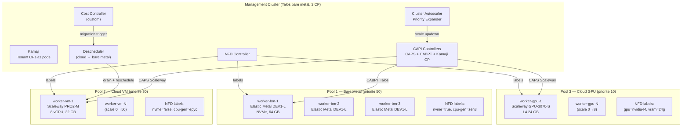
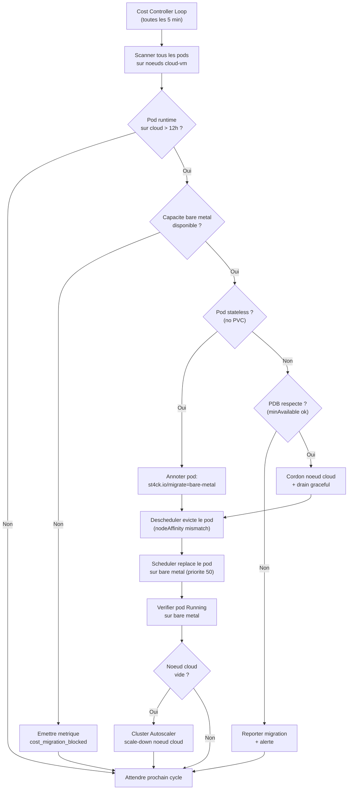

# ADR-024 : Architecture Autoscaling Hybride Cloud / Bare Metal

**Date** : 2026-03-20
**Statut** : Propose
**Decideurs** : Equipe plateforme

---

## 1. Resume executif

Ce document definit l'architecture d'autoscaling hybride combinant bare metal (Scaleway Elastic Metal ou on-prem) et cloud (Scaleway VMs + GPUs). L'objectif : utiliser le bare metal en priorite (cout fixe, performance maximale), deborder automatiquement sur le cloud (cout variable, billed/min), et rapatrier les workloads vers le bare metal des que la capacite le permet. Le management cluster Talos orchestre l'ensemble via Kamaji (tenant control planes), CAPI (provisioning), Cluster Autoscaler (scaling), et un cost controller custom (migration cloud → bare metal).

---

## 2. Contexte

### Etat actuel

La plateforme dispose d'un cluster Talos statique (3 CP + 3 workers) deploye sur un seul provider a la fois (local, Scaleway, Outscale). Le scaling est manuel : ajout de noeuds via Terraform ou Matchbox (ADR-019). Les pics de charge necessitent un surdimensionnement permanent ou une intervention humaine.

### Besoin

| Contrainte | Explication |
|-----------|-------------|
| Cout maitrise | Le bare metal est 3-5x moins cher que le cloud VM pour une charge soutenue |
| Burst rapide | Les pics de charge (CI, inference ML, evenements) necessitent des noeuds en < 5 min |
| GPU on-demand | Les workloads ML/inference necessitent des GPUs L4/H100, mais pas en permanence |
| Zero gaspillage | Les noeuds cloud inutilises doivent etre liberes rapidement (billed/min) |
| Hardware heterogene | Tous les noeuds n'ont pas les memes capacites (NVMe, GPU, CPU gen) |

---

## 3. Decision

### 3.1 Architecture cible

Le management cluster Talos bare metal (3 CP) heberge les composants d'orchestration. Les workloads tournent sur 3 pools de noeuds avec des priorites differentes.



### 3.2 MachineDeployments (pools de noeuds)

| Pool | Priorite | Min | Max | Type instance | Facturation | Usage |
|------|----------|-----|-----|---------------|-------------|-------|
| bare-metal | 50 (prefere) | 3 | 6 | Elastic Metal DEV1-L | Horaire (~0.10 EUR/h) | Charge soutenue, stockage, ingress |
| cloud-vm | 30 | 0 | 50 | PRO2-M / PRO2-L | Minute (~0.04 EUR/h) | Burst compute, CI, batch |
| cloud-gpu | 10 | 0 | 8 | GPU-3070-S (L4) / H100 | Minute (~1.10 EUR/h L4) | Inference ML, training |

### 3.3 Node Feature Discovery (NFD)

NFD est deploye comme DaemonSet sur tous les noeuds. Il detecte automatiquement les capacites hardware et applique des labels Kubernetes.

**Exemple de labels NFD sur un noeud bare metal :**

```yaml
# Labels automatiques NFD (node.kubernetes.io/feature-*)
feature.node.kubernetes.io/cpu-model.vendor_id: AuthenticAMD
feature.node.kubernetes.io/cpu-model.family: 25        # Zen3
feature.node.kubernetes.io/cpu-hardware_multithreading: "true"
feature.node.kubernetes.io/cpu-cpuid.AVX512F: "true"
feature.node.kubernetes.io/storage-nonrotationaldisk: "true"  # NVMe
feature.node.kubernetes.io/pci-0300.present: "true"     # GPU class
feature.node.kubernetes.io/system-os_release.ID: talos
# Labels custom via NodeFeatureRule
st4ck.io/pool: bare-metal
st4ck.io/nvme: "true"
st4ck.io/cpu-gen: zen3
st4ck.io/ram-speed: ddr5-4800
st4ck.io/disk-type: nvme-gen4
```

**Exemple de labels NFD sur un noeud GPU :**

```yaml
feature.node.kubernetes.io/pci-10de.present: "true"     # NVIDIA vendor
feature.node.kubernetes.io/pci-10de.sriov.capable: "true"
nvidia.com/gpu.product: NVIDIA-L4
nvidia.com/gpu.memory: "24576"
st4ck.io/pool: cloud-gpu
st4ck.io/gpu-model: nvidia-l4
st4ck.io/gpu-vram: "24g"
```

**NodeFeatureRule (regles custom) :**

```yaml
apiVersion: nfd.k8s-sigs.io/v1alpha1
kind: NodeFeatureRule
metadata:
  name: st4ck-pool-labels
spec:
  rules:
    - name: nvme-capable
      labels:
        st4ck.io/nvme: "true"
      matchFeatures:
        - feature: storage.block
          matchExpressions:
            nonrotationaldisk: {op: IsTrue}

    - name: gpu-workload
      labels:
        st4ck.io/gpu-model: "@pci-10de.device"
      matchFeatures:
        - feature: pci.device
          matchExpressions:
            vendor: {op: In, value: ["10de"]}  # NVIDIA
```

**Utilisation dans un Deployment :**

```yaml
spec:
  template:
    spec:
      affinity:
        nodeAffinity:
          requiredDuringSchedulingIgnoredDuringExecution:
            nodeSelectorTerms:
              - matchExpressions:
                  - key: st4ck.io/nvme
                    operator: In
                    values: ["true"]
          preferredDuringSchedulingIgnoredDuringExecution:
            - weight: 80
              preference:
                matchExpressions:
                  - key: st4ck.io/pool
                    operator: In
                    values: ["bare-metal"]
```

### 3.4 Scheduling cost-aware — Priority Expander

Le Cluster Autoscaler utilise le **priority expander** pour choisir le pool le moins cher capable de satisfaire les pods pending.

```yaml
apiVersion: v1
kind: ConfigMap
metadata:
  name: cluster-autoscaler-priority-expander
  namespace: kube-system
data:
  priorities: |
    50:
      - bare-metal-.*
    30:
      - cloud-vm-.*
    10:
      - cloud-gpu-.*
```

**Logique de scaling :**

1. Pods pending → Cluster Autoscaler evalue les pools
2. Priority expander trie : bare metal (50) → cloud VM (30) → GPU (10)
3. Le pool avec la priorite la plus haute ET la capacite suffisante est choisi
4. Si bare metal est plein (max atteint ou scale-up impossible) → cloud VM
5. Si les pods requierent des GPUs (resource request `nvidia.com/gpu`) → cloud GPU exclusivement

### 3.5 Cost Controller — Migration cloud vers bare metal

Le cost controller est un operateur custom (CRD + controller Go) qui surveille le runtime des pods sur les noeuds cloud et declenche une migration vers le bare metal quand un seuil est depasse.



**CRD CostPolicy :**

```yaml
apiVersion: autoscaling.st4ck.io/v1alpha1
kind: CostPolicy
metadata:
  name: cloud-to-baremetal
spec:
  sourcePool: cloud-vm
  targetPool: bare-metal
  thresholds:
    maxCloudRuntime: 12h      # Migrer apres 12h sur cloud
    evaluationInterval: 5m    # Frequence de scan
  migration:
    strategy: rolling         # Stateless: rolling update
    maxUnavailable: 1         # Maximum 1 pod migre a la fois
    gracePeriodSeconds: 300   # 5 min de grace pour le drain
  exclusions:
    namespaces:               # Ne pas migrer ces namespaces
      - kube-system
      - monitoring
    labels:
      st4ck.io/pin-cloud: "true"  # Label pour forcer le cloud
```

### 3.6 GPU on-demand — Scale from zero

L'architecture GPU combine NVIDIA GPU Operator, NFD et le Cluster Autoscaler pour un scaling 0 → N transparent.

**Sequence de scaling GPU :**

1. Un pod avec `resources.limits: nvidia.com/gpu: 1` est cree → Pending
2. Cluster Autoscaler detecte le pod unschedulable
3. Priority expander selectionne le pool `cloud-gpu` (seul pool avec GPU)
4. CAPI provisionne un noeud Scaleway GPU via CAPS
5. Le noeud demarre avec un **taint startup** : `st4ck.io/gpu-validating:NoSchedule`
6. NVIDIA GPU Operator installe les drivers + device plugin
7. NFD detecte le GPU et applique les labels
8. Le DaemonSet validateur (benchmark) verifie le GPU (cuda-smi + matmul test)
9. Si le benchmark passe → le taint est supprime → le pod est schedule

```yaml
# Configuration Cluster Autoscaler pour scale-from-zero GPU
apiVersion: v1
kind: ConfigMap
metadata:
  name: cluster-autoscaler-gpu-config
  namespace: kube-system
data:
  # Template pour le node group GPU (infere par CAPI)
  nodes: |
    - --nodes=0:8:cloud-gpu
      --scale-down-delay-after-add=10m
      --scale-down-unneeded-time=10m
      --gpu-total=0:8:nvidia.com/gpu
```

### 3.7 Node benchmarking — Taint gate

Chaque nouveau noeud est tainted au demarrage et ne recoit du trafic qu'apres validation.

```yaml
apiVersion: apps/v1
kind: DaemonSet
metadata:
  name: node-validator
  namespace: kube-system
spec:
  selector:
    matchLabels:
      app: node-validator
  template:
    metadata:
      labels:
        app: node-validator
    spec:
      tolerations:
        - key: st4ck.io/node-validating
          operator: Exists
          effect: NoSchedule
        - key: st4ck.io/gpu-validating
          operator: Exists
          effect: NoSchedule
      initContainers:
        # Phase 1 : benchmark disque
        - name: fio-bench
          image: ljishen/fio:3.36
          command: ["sh", "-c"]
          args:
            - |
              fio --name=seq-read --bs=128k --size=1G \
                  --rw=read --direct=1 --numjobs=4 \
                  --output-format=json > /results/fio.json
              # Seuil : > 500 MB/s seq read pour NVMe
              SPEED=$(jq '.jobs[0].read.bw_bytes' /results/fio.json)
              [ "$SPEED" -gt 500000000 ] || exit 1
          volumeMounts:
            - name: results
              mountPath: /results
            - name: bench-vol
              mountPath: /bench
        # Phase 2 : benchmark CPU
        - name: stress-bench
          image: alexeiled/stress-ng:0.17.08
          command: ["sh", "-c"]
          args:
            - |
              stress-ng --cpu 0 --cpu-method matrixprod \
                        --metrics --timeout 30s \
                        --yaml /results/stress.yaml
              # Verifier que le score CPU est dans les normes
        # Phase 3 : benchmark reseau
        - name: iperf-bench
          image: networkstatic/iperf3:3.16
          command: ["sh", "-c"]
          args:
            - |
              iperf3 -c iperf-server.kube-system.svc -J > /results/iperf.json
              # Seuil : > 1 Gbps
              BW=$(jq '.end.sum_received.bits_per_second' /results/iperf.json)
              [ "${BW%.*}" -gt 1000000000 ] || exit 1
      containers:
        - name: taint-remover
          image: bitnami/kubectl:1.35
          command: ["sh", "-c"]
          args:
            - |
              NODE=$(cat /etc/hostname)
              kubectl taint node $NODE st4ck.io/node-validating- || true
              kubectl taint node $NODE st4ck.io/gpu-validating- || true
              kubectl annotate node $NODE st4ck.io/validated-at=$(date -Iseconds)
              sleep infinity
      volumes:
        - name: results
          emptyDir: {}
        - name: bench-vol
          emptyDir:
            sizeLimit: 2Gi
```

### 3.8 Downscaling safety — Buffer pods et delais

**Buffer pods (pause containers) :**

```yaml
apiVersion: apps/v1
kind: Deployment
metadata:
  name: capacity-buffer
  namespace: kube-system
spec:
  replicas: 2    # Maintient 2 noeuds de reserve
  selector:
    matchLabels:
      app: capacity-buffer
  template:
    metadata:
      labels:
        app: capacity-buffer
    spec:
      priorityClassName: buffer  # priorite -1 → evicte en premier
      containers:
        - name: pause
          image: registry.k8s.io/pause:3.10
          resources:
            requests:
              cpu: "3500m"      # ~1 noeud de capacite par replica
              memory: "28Gi"
      affinity:
        podAntiAffinity:
          requiredDuringSchedulingIgnoredDuringExecution:
            - labelSelector:
                matchLabels:
                  app: capacity-buffer
              topologyKey: kubernetes.io/hostname
```

**Delais de scale-down :**

| Pool | scale-down-delay-after-add | scale-down-unneeded-time | Raison |
|------|---------------------------|-------------------------|--------|
| bare-metal | 30 min | 30 min | Eviter les oscillations (boot lent, cout horaire) |
| cloud-vm | 10 min | 10 min | Facturation a la minute, liberation rapide |
| cloud-gpu | 5 min | 10 min | Tres couteux, liberer des que possible |

### 3.9 Priority preemption tiers

```yaml
---
apiVersion: scheduling.k8s.io/v1
kind: PriorityClass
metadata:
  name: mission-critical
value: 1000000
globalDefault: false
preemptionPolicy: PreemptLowerPriority
description: "Ingress controllers, DNS, monitoring agents, CNI"
---
apiVersion: scheduling.k8s.io/v1
kind: PriorityClass
metadata:
  name: operational
value: 100000
globalDefault: true
preemptionPolicy: PreemptLowerPriority
description: "Production APIs, databases, identity stack"
---
apiVersion: scheduling.k8s.io/v1
kind: PriorityClass
metadata:
  name: tactical
value: 10000
globalDefault: false
preemptionPolicy: PreemptLowerPriority
description: "Batch jobs, CI pipelines, backups"
---
apiVersion: scheduling.k8s.io/v1
kind: PriorityClass
metadata:
  name: buffer
value: -1
globalDefault: false
preemptionPolicy: Never
description: "Capacity reservation — evicted first to make room"
```

**Matrice de preemption :**

| Pod preempte ↓ / Pod arrivant → | mission-critical | operational | tactical | buffer |
|----------------------------------|-----------------|-------------|----------|--------|
| mission-critical | Non | Non | Non | Non |
| operational | Oui | Non | Non | Non |
| tactical | Oui | Oui | Non | Non |
| buffer | Oui | Oui | Oui | Non |

### 3.10 Reseau hybride — KubeSpan

KubeSpan est integre nativement dans Talos et fournit un mesh WireGuard automatique entre tous les noeuds, y compris ceux derriere du NAT.

**Pourquoi KubeSpan et pas Cilium WireGuard :**

| Critere | KubeSpan (Talos) | Cilium WireGuard |
|---------|-----------------|------------------|
| NAT traversal | Oui (STUN + relay) | Non (necessite connectivite directe) |
| Configuration | Zero-touch (active dans machine config) | Manuelle (Cilium Helm values) |
| Couche | L3 (WireGuard kernel, sous Kubernetes) | L3-L4 (au-dessus de Kubernetes) |
| Multi-cloud | Natif (decouvert via Kubernetes API) | Necessite Cluster Mesh |
| Performance | Lineaire (kernel WireGuard) | Lineaire (kernel WireGuard) |

```yaml
# Machine config Talos — activation KubeSpan
machine:
  network:
    kubespan:
      enabled: true
      allowDownPeerBypass: false  # Pas de trafic non chiffre
cluster:
  discovery:
    enabled: true
    registries:
      kubernetes:
        disabled: false
      service:
        disabled: false
```

**Modele de trafic :**

```
bare-metal (DC) ←──WireGuard──→ cloud-vm (Scaleway VPC)
bare-metal (DC) ←──WireGuard──→ cloud-gpu (Scaleway VPC)
cloud-vm       ←──VPC direct──→ cloud-gpu (meme VPC)
```

Scaleway a **zero frais d'egress**, ce qui rend le trafic inter-pool economiquement neutre.

### 3.11 Ingress — bare metal first

Les noeuds bare metal gerent exclusivement le trafic externe (ingress) :

- **25 Gbps** de bande passante (Elastic Metal)
- **IPs stables** (pas de rotation comme les VMs cloud)
- Cilium en mode DSR (Direct Server Return) pour le retour client

Les noeuds cloud sont du **burst compute pur** : ils ne recoivent pas de trafic externe.

```yaml
# IngressClass avec nodeAffinity bare metal
apiVersion: networking.k8s.io/v1
kind: IngressClass
metadata:
  name: external
spec:
  controller: cilium.io/ingress
---
# Cilium IngressController config
apiVersion: cilium.io/v2
kind: CiliumIngressController
metadata:
  name: external
spec:
  nodeSelector:
    st4ck.io/pool: bare-metal
  serviceType: LoadBalancer
  loadBalancerMode: dedicated
```

---

## 4. Estimation des couts

### Scaleway pricing (mars 2026, region fr-par)

| Ressource | Type | Prix | Facturation |
|-----------|------|------|-------------|
| Elastic Metal DEV1-L | 8 cores, 64 GB, 2x 1 TB NVMe | ~0.10 EUR/h (~73 EUR/mois) | Horaire |
| PRO2-M | 8 vCPU, 32 GB | ~0.04 EUR/h (~29 EUR/mois) | Minute |
| PRO2-L | 16 vCPU, 64 GB | ~0.08 EUR/h (~58 EUR/mois) | Minute |
| GPU-3070-S (L4 24 GB) | 8 vCPU, 32 GB, 1x L4 | ~1.10 EUR/h | Minute |
| GPU H100 | 24 vCPU, 192 GB, 1x H100 | ~3.50 EUR/h | Minute |
| Egress | Tout trafic sortant | **0 EUR** | - |

### Scenarios de cout mensuel

| Scenario | Bare metal (3) | Cloud VM (moy.) | GPU (moy.) | Total/mois |
|----------|---------------|-----------------|------------|------------|
| Charge faible | 3 x 73 = 219 EUR | 0 (scale to zero) | 0 | **219 EUR** |
| Charge normale | 3 x 73 = 219 EUR | 2 x 29 = 58 EUR | 0 | **277 EUR** |
| Burst CI/batch | 3 x 73 = 219 EUR | 10 x 29 x 0.3 = 87 EUR | 0 | **306 EUR** |
| ML inference | 3 x 73 = 219 EUR | 2 x 29 = 58 EUR | 2 x 1.10 x 4h/j x 30 = 264 EUR | **541 EUR** |
| Pic maximal | 3 x 73 = 219 EUR | 20 x 29 = 580 EUR | 4 x 1.10 x 8h/j x 30 = 1056 EUR | **1855 EUR** |

**Comparaison avec du full cloud VM (equivalent) :**

| Scenario | Hybride (ci-dessus) | Full cloud VM | Economie |
|----------|---------------------|---------------|----------|
| Charge normale | 277 EUR | 5 x 58 = 290 EUR | -4% |
| Charge soutenue | 306 EUR | 13 x 29 = 377 EUR | -19% |
| ML inference | 541 EUR | 541 + overhead VM control planes | -10% |
| Pic maximal | 1855 EUR | ~2200 EUR | -16% |

Le bare metal devient rentable des que la charge est soutenue (> 50% d'utilisation).

---

## 5. Composants CAPI

### Stack CAPI dans le management cluster

| Composant | Version | Role |
|-----------|---------|------|
| Cluster API (core) | v1.9+ | Orchestration lifecycle |
| CAPS (Scaleway) | v0.2.0 | Infrastructure provider — provisionne VMs et Elastic Metal |
| CABPT (Talos) | v0.6+ | Bootstrap provider — genere machine configs Talos |
| Kamaji CP provider | v1.0+ | Control plane provider — tenant CPs comme pods |
| Cluster Autoscaler | v1.31+ | Scale up/down des MachineDeployments |

### Interaction CAPI ↔ Cluster Autoscaler

```
Pod Pending
    │
    ▼
Cluster Autoscaler
    │ → priority expander (bare-metal 50 → cloud-vm 30 → cloud-gpu 10)
    │
    ▼
CAPI MachineDeployment.spec.replicas++
    │
    ▼
CAPS → Scaleway API → Instance creee
    │
    ▼
CABPT → Machine config Talos injecte
    │
    ▼
Noeud boot → join cluster → NFD labels → benchmark → taint removed → Pod scheduled
```

---

## 6. Alternatives considerees

| Option | Avantages | Inconvenients | Decision |
|--------|-----------|---------------|----------|
| **Priority expander + cost controller (choisi)** | Controle fin, migration automatique cloud → BM | Operateur custom a maintenir | **Retenu** |
| Karpenter | Provisioning rapide, consolide | Pas de support CAPI/Talos, AWS-centric | Rejete |
| VPA seul (sans scaling horizontal) | Simple | Ne gere pas le scaling de noeuds | Rejete |
| Scaling manuel + alertes | Zero complexite | Temps de reaction humain = gaspillage | Rejete |
| Full cloud (pas de bare metal) | Simplicite operationnelle | 3-5x plus cher en charge soutenue | Rejete |
| Full bare metal (pas de cloud) | Cout fixe previsible | Impossible de gerer les pics, GPU non rentable | Rejete |
| Cilium WireGuard (au lieu de KubeSpan) | Integre dans la CNI existante | Pas de NAT traversal, echec en hybride | Rejete |
| Live migration (kubevirt) | Zero downtime theorique | Immature pour conteneurs, complexe | Rejete |

---

## 7. Consequences

### Positives

- **Cout optimise** : bare metal pour la charge de base (3-5x moins cher), cloud pour le burst uniquement
- **Scaling automatique** : 0 intervention humaine pour les pics (< 5 min pour un noeud cloud VM)
- **GPU on-demand** : scale from zero, paiement a la minute, pas de GPU idle
- **Hardware-aware** : NFD garantit que les workloads atterrissent sur du hardware adapte
- **Migration automatique** : le cost controller rapatrie les workloads longue duree vers le bare metal
- **Zero egress** : Scaleway ne facture pas le trafic sortant (economie significative en hybride)
- **Reseau transparent** : KubeSpan fournit un mesh WireGuard sans configuration reseau manuelle
- **Preemption claire** : 4 tiers de priorite evitent les evictions non controlees

### Negatives

- **Complexite operationnelle** : 6 composants supplementaires dans le management cluster (Kamaji, CAPI, CA, cost controller, descheduler, NFD)
- **Cost controller custom** : operateur Go a developper et maintenir (~2000 LOC estime)
- **CAPS Scaleway v0.2.0** : provider CAPI jeune, risque de bugs ou fonctionnalites manquantes
- **Temps de boot bare metal** : 5-15 min (Elastic Metal) vs 1-2 min (VM) — le bare metal ne peut pas absorber les pics instantanes
- **Benchmark gate** : ajoute 1-2 min de latence avant qu'un noeud accepte du trafic
- **KubeSpan overhead** : ~5% de throughput en moins vs trafic direct (chiffrement WireGuard)

### Risques

| Risque | Probabilite | Impact | Mitigation |
|--------|-------------|--------|-----------|
| CAPS Scaleway instable (v0.2.0) | Moyenne | Eleve | Tests intensifs en staging, fallback Terraform |
| Oscillation scale-up/down (flapping) | Moyenne | Moyen | Buffer pods + delais de scale-down differencies |
| Cost controller bug (migration prematuree) | Faible | Moyen | Mode dry-run initial, metriques Prometheus |
| GPU Operator incompatibilite Talos | Faible | Eleve | Valider la matrice kernel/driver avant deploy |
| KubeSpan STUN failure (NAT type 3) | Faible | Eleve | Relay via noeud bare metal (IP publique stable) |
| Noeud defaillant passe le benchmark | Tres faible | Eleve | Monitoring continu post-validation (Tetragon + node-problem-detector) |

---

## 8. Plan d'implementation

| Phase | Tache | Effort | Prerequis |
|-------|-------|--------|-----------|
| Phase 1 | NFD DaemonSet + NodeFeatureRules custom | 1 jour | Cluster existant |
| Phase 2 | PriorityClasses (4 tiers) + buffer pods | 0.5 jour | - |
| Phase 3 | CAPI controllers (core + CAPS + CABPT) | 2 jours | - |
| Phase 4 | Kamaji CP provider + tenant test | 2 jours | Phase 3 |
| Phase 5 | Cluster Autoscaler + priority expander | 1 jour | Phase 3 |
| Phase 6 | MachineDeployments (bare-metal, cloud-vm, cloud-gpu) | 2 jours | Phase 3, 5 |
| Phase 7 | NVIDIA GPU Operator + scale-from-zero GPU | 2 jours | Phase 1, 6 |
| Phase 8 | Node validator DaemonSet (fio + stress-ng + iperf3) | 2 jours | Phase 1 |
| Phase 9 | Cost controller (CRD + operateur Go) | 5 jours | Phase 1, 5, 6 |
| Phase 10 | Descheduler integration (cloud → bare metal) | 1 jour | Phase 9 |
| Phase 11 | KubeSpan activation + tests hybrides | 1 jour | Phase 6 |
| Phase 12 | Ingress bare-metal-only (Cilium DSR) | 0.5 jour | Phase 6 |
| Phase 13 | Tests end-to-end (scaling, migration, GPU, failover) | 3 jours | Toutes |
| **Total** | | **~23 jours** | |

---

## 9. Questions ouvertes

| # | Question | Proprietaire | Statut |
|---|----------|-------------|--------|
| 1 | CAPS Scaleway v0.2.0 supporte-t-il Elastic Metal via CAPI ? | Equipe plateforme | A valider |
| 2 | Seuil optimal pour la migration cloud → bare metal (12h ? 8h ? 24h ?) | Equipe plateforme | A mesurer |
| 3 | Quel backend etcd pour Kamaji ? (PostgreSQL partage vs etcd dedie) | Equipe plateforme | A decider |
| 4 | GPU Operator sur Talos : kernel module loading sans systemd ? | Equipe plateforme | A tester |
| 5 | KubeSpan performance avec 50+ noeuds cloud (overhead mesh) ? | Equipe plateforme | A benchmarker |
| 6 | Buffer pods : 2 replicas suffisent-ils ? Predictive scaling via Prometheus ? | Equipe plateforme | A evaluer |

---

## Appendice

### A. Glossaire

| Terme | Definition |
|-------|-----------|
| CABPT | Cluster API Bootstrap Provider Talos — genere les machine configs Talos pour CAPI |
| CAPI | Cluster API — framework Kubernetes pour le lifecycle management de clusters |
| CAPS | Cluster API Provider Scaleway — infrastructure provider pour Scaleway |
| Descheduler | Composant qui evicte les pods mal places pour re-scheduling optimal |
| DSR | Direct Server Return — le retour client bypasse le load balancer |
| KubeSpan | Mesh WireGuard integre a Talos (NAT traversal, zero config) |
| NFD | Node Feature Discovery — detecte le hardware et applique des labels Kubernetes |
| Priority Expander | Plugin Cluster Autoscaler qui choisit le node group par priorite |

### B. References

- [ADR-019 : Matchbox bare metal](019-matchbox-bare-metal.md)
- [ADR-020 : Kamaji KaaS](020-kamaji-kaas.md)
- [ADR-023 : Disaster Recovery](023-disaster-recovery-architecture.md)
- [Cluster API Book](https://cluster-api.sigs.k8s.io/)
- [CAPS Scaleway](https://github.com/scaleway/cluster-api-provider-scaleway)
- [Kamaji](https://github.com/clastix/kamaji)
- [Node Feature Discovery](https://kubernetes-sigs.github.io/node-feature-discovery/)
- [Cluster Autoscaler Priority Expander](https://github.com/kubernetes/autoscaler/blob/master/cluster-autoscaler/expander/priority/readme.md)
- [KubeSpan](https://www.talos.dev/v1.12/talos-guides/network/kubespan/)
- [Scaleway Pricing](https://www.scaleway.com/en/pricing/)
