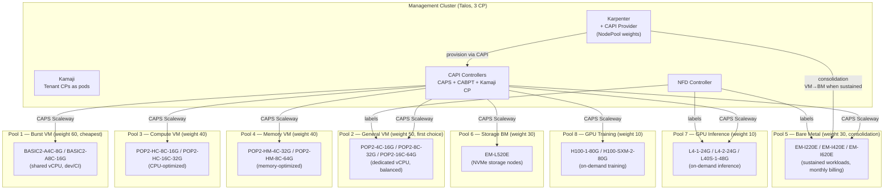
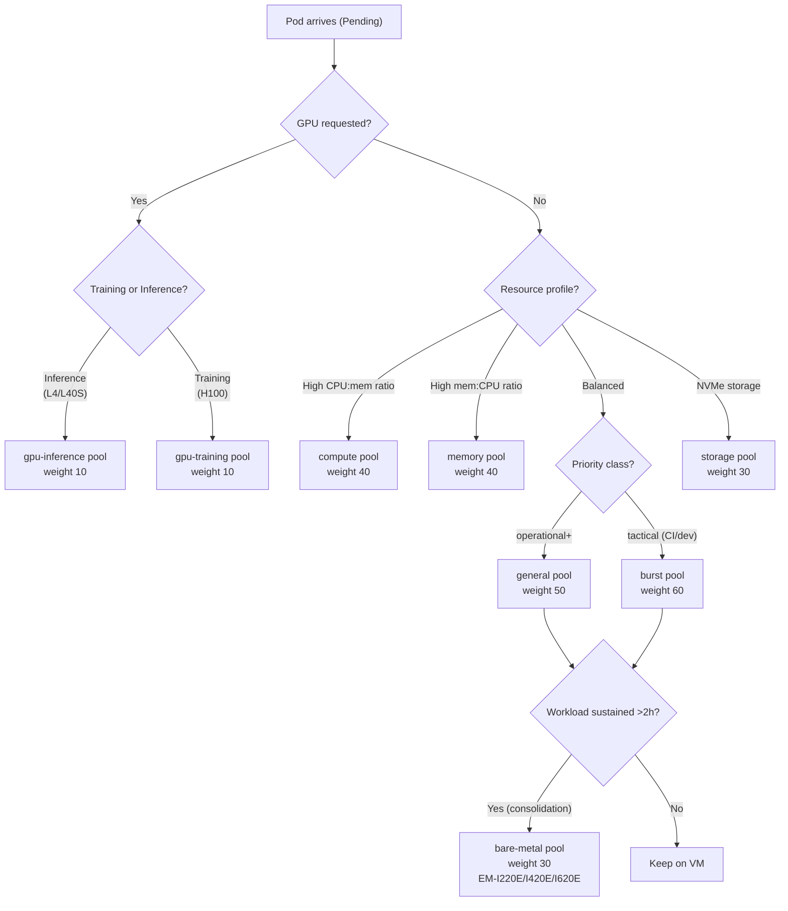

# ADR-024 : Architecture Autoscaling Hybride Cloud / Bare Metal

**Date** : 2026-03-20
**Statut** : Propose
**Decideurs** : Equipe plateforme

---

## 1. Resume executif

Ce document definit l'architecture d'autoscaling hybride combinant cloud VMs (premiere intention, boot rapide, facturation/min) et bare metal (active par consolidation quand le workload est soutenu >2h). Le modele est **inverse du traditionnel** : le cloud VM est le premier choix (scale-to-zero, pas de gaspillage), le bare metal intervient par consolidation naturelle de Karpenter quand le prix/vCPU/h est plus bas sur du bare metal mensuel. Le management cluster Talos orchestre l'ensemble via Kamaji (tenant control planes), CAPI (provisioning), Karpenter avec le provider CAPI (scaling + consolidation), et NFD (hardware discovery).

---

## 2. Contexte

### Etat actuel

La plateforme dispose d'un cluster Talos statique (3 CP + 3 workers) deploye sur un seul provider a la fois (local, Scaleway, Outscale). Le scaling est manuel : ajout de noeuds via Terraform ou Matchbox (ADR-019). Les pics de charge necessitent un surdimensionnement permanent ou une intervention humaine.

### Besoin

| Contrainte | Explication |
|-----------|-------------|
| Cout maitrise | Le bare metal mensuel est ~50% moins cher que le cloud VM pour une charge soutenue (break-even a 365h/mois) |
| Burst rapide | Les pics de charge (CI, inference ML, evenements) necessitent des noeuds en < 5 min |
| GPU on-demand | Les workloads ML/inference necessitent des GPUs L4/H100, mais pas en permanence |
| Zero gaspillage | Les noeuds cloud inutilises doivent etre liberes rapidement (billed/min) |
| Hardware heterogene | Tous les noeuds n'ont pas les memes capacites (NVMe, GPU, CPU gen) |

---

## 3. Decision

### 3.1 Architecture cible

Le management cluster Talos (3 CP) heberge les composants d'orchestration. Les workloads tournent sur 8 pools de noeuds specialises, tous avec `minValues: 0` (full scale-to-zero). Le modele est **cloud-first** : les VMs sont le premier choix (boot rapide, facturation/min), le bare metal est active par consolidation quand le workload est soutenu.



### 3.2 NodePools (pools de noeuds)

Tous les pools ont `minValues: 0` — full scale-to-zero capability. Le cloud VM est le **premier choix** (weight le plus eleve parmi les pools generaux). Le bare metal est active par consolidation Karpenter quand le workload est soutenu >2h car son prix/vCPU/h est plus bas en commitment mensuel.

| Pool | Weight | Min | Max | Types instance Scaleway | Facturation | Usage |
|------|--------|-----|-----|------------------------|-------------|-------|
| **general** | 50 | 0 | 50 | POP2-4C-16G, POP2-8C-32G, POP2-16C-64G | Minute | Premier choix — dedicated vCPU, balanced |
| **compute** | 40 | 0 | 30 | POP2-HC-8C-16G, POP2-HC-16C-32G | Minute | CPU-optimized, compilations, batch |
| **memory** | 40 | 0 | 20 | POP2-HM-4C-32G, POP2-HM-8C-64G | Minute | Memory-optimized, caches, databases |
| **burst** | 60 | 0 | 100 | BASIC2-A4C-8G, BASIC2-A8C-16G | Minute | Le moins cher — shared vCPU, dev/CI |
| **bare-metal** | 30 | 0 | 6 | EM-I220E, EM-I420E, EM-I620E | Horaire (mensuel prefere) | Consolide par Karpenter quand soutenu |
| **storage** | 30 | 0 | 4 | EM-L520E | Horaire (mensuel prefere) | NVMe storage nodes |
| **gpu-inference** | 10 | 0 | 8 | L4-1-24G, L4-2-24G, L40S-1-48G | Minute | On-demand inference ML |
| **gpu-training** | 10 | 0 | 4 | H100-1-80G, H100-SXM-2-80G | Minute | On-demand training ML |

**Pourquoi le modele est inverse (cloud-first) :**

Les workloads courts (<1h) sont moins chers sur VM (facturation a la minute). Le bare metal a l'heure perd de l'argent pour les bursts courts. La consolidation Karpenter migre naturellement les workloads soutenus vers le bare metal car le prix/vCPU/h y est plus bas (en engagement mensuel). Le bare metal mensuel est ~50% moins cher que le VM equivalent.

### 3.3 Node Feature Discovery (NFD)

NFD est deploye comme DaemonSet sur tous les noeuds. Il detecte automatiquement les capacites hardware et applique des labels Kubernetes.

**Exemple de labels NFD sur un noeud bare metal :**

```yaml
# Labels automatiques NFD (node.kubernetes.io/feature-*)
feature.node.kubernetes.io/cpu-model.vendor_id: AuthenticAMD
feature.node.kubernetes.io/cpu-model.family: 25        # Zen3
feature.node.kubernetes.io/cpu-hardware_multithreading: "true"
feature.node.kubernetes.io/cpu-cpuid.AVX512F: "true"
feature.node.kubernetes.io/storage-nonrotationaldisk: "true"  # NVMe
feature.node.kubernetes.io/pci-0300.present: "true"     # GPU class
feature.node.kubernetes.io/system-os_release.ID: talos
# Labels custom via NodeFeatureRule
st4ck.io/pool: bare-metal
st4ck.io/nvme: "true"
st4ck.io/cpu-gen: zen3
st4ck.io/ram-speed: ddr5-4800
st4ck.io/disk-type: nvme-gen4
```

**Exemple de labels NFD sur un noeud GPU :**

```yaml
feature.node.kubernetes.io/pci-10de.present: "true"     # NVIDIA vendor
feature.node.kubernetes.io/pci-10de.sriov.capable: "true"
nvidia.com/gpu.product: NVIDIA-L4
nvidia.com/gpu.memory: "24576"
st4ck.io/pool: cloud-gpu
st4ck.io/gpu-model: nvidia-l4
st4ck.io/gpu-vram: "24g"
```

**NodeFeatureRule (regles custom) :**

```yaml
apiVersion: nfd.k8s-sigs.io/v1alpha1
kind: NodeFeatureRule
metadata:
  name: st4ck-pool-labels
spec:
  rules:
    - name: nvme-capable
      labels:
        st4ck.io/nvme: "true"
      matchFeatures:
        - feature: storage.block
          matchExpressions:
            nonrotationaldisk: {op: IsTrue}

    - name: gpu-workload
      labels:
        st4ck.io/gpu-model: "@pci-10de.device"
      matchFeatures:
        - feature: pci.device
          matchExpressions:
            vendor: {op: In, value: ["10de"]}  # NVIDIA
```

**Utilisation dans un Deployment :**

```yaml
spec:
  template:
    spec:
      affinity:
        nodeAffinity:
          requiredDuringSchedulingIgnoredDuringExecution:
            nodeSelectorTerms:
              - matchExpressions:
                  - key: st4ck.io/nvme
                    operator: In
                    values: ["true"]
          preferredDuringSchedulingIgnoredDuringExecution:
            - weight: 80
              preference:
                matchExpressions:
                  - key: st4ck.io/pool
                    operator: In
                    values: ["bare-metal"]
```

### 3.4 Scheduling cost-aware — Karpenter NodePool weights

Karpenter utilise les **NodePool weights** pour choisir le pool le moins cher capable de satisfaire les pods pending. Quand plusieurs NodePools matchent, Karpenter selectionne celui avec le poids le plus eleve. Le modele cloud-first signifie que les VMs sont preferees pour le provisionnement initial, et la consolidation migre vers le bare metal quand le workload est soutenu.

```yaml
apiVersion: karpenter.sh/v1
kind: NodePool
metadata:
  name: burst
spec:
  weight: 60    # Priorite maximale — le moins cher (shared vCPU)
  template:
    spec:
      requirements:
        - key: st4ck.io/pool
          operator: In
          values: ["burst"]
        - key: node.kubernetes.io/instance-type
          operator: In
          values: ["BASIC2-A4C-8G", "BASIC2-A8C-16G"]
      nodeClassRef:
        group: infrastructure.cluster.x-k8s.io
        kind: CAPINodeClass
        name: burst
  limits:
    cpu: "800"
    memory: "1600Gi"
  disruption:
    consolidationPolicy: WhenEmptyOrUnderutilized
    consolidateAfter: 10m
---
apiVersion: karpenter.sh/v1
kind: NodePool
metadata:
  name: general
spec:
  weight: 50    # Premier choix pour workloads production
  template:
    spec:
      requirements:
        - key: st4ck.io/pool
          operator: In
          values: ["general"]
        - key: node.kubernetes.io/instance-type
          operator: In
          values: ["POP2-4C-16G", "POP2-8C-32G", "POP2-16C-64G"]
      nodeClassRef:
        group: infrastructure.cluster.x-k8s.io
        kind: CAPINodeClass
        name: general
  limits:
    cpu: "800"
    memory: "3200Gi"
  disruption:
    consolidationPolicy: WhenEmptyOrUnderutilized
    consolidateAfter: 10m   # Liberation rapide — facturation a la minute
---
apiVersion: karpenter.sh/v1
kind: NodePool
metadata:
  name: compute
spec:
  weight: 40    # CPU-optimized
  template:
    spec:
      requirements:
        - key: st4ck.io/pool
          operator: In
          values: ["compute"]
        - key: node.kubernetes.io/instance-type
          operator: In
          values: ["POP2-HC-8C-16G", "POP2-HC-16C-32G"]
      nodeClassRef:
        group: infrastructure.cluster.x-k8s.io
        kind: CAPINodeClass
        name: compute
  limits:
    cpu: "480"
    memory: "960Gi"
  disruption:
    consolidationPolicy: WhenEmptyOrUnderutilized
    consolidateAfter: 10m
---
apiVersion: karpenter.sh/v1
kind: NodePool
metadata:
  name: memory
spec:
  weight: 40    # Memory-optimized
  template:
    spec:
      requirements:
        - key: st4ck.io/pool
          operator: In
          values: ["memory"]
        - key: node.kubernetes.io/instance-type
          operator: In
          values: ["POP2-HM-4C-32G", "POP2-HM-8C-64G"]
      nodeClassRef:
        group: infrastructure.cluster.x-k8s.io
        kind: CAPINodeClass
        name: memory
  limits:
    cpu: "160"
    memory: "1280Gi"
  disruption:
    consolidationPolicy: WhenEmptyOrUnderutilized
    consolidateAfter: 10m
---
apiVersion: karpenter.sh/v1
kind: NodePool
metadata:
  name: bare-metal
spec:
  weight: 30    # Active par consolidation — pas en premier choix
  template:
    spec:
      requirements:
        - key: st4ck.io/pool
          operator: In
          values: ["bare-metal"]
        - key: node.kubernetes.io/instance-type
          operator: In
          values: ["EM-I220E", "EM-I420E", "EM-I620E"]
      nodeClassRef:
        group: infrastructure.cluster.x-k8s.io
        kind: CAPINodeClass
        name: bare-metal
  limits:
    cpu: "384"      # 6 x 64 cores
    memory: "3456Gi" # 6 x 576 GB
  disruption:
    consolidationPolicy: WhenEmptyOrUnderutilized
    consolidateAfter: 120m  # 2h — ne consolider que si workload vraiment soutenu
---
apiVersion: karpenter.sh/v1
kind: NodePool
metadata:
  name: storage
spec:
  weight: 30    # NVMe storage bare metal
  template:
    spec:
      requirements:
        - key: st4ck.io/pool
          operator: In
          values: ["storage"]
        - key: node.kubernetes.io/instance-type
          operator: In
          values: ["EM-L520E"]
      nodeClassRef:
        group: infrastructure.cluster.x-k8s.io
        kind: CAPINodeClass
        name: storage
  limits:
    cpu: "128"
    memory: "1024Gi"
  disruption:
    consolidationPolicy: WhenEmptyOrUnderutilized
    consolidateAfter: 120m
---
apiVersion: karpenter.sh/v1
kind: NodePool
metadata:
  name: gpu-inference
spec:
  weight: 10    # GPU on-demand uniquement
  template:
    spec:
      requirements:
        - key: st4ck.io/pool
          operator: In
          values: ["gpu-inference"]
        - key: node.kubernetes.io/instance-type
          operator: In
          values: ["L4-1-24G", "L4-2-24G", "L40S-1-48G"]
        - key: nvidia.com/gpu
          operator: Exists
      nodeClassRef:
        group: infrastructure.cluster.x-k8s.io
        kind: CAPINodeClass
        name: gpu-inference
  limits:
    nvidia.com/gpu: "8"
  disruption:
    consolidationPolicy: WhenEmptyOrUnderutilized
    consolidateAfter: 5m    # Tres couteux — liberer des que possible
---
apiVersion: karpenter.sh/v1
kind: NodePool
metadata:
  name: gpu-training
spec:
  weight: 10    # GPU on-demand uniquement
  template:
    spec:
      requirements:
        - key: st4ck.io/pool
          operator: In
          values: ["gpu-training"]
        - key: node.kubernetes.io/instance-type
          operator: In
          values: ["H100-1-80G", "H100-SXM-2-80G"]
        - key: nvidia.com/gpu
          operator: Exists
      nodeClassRef:
        group: infrastructure.cluster.x-k8s.io
        kind: CAPINodeClass
        name: gpu-training
  limits:
    nvidia.com/gpu: "4"
  disruption:
    consolidationPolicy: WhenEmptyOrUnderutilized
    consolidateAfter: 5m
```

**Instance selection decision tree :**



**Logique de scaling :**

1. Pods pending → Karpenter evalue les NodePools dont les requirements matchent
2. NodePool weights trient : burst (60) → general (50) → compute/memory (40) → bare-metal/storage (30) → GPU (10)
3. Le NodePool avec le poids le plus eleve ET les requirements satisfaits est choisi
4. **Cloud VM en premier** : boot rapide (1-2 min), facturation a la minute, zero gaspillage
5. **Consolidation vers bare metal** : quand Karpenter detecte un workload soutenu >2h, il consolide sur du bare metal (prix/vCPU/h plus bas en mensuel)
6. Si les pods requierent des GPUs (resource request `nvidia.com/gpu`) → GPU pool exclusivement
7. Tous les pools scale-to-zero : aucun noeud idle si pas de workload

### 3.5 Karpenter consolidation — Migration VM vers bare metal

Karpenter gere nativement la consolidation : il identifie les noeuds sous-utilises et regroupe les workloads sur moins de noeuds, liberant les noeuds vides. Dans le modele cloud-first, la consolidation joue un role cle : elle migre naturellement les workloads soutenus vers le bare metal car le prix/vCPU/h y est plus bas.

**Mecanisme :**

1. Karpenter surveille en continu l'utilisation de chaque noeud
2. Un pod arrive → provisionne sur VM (weight 50/60, boot 1-2 min, facturation/min)
3. Quand un workload est soutenu >2h sur VM, Karpenter evalue si le bare metal (weight 30 mais prix/vCPU/h plus bas) est plus efficace
4. Karpenter provisionne un noeud bare metal, migre les pods, termine la VM
5. Si le workload diminue, le bare metal est libere (si hourly) ou conserve (si engagement mensuel)
6. Pas besoin de CRD custom, de Descheduler, ou d'operateur Go — Karpenter gere tout nativement

**Consolidation avancee — remplacement de petites VMs par moins de grosses :**

Karpenter peut aussi remplacer N petites VMs par M grosses VMs (N > M) quand c'est plus efficace. Par exemple, 4x POP2-4C-16G → 1x POP2-16C-64G si le bin-packing est meilleur. Ou consolider 3x POP2-16C-64G → 1x EM-I420E (bare metal mensuel, 44% moins cher).

**Parametres de consolidation par pool :**

| Pool | consolidateAfter | Raison |
|------|-----------------|--------|
| burst | 10 min | Shared vCPU, CI/dev — liberer des que idle |
| general | 10 min | Facturation a la minute, liberation rapide |
| compute | 10 min | Facturation a la minute |
| memory | 10 min | Facturation a la minute |
| bare-metal | 120 min | Ne consolider que si workload vraiment soutenu (2h) |
| storage | 120 min | NVMe bare metal, donnees persistantes |
| gpu-inference | 5 min | Tres couteux — liberer des que possible |
| gpu-training | 5 min | Tres couteux — liberer des que possible |

**Seuils de terminaison :**

| Pool | Idle → terminaison | Engagement | Politique |
|------|-------------------|------------|-----------|
| Cloud VM (burst/general/compute/memory) | >10 min idle | Aucun | Terminer immediatement |
| Bare metal (hourly) | >120 min idle | Aucun | Terminer |
| Bare metal (monthly) | >120 min idle | Mensuel | Conserver (deja paye) |
| GPU (inference/training) | >5 min idle | Aucun | Terminer immediatement |

**Disruption budgets :**

```yaml
disruption:
  budgets:
    # Pas de disruption pendant les heures de bureau
    - nodes: "0"
      schedule: "0 8 * * 1-5"   # Lun-Ven 8h
      duration: 10h              # Jusqu'a 18h
    # Hors heures : disruption normale
    - nodes: "10%"
```

### 3.6 Karpenter + CAPI Provider

Le provider `karpenter-provider-cluster-api` (kubernetes-sigs) permet a Karpenter d'utiliser Cluster API comme backend d'infrastructure. Cela decouple Karpenter d'AWS et le rend compatible avec tout provider CAPI (Scaleway, bare metal, etc.).

**Architecture :**

```
Karpenter Core
    │
    ▼
karpenter-provider-cluster-api
    │ → CAPINodeClass (custom resource)
    │
    ▼
CAPI Controllers
    ├── CAPS (Scaleway) → VMs + Elastic Metal
    └── CABPT (Talos) → Machine configs
```

**CAPINodeClass (reference dans chaque NodePool) :**

```yaml
apiVersion: infrastructure.cluster.x-k8s.io/v1alpha1
kind: CAPINodeClass
metadata:
  name: cloud-vm
spec:
  machineDeploymentRef:
    name: cloud-vm
    namespace: capi-system
  # Le provider CAPI traduit en MachineDeployment.spec.replicas
```

**Avantages par rapport a Cluster Autoscaler :**

| Critere | Cluster Autoscaler | Karpenter + CAPI |
|---------|-------------------|-----------------|
| Scheduling | Reactive (pods pending) | Reactive + proactif (consolidation) |
| Cost optimization | Priority expander (ConfigMap) | NodePool weights + consolidation native |
| Migration cloud → BM | Necessite cost controller custom + Descheduler | Natif via consolidation + weights |
| Configuration | Node groups statiques | NodePools flexibles, instance diversity |
| Bin-packing | Basique | Avance (remplacement N petits → M gros noeuds) |
| Composants a maintenir | CA + cost controller Go + Descheduler | Karpenter seul |

### 3.7 GPU on-demand — Scale from zero

L'architecture GPU combine NVIDIA GPU Operator, NFD et Karpenter pour un scaling 0 → N transparent.

**Sequence de scaling GPU :**

1. Un pod avec `resources.limits: nvidia.com/gpu: 1` est cree → Pending
2. Karpenter detecte le pod unschedulable
3. Le NodePool `cloud-gpu` est le seul avec `nvidia.com/gpu: Exists` → selectionne
4. Karpenter provisionne un noeud Scaleway GPU via le CAPI provider
5. Le noeud demarre avec un **taint startup** : `st4ck.io/gpu-validating:NoSchedule`
6. NVIDIA GPU Operator installe les drivers + device plugin
7. NFD detecte le GPU et applique les labels
8. Le DaemonSet validateur (benchmark) verifie le GPU (cuda-smi + matmul test)
9. Si le benchmark passe → le taint est supprime → le pod est schedule

### 3.8 Node benchmarking — Taint gate

Chaque nouveau noeud est tainted au demarrage et ne recoit du trafic qu'apres validation.

```yaml
apiVersion: apps/v1
kind: DaemonSet
metadata:
  name: node-validator
  namespace: kube-system
spec:
  selector:
    matchLabels:
      app: node-validator
  template:
    metadata:
      labels:
        app: node-validator
    spec:
      tolerations:
        - key: st4ck.io/node-validating
          operator: Exists
          effect: NoSchedule
        - key: st4ck.io/gpu-validating
          operator: Exists
          effect: NoSchedule
      initContainers:
        # Phase 1 : benchmark disque
        - name: fio-bench
          image: ljishen/fio:3.36
          command: ["sh", "-c"]
          args:
            - |
              fio --name=seq-read --bs=128k --size=1G \
                  --rw=read --direct=1 --numjobs=4 \
                  --output-format=json > /results/fio.json
              # Seuil : > 500 MB/s seq read pour NVMe
              SPEED=$(jq '.jobs[0].read.bw_bytes' /results/fio.json)
              [ "$SPEED" -gt 500000000 ] || exit 1
          volumeMounts:
            - name: results
              mountPath: /results
            - name: bench-vol
              mountPath: /bench
        # Phase 2 : benchmark CPU
        - name: stress-bench
          image: alexeiled/stress-ng:0.17.08
          command: ["sh", "-c"]
          args:
            - |
              stress-ng --cpu 0 --cpu-method matrixprod \
                        --metrics --timeout 30s \
                        --yaml /results/stress.yaml
              # Verifier que le score CPU est dans les normes
        # Phase 3 : benchmark reseau
        - name: iperf-bench
          image: networkstatic/iperf3:3.16
          command: ["sh", "-c"]
          args:
            - |
              iperf3 -c iperf-server.kube-system.svc -J > /results/iperf.json
              # Seuil : > 1 Gbps
              BW=$(jq '.end.sum_received.bits_per_second' /results/iperf.json)
              [ "${BW%.*}" -gt 1000000000 ] || exit 1
      containers:
        - name: taint-remover
          image: bitnami/kubectl:1.35
          command: ["sh", "-c"]
          args:
            - |
              NODE=$(cat /etc/hostname)
              kubectl taint node $NODE st4ck.io/node-validating- || true
              kubectl taint node $NODE st4ck.io/gpu-validating- || true
              kubectl annotate node $NODE st4ck.io/validated-at=$(date -Iseconds)
              sleep infinity
      volumes:
        - name: results
          emptyDir: {}
        - name: bench-vol
          emptyDir:
            sizeLimit: 2Gi
```

### 3.9 Downscaling safety — Buffer pods et delais

**Buffer pods (pause containers) :**

```yaml
apiVersion: apps/v1
kind: Deployment
metadata:
  name: capacity-buffer
  namespace: kube-system
spec:
  replicas: 2    # Maintient 2 noeuds de reserve
  selector:
    matchLabels:
      app: capacity-buffer
  template:
    metadata:
      labels:
        app: capacity-buffer
    spec:
      priorityClassName: buffer  # priorite -1 → evicte en premier
      containers:
        - name: pause
          image: registry.k8s.io/pause:3.10
          resources:
            requests:
              cpu: "3500m"      # ~1 noeud de capacite par replica
              memory: "28Gi"
      affinity:
        podAntiAffinity:
          requiredDuringSchedulingIgnoredDuringExecution:
            - labelSelector:
                matchLabels:
                  app: capacity-buffer
              topologyKey: kubernetes.io/hostname
```

### 3.10 Priority preemption tiers

```yaml
---
apiVersion: scheduling.k8s.io/v1
kind: PriorityClass
metadata:
  name: mission-critical
value: 1000000
globalDefault: false
preemptionPolicy: PreemptLowerPriority
description: "Ingress controllers, DNS, monitoring agents, CNI"
---
apiVersion: scheduling.k8s.io/v1
kind: PriorityClass
metadata:
  name: operational
value: 100000
globalDefault: true
preemptionPolicy: PreemptLowerPriority
description: "Production APIs, databases, identity stack"
---
apiVersion: scheduling.k8s.io/v1
kind: PriorityClass
metadata:
  name: tactical
value: 10000
globalDefault: false
preemptionPolicy: PreemptLowerPriority
description: "Batch jobs, CI pipelines, backups"
---
apiVersion: scheduling.k8s.io/v1
kind: PriorityClass
metadata:
  name: buffer
value: -1
globalDefault: false
preemptionPolicy: Never
description: "Capacity reservation — evicted first to make room"
```

**Matrice de preemption :**

| Pod preempte ↓ / Pod arrivant → | mission-critical | operational | tactical | buffer |
|----------------------------------|-----------------|-------------|----------|--------|
| mission-critical | Non | Non | Non | Non |
| operational | Oui | Non | Non | Non |
| tactical | Oui | Oui | Non | Non |
| buffer | Oui | Oui | Oui | Non |

### 3.11 Reseau hybride — KubeSpan

KubeSpan est integre nativement dans Talos et fournit un mesh WireGuard automatique entre tous les noeuds, y compris ceux derriere du NAT.

**Pourquoi KubeSpan et pas Cilium WireGuard :**

| Critere | KubeSpan (Talos) | Cilium WireGuard |
|---------|-----------------|------------------|
| NAT traversal | Oui (STUN + relay) | Non (necessite connectivite directe) |
| Configuration | Zero-touch (active dans machine config) | Manuelle (Cilium Helm values) |
| Couche | L3 (WireGuard kernel, sous Kubernetes) | L3-L4 (au-dessus de Kubernetes) |
| Multi-cloud | Natif (decouvert via Kubernetes API) | Necessite Cluster Mesh |
| Performance | Lineaire (kernel WireGuard) | Lineaire (kernel WireGuard) |

```yaml
# Machine config Talos — activation KubeSpan
machine:
  network:
    kubespan:
      enabled: true
      allowDownPeerBypass: false  # Pas de trafic non chiffre
cluster:
  discovery:
    enabled: true
    registries:
      kubernetes:
        disabled: false
      service:
        disabled: false
```

**Modele de trafic :**

```
bare-metal (DC) ←──WireGuard──→ cloud-vm (Scaleway VPC)
bare-metal (DC) ←──WireGuard──→ cloud-gpu (Scaleway VPC)
cloud-vm       ←──VPC direct──→ cloud-gpu (meme VPC)
```

Scaleway a **zero frais d'egress**, ce qui rend le trafic inter-pool economiquement neutre.

### 3.12 Ingress — bare metal first

Les noeuds bare metal gerent exclusivement le trafic externe (ingress) :

- **25 Gbps** de bande passante (Elastic Metal)
- **IPs stables** (pas de rotation comme les VMs cloud)
- Cilium en mode DSR (Direct Server Return) pour le retour client

Les noeuds cloud sont du **burst compute pur** : ils ne recoivent pas de trafic externe.

```yaml
# IngressClass avec nodeAffinity bare metal
apiVersion: networking.k8s.io/v1
kind: IngressClass
metadata:
  name: external
spec:
  controller: cilium.io/ingress
---
# Cilium IngressController config
apiVersion: cilium.io/v2
kind: CiliumIngressController
metadata:
  name: external
spec:
  nodeSelector:
    st4ck.io/pool: bare-metal
  serviceType: LoadBalancer
  loadBalancerMode: dedicated
```

---

## 4. Strategie de pricing Scaleway

### 4.1 Faits cles du pricing

| Facteur | Detail |
|---------|--------|
| **Bare metal mensuel vs horaire** | Le commitment mensuel est ~50% moins cher que le tarif horaire |
| **Bare metal vs VM equivalent** | EM-I620E (64C/576G): EUR 599.99/mo vs POP2-64C-256G: EUR 1,715.50/mo = **65% d'economie** |
| **Break-even bare metal mensuel** | Rentable si le workload tourne >50% du mois (>365h sur 730h) |
| **Egress Scaleway** | **EUR 0** — aucun frais de bande passante sortante |
| **Facturation VM** | Par minute (granularite fine, zero gaspillage sur bursts courts) |
| **Facturation bare metal** | Par heure (granularite plus grosse, penalisant pour bursts <1h) |

### 4.2 Catalogue d'instances (region fr-par, mars 2026)

**Cloud VMs — facturation a la minute :**

| Pool | Instance | vCPU | RAM | Prix/h | Prix/mois (730h) | vCPU type |
|------|----------|------|-----|--------|-------------------|-----------|
| burst | BASIC2-A4C-8G | 4 | 8 GB | ~0.02 EUR | ~15 EUR | Shared |
| burst | BASIC2-A8C-16G | 8 | 16 GB | ~0.04 EUR | ~29 EUR | Shared |
| general | POP2-4C-16G | 4 | 16 GB | ~0.04 EUR | ~29 EUR | Dedicated |
| general | POP2-8C-32G | 8 | 32 GB | ~0.08 EUR | ~58 EUR | Dedicated |
| general | POP2-16C-64G | 16 | 64 GB | ~0.16 EUR | ~117 EUR | Dedicated |
| compute | POP2-HC-8C-16G | 8 | 16 GB | ~0.06 EUR | ~44 EUR | Dedicated |
| compute | POP2-HC-16C-32G | 16 | 32 GB | ~0.12 EUR | ~88 EUR | Dedicated |
| memory | POP2-HM-4C-32G | 4 | 32 GB | ~0.06 EUR | ~44 EUR | Dedicated |
| memory | POP2-HM-8C-64G | 8 | 64 GB | ~0.12 EUR | ~88 EUR | Dedicated |

**Bare Metal — facturation horaire ou engagement mensuel :**

| Pool | Instance | Cores | RAM | Prix/h | Prix/mois (mensuel) | Economie vs horaire |
|------|----------|-------|-----|--------|---------------------|---------------------|
| bare-metal | EM-I220E | 16C | 64 GB | ~0.25 EUR | ~99.99 EUR | ~45% |
| bare-metal | EM-I420E | 32C | 256 GB | ~0.55 EUR | ~249.99 EUR | ~38% |
| bare-metal | EM-I620E | 64C | 576 GB | ~1.20 EUR | ~599.99 EUR | ~31% |
| storage | EM-L520E | 32C | 256 GB | ~0.65 EUR | ~299.99 EUR | ~37% |

**GPU — facturation a la minute :**

| Pool | Instance | GPU | VRAM | Prix/h | Prix/mois (730h) |
|------|----------|-----|------|--------|-------------------|
| gpu-inference | L4-1-24G | 1x L4 | 24 GB | ~1.10 EUR | ~803 EUR |
| gpu-inference | L4-2-24G | 2x L4 | 48 GB | ~2.20 EUR | ~1,606 EUR |
| gpu-inference | L40S-1-48G | 1x L40S | 48 GB | ~2.50 EUR | ~1,825 EUR |
| gpu-training | H100-1-80G | 1x H100 | 80 GB | ~3.50 EUR | ~2,555 EUR |
| gpu-training | H100-SXM-2-80G | 2x H100 SXM | 160 GB | ~7.00 EUR | ~5,110 EUR |

### 4.3 Comparaison bare metal mensuel vs VM equivalent

| Comparaison | Bare metal (mensuel) | VM equivalent | Economie |
|-------------|---------------------|---------------|----------|
| EM-I220E (16C/64G) vs POP2-16C-64G | EUR 99.99/mo | EUR 117/mo | 15% |
| EM-I420E (32C/256G) vs 2x POP2-16C-64G | EUR 249.99/mo | EUR 234/mo | -7% (VM gagne) |
| EM-I620E (64C/576G) vs POP2-64C-256G | EUR 599.99/mo | EUR 1,715.50/mo | **65%** |
| EM-I620E (64C/576G) vs 4x POP2-16C-64G | EUR 599.99/mo | EUR 468/mo | -28% (VM gagne en CPU) |

Le bare metal est massivement gagnant **uniquement** quand on a besoin de beaucoup de RAM (576 GB vs 256 GB max en VM). Pour du CPU pur, les VMs POP2 sont parfois moins cheres.

### 4.4 Scenarios de cout mensuel — modele cloud-first

| Scenario | Full cloud (VMs) | Hybride (base BM + burst VM) | Economie |
|----------|-----------------|------------------------------|----------|
| **6 noeuds 24/7** | ~EUR 2,500/mo | ~EUR 1,390/mo | **44%** |
| **Burst 20 noeuds 4h/jour** | ~EUR 3,800/mo | ~EUR 1,600/mo | **58%** |

**Detail du scenario "6 noeuds 24/7" :**

| Configuration | Calcul | Total |
|---------------|--------|-------|
| Full cloud | 6x POP2-8C-32G @ EUR 58/mo x 6 + overhead | ~EUR 2,500/mo |
| Hybride | 2x EM-I420E mensuel @ EUR 250 + 2x POP2-8C-32G burst @ EUR 58 x 0.3 | ~EUR 1,390/mo |

**Detail du scenario "burst 20 noeuds 4h/jour" :**

| Configuration | Calcul | Total |
|---------------|--------|-------|
| Full cloud | 6x POP2 base + 14x POP2 burst 4h/j x 30j | ~EUR 3,800/mo |
| Hybride | 3x EM-I620E mensuel + 14x BASIC2-A8C-16G burst 4h/j x 30j | ~EUR 1,600/mo |

### 4.5 Break-even analysis

```
                Prix/mois
                    ^
                    |
    EUR 876 ........|..............*...............  Bare metal hourly (730h x EUR 1.20)
                    |            /
                    |           /
    EUR 600 ........|.........X...................  Bare metal monthly (EUR 599.99 fixe)
                    |        /|
                    |       / |
                    |      /  |
                    |     /   |
                    |    /    |
                    |   /     |
                    |  /      |
                    | /       |
                    |/________|________________>  Heures d'utilisation/mois
                    0       365h (50%)       730h
                         Break-even
```

**Regle simple :** si un workload tourne >50% du mois (>365h), l'engagement mensuel bare metal est rentable. En dessous, les VMs facturees a la minute sont moins cheres.

### 4.6 Strategie de commitment

| Duree workload | Strategie optimale | Pool Karpenter |
|---------------|-------------------|----------------|
| < 10 min | VM burst (shared vCPU) | burst (weight 60) |
| 10 min - 2h | VM general (dedicated vCPU) | general (weight 50) |
| 2h - 365h/mois | VM general (pas encore rentable en BM) | general (weight 50) |
| > 365h/mois (soutenu) | Bare metal mensuel (consolide par Karpenter) | bare-metal (weight 30) |
| GPU < 1h | GPU on-demand | gpu-inference/training (weight 10) |
| GPU soutenu | GPU reserved (si disponible) | gpu-inference/training (weight 10) |

---

## 5. Isolation multi-tenant

### 5.1 Exigence cle

L'operateur de la plateforme KaaS doit pouvoir upgrader, patcher, backup/restore, scaler les clusters tenants — mais ne doit **pas** pouvoir lire les Secrets, ConfigMaps sensibles, ni exec dans les pods des tenants.

### 5.2 Kamaji et l'isolation des donnees tenant

Kamaji fournit une isolation "hard multi-tenancy" : chaque tenant dispose de son propre control plane (kube-apiserver, controller-manager, scheduler) tournant comme pods dans le management cluster. Cependant, l'operateur du management cluster a acces aux pods du control plane, et donc potentiellement au datastore (etcd/PostgreSQL) contenant les secrets des tenants.

**Options de datastore Kamaji :**

| Backend | Isolation | Encryption at rest |
|---------|-----------|-------------------|
| kamaji-etcd (multi-tenant) | RBAC par prefix de cle — un tenant ne voit pas les donnees d'un autre | Possible via etcd encryption |
| kamaji-etcd (dedie par tenant) | Fort — datastore separe par tenant | Possible via etcd encryption |
| PostgreSQL (kine) | Schema/DB par tenant possible | Encryption via TDE ou disque |

### 5.3 EncryptionConfiguration par tenant

Chaque TenantControlPlane Kamaji execute son propre kube-apiserver. Il est donc possible de configurer une **EncryptionConfiguration distincte par tenant**, avec une cle de chiffrement unique par tenant.

**Mecanisme :**

1. Le kube-apiserver de chaque tenant recoit sa propre `EncryptionConfiguration` via un Secret Kubernetes monte dans le pod
2. Les Secrets et ConfigMaps du tenant sont chiffres dans etcd avec une cle que l'operateur ne connait pas
3. L'operateur peut toujours backup/restore le datastore etcd (sauvegarde opaque chiffree)
4. Seul le kube-apiserver du tenant (avec la bonne cle) peut dechiffrer les donnees

```yaml
# EncryptionConfiguration par tenant (montee dans le pod kube-apiserver)
apiVersion: apiserver.config.k8s.io/v1
kind: EncryptionConfiguration
resources:
  - resources:
      - secrets
      - configmaps
    providers:
      - kms:
          apiVersion: v2
          name: tenant-kms
          endpoint: unix:///var/run/kms/kms.sock  # KMS plugin par tenant
      - identity: {}  # Fallback lecture (donnees non chiffrees legacy)
```

**Option KMS externe par tenant :**

Chaque tenant peut fournir ses propres credentials KMS (OpenBao, AWS KMS, GCP KMS), garantissant que l'operateur n'a jamais acces aux KEK (Key Encryption Keys) du tenant.

### 5.4 Comparaison Kamaji vs vCluster

| Critere | Kamaji | vCluster |
|---------|--------|---------|
| Isolation control plane | Fort — kube-apiserver dedie par tenant | Fort — API server virtuel par tenant |
| Isolation workers | Fort — worker nodes dedies par tenant | Faible — partage des workers du host cluster |
| Isolation reseau | Fort (noeuds separes) | Moyen (namespace-level, NetworkPolicies) |
| Encryption per-tenant | Oui — EncryptionConfig par kube-apiserver | Oui — EncryptionConfig dans le vCluster |
| Operator data access | Acces au datastore (mitige par KMS per-tenant) | Acces aux Secrets syncronises dans le host (mitige par KMS) |
| Overhead | Faible — CP comme pods (~200 MB/tenant) | Faible — syncer + API server (~150 MB/tenant) |
| Worker isolation | Natif (nodes dedies) | Necessite des constructions supplementaires |

**vCluster** offre une isolation plus legere (tout tourne sur les memes workers), mais les workloads des tenants partagent les noeuds du host cluster. Les PersistentVolumes et les Secrets synchronises dans le host sont accessibles a l'operateur.

**Kamaji** offre une isolation plus forte car chaque tenant a ses propres worker nodes, mais necessite plus de ressources infrastructure.

### 5.5 Approche recommandee (simplest secure)

L'approche la plus simple offrant une securite suffisante pour un KaaS :

1. **Kamaji avec etcd dedie par tenant** (ou prefix isole avec RBAC strict)
2. **EncryptionConfiguration par tenant** avec provider KMS — chaque tenant a une cle de chiffrement gere par un KMS externe (OpenBao in-cluster avec policy par tenant)
3. **RBAC management cluster** : le ServiceAccount de l'operateur n'a pas de droits `get/list` sur les Secrets dans les namespaces des tenant CPs
4. **Admission policy (Kyverno)** : bloquer `kubectl exec` vers les pods des tenants depuis le management cluster
5. **Network policies** : isoler le trafic entre tenant workers et management cluster (sauf le traffic control plane necessaire)

**Ce que l'operateur PEUT faire :**

- Upgrader les versions Kubernetes des tenants (modifier TenantControlPlane spec)
- Scaler les workers (modifier MachineDeployment replicas via Karpenter/CAPI)
- Backup/restore etcd (sauvegarde opaque — donnees chiffrees)
- Patcher les noeuds (rolling update via CAPI/Talos)
- Monitorer les metriques (CPU, memoire, reseau) sans voir les donnees applicatives

**Ce que l'operateur NE PEUT PAS faire :**

- Lire les Secrets Kubernetes des tenants (chiffres avec une cle KMS tenant-only)
- Exec dans les pods des tenants (bloque par admission policy)
- Acceder aux ConfigMaps sensibles (chiffres at rest)
- Dechiffrer les backups etcd (la KEK est dans le KMS du tenant)

---

## 6. Composants CAPI

### Stack CAPI dans le management cluster

| Composant | Version | Role |
|-----------|---------|------|
| Cluster API (core) | v1.9+ | Orchestration lifecycle |
| CAPS (Scaleway) | v0.2.0 | Infrastructure provider — provisionne VMs et Elastic Metal |
| CABPT (Talos) | v0.6+ | Bootstrap provider — genere machine configs Talos |
| Kamaji CP provider | v1.0+ | Control plane provider — tenant CPs comme pods |
| Karpenter + CAPI provider | v1.1+ | Autoscaling + consolidation via CAPI MachineDeployments |

### Interaction Karpenter ↔ CAPI

```
Pod Pending
    │
    ▼
Karpenter
    │ → NodePool weights (burst 60 → general 50 → compute/memory 40 → bare-metal 30 → GPU 10)
    │
    ▼
karpenter-provider-cluster-api
    │ → Traduit en CAPI MachineDeployment.spec.replicas++
    │
    ▼
CAPS → Scaleway API → Instance creee
    │
    ▼
CABPT → Machine config Talos injecte
    │
    ▼
Noeud boot → join cluster → NFD labels → benchmark → taint removed → Pod scheduled
```

**Consolidation (scale-down) :**

```
Karpenter detecte noeud VM sous-utilise ou workload soutenu >2h
    │
    ▼
Evaluation : pods replaçables sur bare metal (prix/vCPU/h plus bas) ?
    │ → Consolide vers bare-metal mensuel si soutenu
    │
    ▼
Drain graceful du noeud VM
    │
    ▼
karpenter-provider-cluster-api
    │ → MachineDeployment.spec.replicas--
    │
    ▼
CAPS → Scaleway API → Instance supprimee
```

---

## 7. Alternatives considerees

| Option | Avantages | Inconvenients | Decision |
|--------|-----------|---------------|----------|
| **Karpenter + CAPI provider (choisi)** | Consolidation native, cost-aware via weights, zero custom code | Provider CAPI experimental, pas encore GA | **Retenu** |
| Cluster Autoscaler + cost controller custom | Mature, bien documente | Necessite operateur Go custom (~2000 LOC) + Descheduler | Rejete |
| VPA seul (sans scaling horizontal) | Simple | Ne gere pas le scaling de noeuds | Rejete |
| Scaling manuel + alertes | Zero complexite | Temps de reaction humain = gaspillage | Rejete |
| Full cloud (pas de bare metal) | Simplicite operationnelle | Jusqu'a 65% plus cher en charge soutenue (EM-I620E vs POP2-64C) | Rejete |
| Full bare metal (pas de cloud) | Cout fixe previsible | Impossible de gerer les pics, GPU non rentable | Rejete |
| Cilium WireGuard (au lieu de KubeSpan) | Integre dans la CNI existante | Pas de NAT traversal, echec en hybride | Rejete |
| Live migration (kubevirt) | Zero downtime theorique | Immature pour conteneurs, complexe | Rejete |
| vCluster (au lieu de Kamaji) | Isolation legere, rapide a deployer | Workers partages — isolation plus faible pour KaaS | Rejete pour KaaS (garde pour dev/test) |

---

## 8. Consequences

### Positives

- **Cout optimise** : cloud-first (facturation/min, zero gaspillage), consolidation naturelle vers bare metal mensuel quand soutenu (jusqu'a 65% d'economie)
- **Scaling automatique** : 0 intervention humaine pour les pics (< 5 min pour un noeud cloud VM)
- **Consolidation native** : Karpenter migre automatiquement les workloads VM vers le bare metal mensuel quand soutenu >2h, sans custom code
- **GPU on-demand** : scale from zero, paiement a la minute, pas de GPU idle
- **Hardware-aware** : NFD garantit que les workloads atterrissent sur du hardware adapte
- **Zero egress** : Scaleway ne facture pas le trafic sortant (economie significative en hybride)
- **Reseau transparent** : KubeSpan fournit un mesh WireGuard sans configuration reseau manuelle
- **Preemption claire** : 4 tiers de priorite evitent les evictions non controlees
- **Zero custom code** : Karpenter remplace le cost controller custom Go + Descheduler
- **Isolation tenant** : EncryptionConfiguration per-tenant + KMS garantit que l'operateur ne peut pas lire les donnees tenant

### Negatives

- **karpenter-provider-cluster-api experimental** : pas encore GA, risque de bugs ou breaking changes
- **CAPS Scaleway v0.2.0** : provider CAPI jeune, risque de bugs ou fonctionnalites manquantes
- **Temps de boot bare metal** : 5-15 min (Elastic Metal) vs 1-2 min (VM) — le bare metal ne peut pas absorber les pics instantanes
- **Benchmark gate** : ajoute 1-2 min de latence avant qu'un noeud accepte du trafic
- **KubeSpan overhead** : ~5% de throughput en moins vs trafic direct (chiffrement WireGuard)
- **KMS per-tenant** : ajoute de la complexite operationnelle (gestion des cles, rotation)

### Risques

| Risque | Probabilite | Impact | Mitigation |
|--------|-------------|--------|-----------|
| karpenter-provider-cluster-api instable | Moyenne | Eleve | Tests intensifs en staging, fallback Cluster Autoscaler |
| CAPS Scaleway instable (v0.2.0) | Moyenne | Eleve | Tests intensifs en staging, fallback Terraform |
| Oscillation scale-up/down (flapping) | Moyenne | Moyen | Buffer pods + consolidateAfter differencies par pool |
| GPU Operator incompatibilite Talos | Faible | Eleve | Valider la matrice kernel/driver avant deploy |
| KubeSpan STUN failure (NAT type 3) | Faible | Eleve | Relay via noeud bare metal (IP publique stable) |
| Noeud defaillant passe le benchmark | Tres faible | Eleve | Monitoring continu post-validation (Tetragon + node-problem-detector) |
| Fuite de cle KMS tenant | Faible | Eleve | Rotation automatique des KEK, audit logs OpenBao |

---

## 9. Plan d'implementation

| Phase | Tache | Effort | Prerequis |
|-------|-------|--------|-----------|
| Phase 1 | NFD DaemonSet + NodeFeatureRules custom | 1 jour | Cluster existant |
| Phase 2 | PriorityClasses (4 tiers) + buffer pods | 0.5 jour | - |
| Phase 3 | CAPI controllers (core + CAPS + CABPT) | 2 jours | - |
| Phase 4 | Kamaji CP provider + tenant test | 2 jours | Phase 3 |
| Phase 5 | Karpenter + karpenter-provider-cluster-api | 2 jours | Phase 3 |
| Phase 6 | NodePools (bare-metal, cloud-vm, cloud-gpu) + CAPINodeClasses | 2 jours | Phase 3, 5 |
| Phase 7 | NVIDIA GPU Operator + scale-from-zero GPU | 2 jours | Phase 1, 6 |
| Phase 8 | Node validator DaemonSet (fio + stress-ng + iperf3) | 2 jours | Phase 1 |
| Phase 9 | KubeSpan activation + tests hybrides | 1 jour | Phase 6 |
| Phase 10 | Ingress bare-metal-only (Cilium DSR) | 0.5 jour | Phase 6 |
| Phase 11 | Isolation tenant : EncryptionConfig per-tenant + KMS OpenBao | 3 jours | Phase 4 |
| Phase 12 | Isolation tenant : RBAC + Kyverno admission policies | 1 jour | Phase 11 |
| Phase 13 | Tests end-to-end (scaling, consolidation, GPU, failover, isolation) | 3 jours | Toutes |
| **Total** | | **~22 jours** | |

---

## 10. Questions ouvertes

| # | Question | Proprietaire | Statut |
|---|----------|-------------|--------|
| 1 | CAPS Scaleway v0.2.0 supporte-t-il Elastic Metal via CAPI ? | Equipe plateforme | A valider |
| 2 | karpenter-provider-cluster-api : quand la GA ? Stabilite suffisante pour prod ? | Equipe plateforme | A evaluer |
| 3 | Quel backend etcd pour Kamaji ? (PostgreSQL partage vs etcd dedie) | Equipe plateforme | A decider |
| 4 | GPU Operator sur Talos : kernel module loading sans systemd ? | Equipe plateforme | A tester |
| 5 | KubeSpan performance avec 50+ noeuds cloud (overhead mesh) ? | Equipe plateforme | A benchmarker |
| 6 | Buffer pods : 2 replicas suffisent-ils ? Predictive scaling via Prometheus ? | Equipe plateforme | A evaluer |
| 7 | KMS per-tenant : OpenBao policies par tenant ou KMS externe (cloud) ? | Equipe plateforme | A decider |
| 8 | Rotation des KEK tenant : automatique (CronJob) ou manuelle ? | Equipe plateforme | A definir |

---

## Appendice

### A. Glossaire

| Terme | Definition |
|-------|-----------|
| CABPT | Cluster API Bootstrap Provider Talos — genere les machine configs Talos pour CAPI |
| CAPI | Cluster API — framework Kubernetes pour le lifecycle management de clusters |
| CAPINodeClass | Custom resource du provider Karpenter CAPI — reference un MachineDeployment |
| CAPS | Cluster API Provider Scaleway — infrastructure provider pour Scaleway |
| DSR | Direct Server Return — le retour client bypasse le load balancer |
| KEK | Key Encryption Key — cle maitre dans le KMS qui chiffre les DEK |
| Karpenter | Autoscaler Kubernetes — provisionne des noeuds via NodePools avec consolidation native |
| KubeSpan | Mesh WireGuard integre a Talos (NAT traversal, zero config) |
| NFD | Node Feature Discovery — detecte le hardware et applique des labels Kubernetes |
| NodePool | Resource Karpenter definissant un groupe de noeuds avec requirements et weight |

### B. References

- [ADR-019 : Matchbox bare metal](019-matchbox-bare-metal.md)
- [ADR-020 : Kamaji KaaS](020-kamaji-kaas.md)
- [ADR-023 : Disaster Recovery](023-disaster-recovery-architecture.md)
- [Cluster API Book](https://cluster-api.sigs.k8s.io/)
- [CAPS Scaleway](https://github.com/scaleway/cluster-api-provider-scaleway)
- [Kamaji](https://github.com/clastix/kamaji)
- [Kamaji etcd](https://github.com/clastix/kamaji-etcd)
- [Node Feature Discovery](https://kubernetes-sigs.github.io/node-feature-discovery/)
- [Karpenter](https://karpenter.sh/)
- [karpenter-provider-cluster-api](https://github.com/kubernetes-sigs/karpenter-provider-cluster-api)
- [Karpenter + CAPI integration proposal](https://github.com/kubernetes-sigs/cluster-api/blob/main/docs/community/20231018-karpenter-integration.md)
- [KubeSpan](https://www.talos.dev/v1.12/talos-guides/network/kubespan/)
- [Kubernetes EncryptionConfiguration](https://kubernetes.io/docs/tasks/administer-cluster/encrypt-data/)
- [Kubernetes KMS provider](https://kubernetes.io/docs/tasks/administer-cluster/kms-provider/)
- [Scaleway Pricing](https://www.scaleway.com/en/pricing/)
