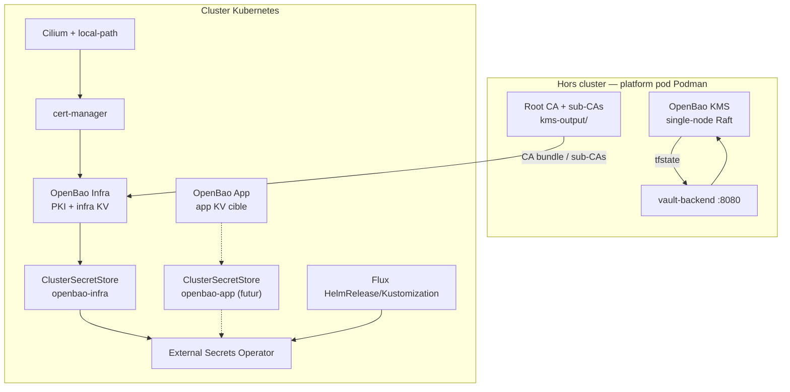

# ADR-033 : OpenBao, ESO et frontière OpenTofu/Flux

**Date** : 2026-06-14
**Statut** : Proposé
**Décideurs** : Équipe plateforme
**Reliés à** : ADR-007 (OpenBao), ADR-008 (secrets générés), ADR-009 (state backend), ADR-026 (static seal), ADR-028 (Flux owner-by-default), ADR-032 (PKI bootstrap)

## Contexte

La plateforme utilise plusieurs instances OpenBao, avec des rôles différents :

| Instance | Où | Rôle | Owner actuel |
|---|---|---|---|
| OpenBao KMS bootstrap | Podman, hors cluster | Backend d'état OpenTofu via `vault-backend`, racine PKI, artefacts `kms-output/` | OpenTofu module `bootstrap/` |
| OpenBao Infra | Kubernetes, namespace `secrets` | PKI plateforme, KV v2 source d'ESO, SSH CA, transit, auth Kubernetes | OpenTofu `stacks/pki/` puis manifests Flux |
| OpenBao App | Kubernetes, namespace `secrets` | Coffre applicatif séparé, prévu pour les secrets workloads | Déployé, peu ou pas consommé aujourd'hui |

La documentation amont OpenBao recommande le chart Helm officiel `openbao/openbao` pour Kubernetes. Aucun opérateur OpenBao officiel n'est requis pour gérer les clusters OpenBao. L'ancien projet `openbao-secrets-operator` n'est pas le chemin recommandé ; pour matérialiser les secrets Kubernetes, le modèle retenu est External Secrets Operator avec son provider Vault/OpenBao.

## Décision proposée

1. **Ne pas ajouter d'opérateur OpenBao non officiel.**
   OpenBao reste déployé par Helm, via OpenTofu pour le bootstrap Day-1 et via Flux HelmRelease quand le handoff est sûr.

2. **Faire d'ESO l'opérateur canonique de synchronisation de secrets.**
   Les `ClusterSecretStore` utilisent `provider.vault`, `path: secret`, `version: v2`, auth Kubernetes et CA provider. C'est le modèle supporté pour OpenBao.

3. **Clarifier les trois domaines OpenBao.**
   - Bootstrap KMS : hors cluster, requis avant tout `tofu init`, pas exposé aux workloads.
   - OpenBao Infra : backend plateforme, PKI, source ESO `openbao-infra`.
   - OpenBao App : coffre applicatif cible ; soit documenté comme réservé, soit câblé par un futur `ClusterSecretStore openbao-app` avec policies dédiées.

4. **Réduire Terraform à ce qui casse les cycles de bootstrap.**
   OpenTofu doit rester propriétaire de l'infrastructure et des dépendances impossibles à créer par Flux avant que Flux existe : CNI, StorageClass par défaut, cert-manager minimal, OpenBao Infra minimal, ESO/ClusterSecretStore minimal, Flux bootstrap. Le reste doit migrer vers Flux/Kustomize/HelmRelease.

5. **Assumer les Jobs de bootstrap comme des objets Kustomize/Flux, sauf vrai chart Helm.**
   Les annotations `helm.sh/hook` ne sont honorées que si le Job est rendu par Helm. Si un Job est appliqué par Kustomize, il doit être séquencé par `dependsOn`, `wait` et des probes/idempotence explicites.

## Architecture cible



## Frontière d'ownership cible

| Objet | Court terme | Cible |
|---|---|---|
| Platform pod, `vault-backend`, KMS bootstrap | OpenTofu | OpenTofu |
| Cilium + local-path | OpenTofu | OpenTofu Day-1, Flux drift possible si handoff explicite |
| cert-manager bootstrap | OpenTofu | OpenTofu Day-1 ou Flux avec CRDs garanties |
| OpenBao Infra | OpenTofu + séquencement 1→3 | Handoff Flux seulement après procédure HA sûre |
| OpenBao App | OpenTofu aujourd'hui | Flux HelmRelease, après clarification du rôle app secrets |
| ESO + CRDs | OpenTofu aujourd'hui pour casser le catch-22 | Version unique ; handoff Flux explicite ou Tofu minimal documenté |
| ClusterSecretStore `openbao-infra` | OpenTofu/Flux selon phase | Flux/Kustomize une fois ESO prêt |
| ExternalSecret / PushSecret applicatifs | Flux | Flux |
| Jobs de bootstrap PKI/secrets | Terraform shim + Kustomize Job | Flux Kustomization `dependsOn` + `wait`, ou vrai hook dans un chart contrôlé |

## Plan de migration

### Phase 1 — Documentation et contrats

- Mettre à jour les docs pour distinguer OpenBao KMS, OpenBao Infra et OpenBao App.
- Amender ADR-007/008/009/032 plutôt que réécrire l'historique.
- Documenter que le provider ESO `vault` est volontaire pour OpenBao.

### Phase 2 — Versions et ownership

- Aligner une version OpenBao unique entre OpenTofu, Flux et bootstrap avant upgrade.
- Aligner une version ESO unique entre OpenTofu et Flux.
- Supprimer toute double gestion d'un même Helm release avec versions divergentes.

### Phase 3 — Plus Flux, moins Terraform

- Déplacer les ExternalSecrets/PushSecrets et les Jobs idempotents vers Flux/Kustomize.
- Remplacer les `terraform_data` de pilotage Kubernetes par des Jobs observables, avec RBAC minimal et logs Kubernetes.
- Ajouter `ClusterSecretStore openbao-app` seulement quand des secrets applicatifs doivent réellement quitter `openbao-infra`.

### Phase 4 — Hardening production

- Garder ADR-026 comme risque accepté hors prod, mais bloquer `prod-*` tant que le static seal n'a pas une solution KMS-wrap/HSM/équivalent.
- Désactiver l'injector OpenBao tant qu'aucun workload ne consomme d'annotations d'injection.
- Ajouter des checks CI qui détectent les drifts de versions OpenBao/ESO entre Tofu, Flux et miroir d'images.

## Conséquences

### Positives

- Modèle compréhensible : un OpenBao de bootstrap, un OpenBao plateforme, un OpenBao applicatif.
- Moins de logique bash dans Terraform.
- Meilleure observabilité des bootstrap jobs via `kubectl logs` et Flux status.
- Alignement avec les chemins supportés : OpenBao Helm officiel + ESO.

### Négatives

- Le handoff OpenTofu → Flux doit être explicite pour éviter les doubles owners.
- Les Jobs Kustomize nécessitent une discipline d'idempotence et de `dependsOn`.
- OpenBao App reste à justifier ou câbler ; sinon il coûte de l'opérationnel sans consommateur.

## Validation attendue

```bash
make validate
kubectl get clustersecretstores
kubectl get externalsecrets -A
kubectl -n secrets exec openbao-infra-0 -c openbao -- bao status
kubectl -n secrets exec openbao-infra-0 -c openbao -- bao secrets list
flux get kustomizations -A
flux get helmreleases -A
```
