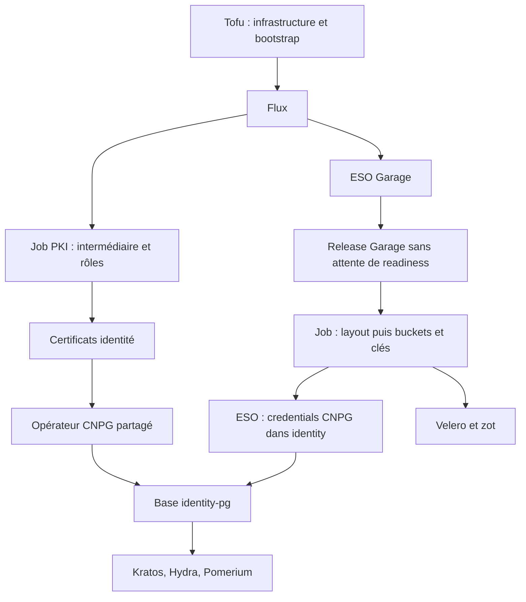

# ADR-043 : Propriété Flux des services de plateforme

**Date** : 2026-09-23
**Statut** : Accepté pour le code ; migration des clusters existants à exécuter
**Complète** : ADR-028, ADR-032, ADR-033

## Décision

Flux installe et réconcilie les services de plateforme dès leur première
installation. OpenTofu conserve l'infrastructure, Talos, Cilium, local-path,
cert-manager, les deux OpenBao, ESO, le ClusterSecretStore et le bootstrap
Flux. Le passage Raft 1 → 3 reste dans Tofu : transférer ce cycle nécessite
une validation dédiée. La génération des secrets et leur amorçage OpenBao
restent également dans Tofu, aux adresses d'état existantes.

Le périmètre de cette migration est le management cluster. Les stacks KaaS
optionnelles restent un chantier distinct ; leur état est décrit en ADR-044.

| Propriétaire | Ressources |
|---|---|
| Tofu | Infrastructure, Talos, CNI, stockage bootstrap, confiance, ESO, accès Git |
| Flux | CNPG partagé, bases, certificats applicatifs, identité, monitoring, sécurité, Garage, Velero, zot, VPA/KEDA/Prometheus Adapter |
| ESO | Secrets Kubernetes des consommateurs, y compris les credentials S3 CNPG |
| Job Garage | Layout initial, buckets, clés et Secrets source du namespace `storage` |

Les états `identity`, `security`, `storage` et `autoscaling` deviennent des états de migration.
Leurs blocs `removed { lifecycle { destroy = false } }` retirent la propriété
Tofu sans détruire les objets. Les configurations de providers restent présentes
pour permettre ce retrait sur les installations existantes.

Le dashboard Grafana vient du JSON de `stacks/monitoring/dashboards`, chargé
par un générateur Kustomize. ESO devient seul propriétaire de `grafana-admin` ;
son mot de passe reste généré et amorcé par l'état monitoring.

## Ordre

Garage n'est Ready qu'après application du layout : attendre sa readiness
dans Helm avant de lancer le Job créerait un cycle. La Kustomization suivante
attend la complétion du Job. Les changements de layout après initialisation
échouent explicitement et demandent une revue de topologie.
Les Jobs conservent leur complétion, sans TTL. Pour réexécuter un bootstrap
après modification de son script ou de son template, incrémenter le suffixe
du nom du Job dans la même révision ; modifier un ConfigMap seul ne le relance pas.

CNPG utilise `ca.crt` des mêmes Secrets que ses certificats serveur et
réplication, conformément au modèle cert-manager. Les deux anciens certificats
CA indépendants n'étaient pas les signataires de ces certificats feuilles.
La sauvegarde quotidienne utilise les six champs cron attendus par CNPG.

Le Job PKI est un Job Kustomize normal : les annotations Helm n'y déclenchent
aucun hook. Sa complétion est conservée ; l'autorité intermédiaire existante
est importée depuis `pki-infra-ca` si nécessaire, et son absence fait échouer
le Job. Le certificat racine et sa clé ne sont pas régénérés dans le cluster.

Les contrôles HA OpenBao interrogent les trois pods et exigent un leader
commun, avec un seul actif. La récupération qui supprimait automatiquement
les PVC après un timeout de readiness est retirée : les données sont conservées
et une incohérence Raft arrête l'opération.

Depuis la correction du 2026-09-26, `k8s-pki-apply` utilise deux phases :
amorçage à une réplique avec les blocs `initialize` uniquement pour les releases
neuves/incomplètes, puis seconde application retirant ces blocs **avant** de
passer à trois répliques dans Helm et de vérifier le leader commun.
Le test réel a reproduit le split-brain malgré l'attente du premier leader :
conserver `initialize` sur les nouveaux membres leur permet de créer leur
propre cluster ([OpenBao #3652](https://github.com/openbao/openbao/issues/3652)).
Les applications suivantes gardent
trois répliques. Un garde-fou Tofu interdit le mode bootstrap sur un StatefulSet
déjà à trois répliques et refuse de recréer un StatefulSet absent avec des PVC
existants. Les contrôles HA sont rejoués après changement de chart ou de values.
Si la seconde application échoue, relancer la cible Make : un Raft déjà à trois
ne repasse pas à une réplique. Les tests simulés ne remplacent pas une vraie
mise à jour de chart avec vérification du quorum ; `make upgrade` reste soumis
à cette recette avant utilisation en production.

Sur le banc local du 26 septembre, les deux clusters ont conservé leur identifiant
commun et retrouvé un leader unique après remplacement de leur pod 0. Le plan
Tofu suivant était vide ; Helm conservait trois répliques sans `initialize`.
Ce test ne constitue pas une montée de version de chart ni une récupération
d'un cluster existant en split-brain.

## Migration d'un cluster existant

Effectuer cette séquence **avant de publier la révision sur la référence
surveillée par Flux**. Retirer simplement un HelmRelease de Git provoquerait
sa désinstallation par pruning. Les blocs `removed` ne protègent que le côté
Tofu, pas le pruning Flux.

1. Sélectionner le contexte et sauvegarder les états et données persistantes
   (`make state-snapshot` et sauvegardes applicatives vérifiées).
2. Exécuter `KUBECONFIG=<chemin> bash scripts/flux-migrate-ownership.sh --check`.
3. Exécuter le même script avec `--prepare`. Il suspend la racine, désactive
   son pruning, puis retire uniquement les CR HelmRelease bootstrap historiques
   après suspension. Les releases Helm restent installées et Tofu les conserve.
   Si une opération Helm est encore en cours, le script s'arrête ; attendre
   sa fin et relancer. Les finalizers inconnus ne sont jamais supprimés.
   Le retrait des finalizers teste atomiquement l'UID et la `resourceVersion`
   relus : une mise à jour concurrente arrête le script sans supprimer le CR.
4. Examiner les plans de `identity`, `security`, `monitoring`, `storage`, `autoscaling` :
   les objets transférés doivent être oubliés, jamais détruits. Appliquer ces
   états avec les cibles Make habituelles. Ne pas lancer `destroy`.
5. Publier la révision, puis appliquer `flux-bootstrap` avec
   `TF_VAR_flux_migration_in_progress=true make flux-bootstrap-apply ...`.
   Reprendre la racine avec `flux resume kustomization management` et réconcilier
   la source puis la racine. Garder `prune: false` pendant cette première passe.
6. Vérifier la révision Git, les 18 HelmReleases, les Kustomizations enfants,
   la complétion des Jobs, les trois membres Raft et CNPG, et les credentials S3.
   Une réconciliation réussie actualise l'inventaire de la racine et oublie les
   anciens objets déplacés sans les supprimer.
7. Réappliquer `flux-bootstrap` sans `TF_VAR_flux_migration_in_progress` pour
   rétablir le pruning. Les anciens ConfigMaps de values bootstrap et certificats
   CA devenus inutiles peuvent ensuite être inventoriés et nettoyés séparément.

Sur un cluster neuf, `make k8s-up` effectue les étapes Tofu séquentiellement
puis crée Flux. Les états de migration sont vides, donc aucune suppression.
Les releases CNPG et Garage gardent leur nom et namespace Helm historiques.

## CI et arrêt

Woodpecker vérifie le code, les graphes et le rendu des charts atteignables
avec `verify-render.sh` et kubeconform épinglé. Flux assure la livraison day-2.
La reconstruction indépendante de l'infrastructure dans `.woodpecker.yml`
est retirée : elle utilisait des chemins d'état, credentials et noms d'image
différents du Makefile. Le provisionnement reste `make scaleway-up` dans un
environnement d'administration configuré ; il n'est plus lancé sur chaque push.

`k8s-down` supprime les graphes Flux feuilles avant leurs dépendances, pendant
que les contrôleurs sont encore disponibles. Une erreur de pruning arrête cette
phase ; les finalizers des bases ne sont plus arrachés pour masquer le problème.
Cette liste d'arrêt couvre les 16 enfants du graphe maintenu, pas les extensions
optionnelles ajoutées par un opérateur. Pour le provider Scaleway, suivre
d'abord [la procédure dédiée](../how-to/scaleway-autoscaling.md#reprise-et-arrêt) :
arrêter les nouvelles allocations, terminer les réservations et retirer les
graphes optionnels dans l'ordre inverse de leurs dépendances.
Le préflight refuse en lecture seule les Deployments/pods du provider natif
encore actifs dans `autoscaling` et les Kustomizations inattendues dans
`flux-system`, ainsi qu'une release Helm native non suspendue qui pourrait
réarmer le contrôleur. Il ne réduit aucun contrôleur. Une seconde lecture des handles
après suspension de la racine bloque la suppression si une réservation est
apparue entre-temps. Maintenir les producteurs désarmés pendant toute l'opération.

## Vérification

`make verify-local` contrôle les stacks et tests Tofu, le graphe Flux réellement
atteignable, l'unicité de propriété, les références et les cycles. Les tests
du graphe couvrent notamment le retour accidentel d'une release bootstrap.

`make verify-render` rend les releases atteignables, y compris le chart Garage
vendored et CNPG sans values personnalisées. Les Secrets ESO ne sont pas
évalués hors cluster ; les CRD sans schéma disponible restent signalés comme
ignorés par kubeconform. Ces contrôles ne remplacent pas le test d'installation
neuve puis la migration sur un cluster de recette avec données.
Ils ne constituent pas non plus une preuve fonctionnelle de VPA, du respect
d'un PDB en situation réelle ou d'un cycle Scaleway matériel.

## Sources

- [Adoption d'une release Helm existante](https://fluxcd.io/flux/migration/helm-operator-migration/)
- [Dépendances et pruning Kustomize](https://fluxcd.io/flux/components/kustomize/kustomizations/)
- [Retrait d'une ressource OpenTofu](https://opentofu.org/docs/language/resources/syntax/)
- [ESO Kubernetes et droits par namespace](https://external-secrets.io/v0.20.4/provider/kubernetes/)
