# Talos Sovereign Kubernetes Platform -- High-Level & Low-Level Design

**Version:** 1.0
**Date:** 2026-03-18
**Status:** Accepted

---

## Table of Contents

- [1. Executive Summary](#1-executive-summary)
- [2. Goals and Non-Goals](#2-goals-and-non-goals)
- [3. Context and Scope](#3-context-and-scope)
- [4. System Architecture (C4 Level 1 & 2)](#4-system-architecture-c4-level-1--2)
- [5. Capacity Estimations](#5-capacity-estimations)
- [6. Data Architecture](#6-data-architecture)
- [7. API Design (High-Level)](#7-api-design-high-level)
- [8. Security Architecture](#8-security-architecture)
- [9. Deployment Architecture](#9-deployment-architecture)
- [10. Observability](#10-observability)
- [11. Failure Modes and Mitigation](#11-failure-modes-and-mitigation)
- [12. Architecture Decision Records (ADRs)](#12-architecture-decision-records-adrs)
- [13. Low-Level Design: Bootstrap](#13-low-level-design-bootstrap)
- [14. Low-Level Design: Infrastructure Layer](#14-low-level-design-infrastructure-layer)
- [15. Low-Level Design: K8s Stacks](#15-low-level-design-k8s-stacks)
- [16. Low-Level Design: Secrets Flow](#16-low-level-design-secrets-flow)
- [17. Low-Level Design: CI/CD Pipeline](#17-low-level-design-cicd-pipeline)
- [18. Low-Level Design: GitOps Day-2](#18-low-level-design-gitops-day-2)
- [19. Open Questions and Risks](#19-open-questions-and-risks)
- [20. Appendix](#20-appendix)

---

## 1. Executive Summary

The Talos Sovereign Kubernetes Platform is a multi-environment, infrastructure-as-code system that deploys hardened Kubernetes clusters on Talos Linux v1.12 across multiple providers (Scaleway, local KVM/libvirt, VMware airgap). It provides a complete platform stack covering networking (Cilium eBPF), PKI (OpenBao + cert-manager), identity (Kratos/Hydra/Pomerium), security (Trivy/Tetragon/Kyverno), storage (Garage S3/Harbor/Velero), monitoring (VictoriaMetrics/VictoriaLogs/Headlamp), and GitOps (Flux v2).

The design prioritizes sovereign operation: all secrets are auto-generated (zero manual input), state is stored in OpenBao KMS with Raft consensus (no external cloud state backends), PKI uses a private three-tier CA hierarchy, and the system supports fully air-gapped deployments on VMware. OpenTofu handles initial deployment; Flux v2 manages day-2 reconciliation. A single podman pod bootstraps the entire platform (OpenBao 3-node, vault-backend, Gitea, Woodpecker CI) before any cluster exists.

Key tradeoffs: sequential deployment over parallel (reliability over speed), OpenBao over HashiCorp Vault (open-source sovereignty), Talos Linux over traditional distributions (immutability over flexibility), and self-hosted CI/Git over SaaS (data sovereignty over convenience).

---

## 2. Goals and Non-Goals

### Goals

- **G1:** Deploy a production-grade Kubernetes cluster (3 CP + 3 workers) on any supported provider with a single `make` command
- **G2:** Zero manual secret management -- all secrets auto-generated via `random_id`/`random_password` and stored in encrypted OpenBao KMS
- **G3:** Private PKI with three-tier CA hierarchy (Root CA > Infra CA / App CA) for all internal TLS
- **G4:** Full observability stack (metrics, logs, dashboards) deployed automatically
- **G5:** OIDC-based identity with zero-trust access proxy (Pomerium) for service access
- **G6:** Supply-chain security: image signing verification (Cosign/Kyverno), vulnerability scanning (Trivy), runtime observability (Tetragon)
- **G7:** Self-hosted S3-compatible storage (Garage), container registry (Harbor), and backup/DR (Velero)
- **G8:** GitOps day-2 management via Flux v2, sourcing from self-hosted Gitea
- **G9:** Support air-gapped VMware deployments with pre-built OVA images
- **G10:** Automated CI/CD via Woodpecker CI, triggered on push to main

### Non-Goals

- **NG1:** Multi-cluster federation or mesh (single cluster per environment)
- **NG2:** Public-facing ingress controller or external DNS automation (internal services only)
- **NG3:** Managed Kubernetes services (EKS, GKE, AKS) -- Talos Linux bare-metal/VM only
- **NG4:** Application-level CI/CD (Woodpecker handles infra pipeline only)
- **NG5:** GPU workload scheduling or ML inference optimization
- **NG6:** Multi-tenancy with namespace-level isolation (single-tenant platform)

---

## 3. Context and Scope

### System Context Diagram (C4 Level 1)

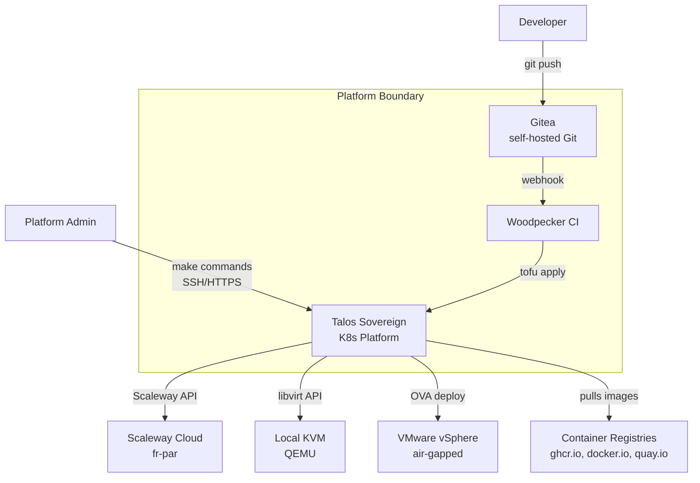

### Actors

| Actor | Role | Access Method |
|-------|------|--------------|
| Platform Admin | Deploys/manages infrastructure | `make` CLI, `kubectl`, `talosctl` |
| Developer | Pushes code, triggers CI | Git push to Gitea |
| Woodpecker CI | Automated deployment pipeline | Runs tofu inside containers |
| Flux v2 | Day-2 GitOps reconciliation | Watches Gitea repo via SSH |

### System Boundary

**In scope:** Kubernetes cluster provisioning, platform stack deployment, PKI, identity, monitoring, security, storage, GitOps, CI/CD pipeline, state management.

**Out of scope:** Application workloads, user-facing services, external DNS management, CDN, email.

---

## 4. System Architecture (C4 Level 2)

### Container Diagram

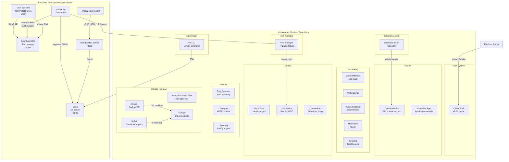

### Container Inventory

| Container | Technology | Responsibility | Namespace | Scaling |
|-----------|-----------|---------------|-----------|---------|
| OpenBao KMS | OpenBao 2.5.1, Raft | TF state + cluster secrets + transit unseal | podman (bootstrap) | Single Raft node |
| vault-backend | gherynos/vault-backend | HTTP backend for OpenTofu state | podman (bootstrap) | Stateless proxy |
| Gitea | Gitea 1.22 rootless | Self-hosted Git, OAuth for WP | podman (bootstrap) | Single instance |
| Woodpecker | Woodpecker v3 | CI/CD pipeline execution | podman (bootstrap) | Server + 1 agent |
| Cilium | Cilium 1.17.13 | CNI + kube-proxy replacement (eBPF) | kube-system | DaemonSet |
| OpenBao Infra | OpenBao (Helm) | In-cluster PKI + infra secrets | secrets | StatefulSet x1 |
| OpenBao App | OpenBao (Helm) | In-cluster application secrets | secrets | StatefulSet x1 |
| cert-manager | cert-manager | Automatic TLS from infra sub-CA | cert-manager | Deployment |
| VictoriaMetrics | vm-k8s-stack | Metrics collection + alerting + Grafana | monitoring | VMSingle + VMAgent |
| VictoriaLogs | victoria-logs-single | Centralized log storage | monitoring | StatefulSet |
| Headlamp | Headlamp | Kubernetes dashboard UI | monitoring | Deployment |
| Kratos | Ory Kratos | Identity management (users, flows) | identity | Deployment |
| Hydra | Ory Hydra | OAuth2 server + OIDC provider | identity | Deployment |
| Pomerium | Pomerium | Zero-trust access proxy | identity | Deployment |
| Trivy Operator | Trivy | Vulnerability + SBOM scanning | security | Deployment |
| Tetragon | Tetragon | eBPF runtime security | security | DaemonSet |
| Kyverno | Kyverno | Policy enforcement (Cosign verify) | security | Deployment |
| local-path-provisioner | Rancher LPP | Default StorageClass | storage | Deployment |
| Garage | Garage v2.2.0 | S3-compatible object storage | garage | StatefulSet x3 |
| Harbor | Harbor | Container image registry | storage | Multiple deployments |
| Velero | Velero | Backup/restore to Garage S3 | storage | Deployment |
| Flux v2 | Flux | GitOps reconciliation | flux-system | Multiple controllers |
| ESO | External Secrets Operator | OpenBao to K8s secret sync | external-secrets | Deployment |

---

## 5. Capacity Estimations

This is a sovereign infrastructure platform (not user-facing SaaS). Sizing is driven by cluster workload capacity and operational overhead rather than user traffic.

### Cluster Sizing

| Parameter | Value | Basis |
|-----------|-------|-------|
| Control plane nodes | 3 | etcd quorum requirement |
| Worker nodes | 3 | Platform stack + headroom for workloads |
| CP instance type (Scaleway) | DEV1-M | 3 vCPU, 4 GB RAM |
| Worker instance type (Scaleway) | DEV1-L | 4 vCPU, 8 GB RAM |
| Ephemeral disk per node | 25 GiB | Local-path + container storage |
| Total cluster vCPU | 21 | (3x3) + (3x4) |
| Total cluster RAM | 36 GiB | (3x4) + (3x8) |

### Storage Estimations

| Data Category | Size | Retention | Formula |
|---------------|------|-----------|---------|
| etcd (3 CP Raft) | ~2 GiB | Perpetual | K8s objects + state |
| OpenBao KMS state | ~100 MiB | Perpetual (Raft snapshots) | tfstate x 7 stacks x ~1 MiB |
| VictoriaMetrics | ~5 GiB/month | 30 days default | ~250 active series x 1 sample/15s x 4B |
| VictoriaLogs | ~2 GiB/month | 30 days default | 6 nodes x ~100 log lines/s x 500B avg |
| Garage S3 (Velero) | ~10 GiB/month | 90 day backups | Daily full backup ~300 MiB |
| Garage S3 (Harbor) | ~20 GiB | Grows with images | Platform images + cache |
| Total persistent storage | ~50 GiB initial | -- | Sum of above |

### Bandwidth Estimations

| Flow | Bandwidth | Notes |
|------|-----------|-------|
| Metrics scraping | ~5 Mbps | VMAgent scrapes all pods every 15s |
| Log collection | ~2 Mbps | DaemonSet tailing container logs |
| Cilium VXLAN overlay | ~10 Mbps baseline | Inter-node pod traffic |
| Flux Git polling | Negligible | 5-minute interval, SSH |
| Image pulls (initial) | ~2 GiB burst | One-time on deploy, ~30 Helm charts |
| Harbor registry traffic | ~50 Mbps peak | CI image push/pull |

### Resource Budget per Stack

| Stack | CPU Request | Memory Request | Pod Count |
|-------|------------|---------------|-----------|
| Cilium | 200m x 6 | 256Mi x 6 | 6 (DaemonSet) + 1 operator + 1 relay |
| PKI (OpenBao x2 + cert-manager) | 500m | 512Mi | 4 |
| Monitoring (VM + VLogs + Grafana + Headlamp) | 1500m | 2 GiB | 8 |
| Identity (Kratos + Hydra + Pomerium) | 600m | 768Mi | 5 |
| Security (Trivy + Tetragon + Kyverno) | 400m + 100m x 6 | 512Mi + 128Mi x 6 | 3 + 6 (DaemonSet) |
| Storage (LPP + Garage + Harbor + Velero) | 1200m | 2 GiB | 12 |
| Flux + ESO | 300m | 384Mi | 6 |
| **Total platform overhead** | **~6 vCPU** | **~8 GiB** | **~50 pods** |
| **Available for workloads** | **~15 vCPU** | **~28 GiB** | -- |

---

## 6. Data Architecture

### Data Flow Diagram

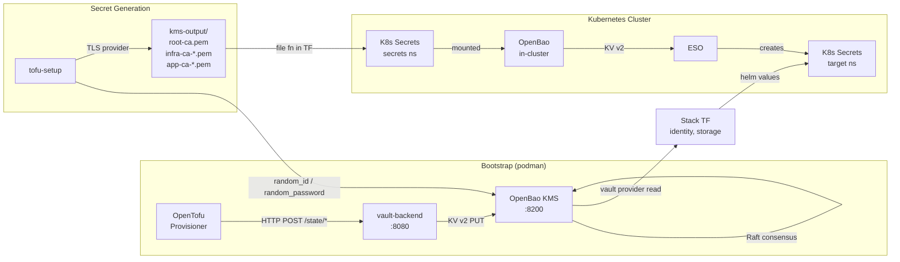

### State Storage Model

```
OpenBao KV v2 (secret/)
├── data/tfstate/
│   ├── scaleway        → Scaleway cluster infra state
│   ├── cni             → Cilium stack state
│   ├── monitoring      → Monitoring stack state
│   ├── pki             → PKI stack state
│   ├── identity        → Identity stack state
│   ├── security        → Security stack state
│   ├── storage         → Storage stack state
│   └── flux-bootstrap  → Flux stack state
├── data/cluster/
│   ├── identity        → Hydra, Pomerium, OIDC secrets
│   └── storage         → Garage, Harbor secrets
└── metadata/tfstate/*-lock  → State locking
```

### PKI Hierarchy

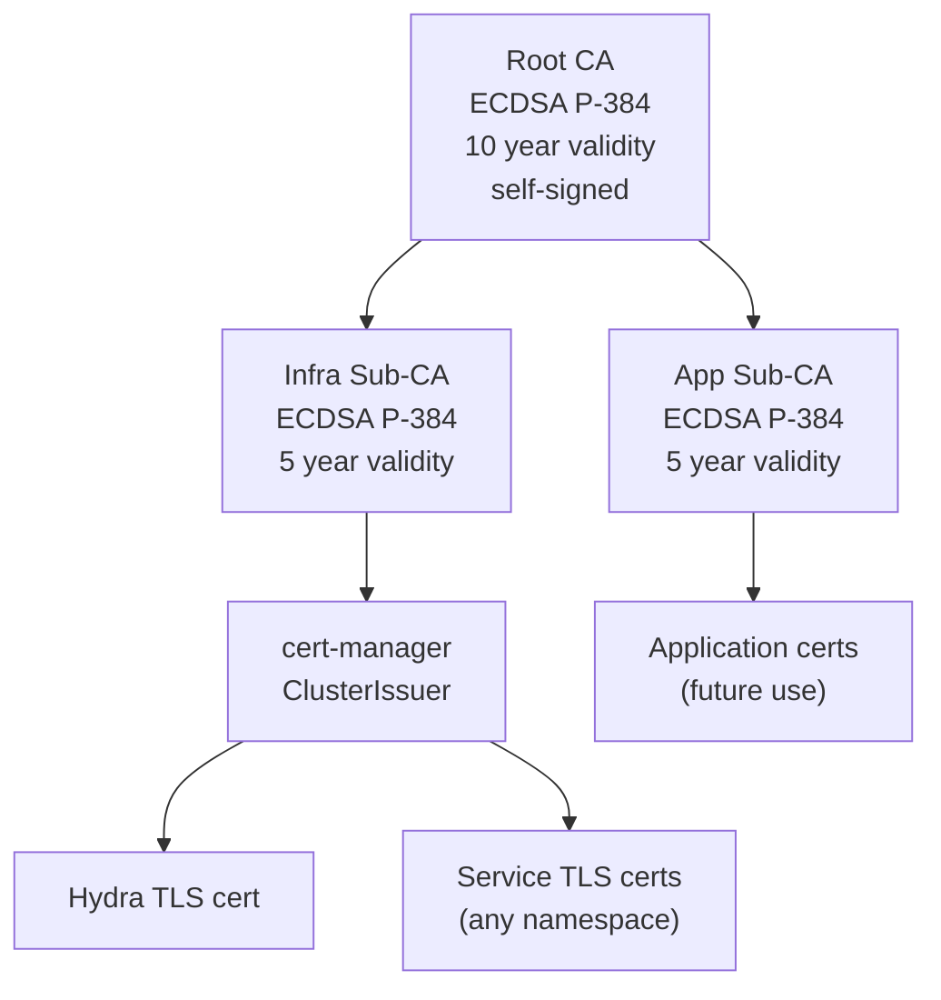

### Backup & Recovery

| Strategy | Tool | Target | RPO | RTO |
|----------|------|--------|-----|-----|
| TF state backup | `make state-snapshot` | Raft snapshot file | 0 (on-demand) | ~5 min (restore) |
| K8s resource backup | Velero | Garage S3 (velero-backups bucket) | Daily scheduled | ~15 min |
| etcd backup | Talos built-in | Included in Velero | Daily | ~10 min |
| Container images | Harbor | Garage S3 (harbor-registry bucket) | Continuous (push) | 0 (always available) |

---

## 7. API Design (High-Level)

The platform does not expose application-level APIs. The key interfaces are:

### Internal API Surfaces

| Interface | Protocol | Port | Purpose | Auth |
|-----------|----------|------|---------|------|
| Kubernetes API | HTTPS | 6443 | Cluster management | mTLS (kubeconfig) |
| Talos API | gRPC+TLS | 50000 | Node management | mTLS (talosconfig) |
| OpenBao KMS | HTTP | 8200 | State + secrets | Token (TF_HTTP_PASSWORD) |
| vault-backend | HTTP | 8080 | TF state proxy | Token (in Authorization header) |
| Gitea | HTTP/SSH | 3000/2222 | Git + OAuth | Basic auth / SSH key |
| Woodpecker | HTTP/gRPC | 8000/9000 | CI UI + agent comms | OAuth (via Gitea) |
| Hydra | HTTPS | 4444/4445 | OIDC public/admin | TLS cert (internal-ca) |
| Garage | HTTP | 3900 | S3-compatible API | Access/secret key pairs |
| Harbor | HTTP | 80 | OCI registry | Admin password |
| Grafana | HTTP | 3000 (in-cluster 80) | Dashboards | Admin password |
| Headlamp | HTTP | 4466 (via port-forward) | K8s UI | ServiceAccount token |

### OpenTofu Backend Protocol

```
Client (tofu) → HTTP → vault-backend (:8080)

GET    /state/{name}        → Read state
POST   /state/{name}        → Write state  (body = JSON state)
LOCK   /state/{name}        → Acquire lock (creates {name}-lock in KV)
UNLOCK /state/{name}        → Release lock (deletes {name}-lock)

Auth: Authorization: Basic TOKEN:<TF_HTTP_PASSWORD>
Proxy: vault-backend translates to OpenBao KV v2 paths:
       /state/cni → secret/data/tfstate/cni
```

---

## 8. Security Architecture

### Authentication Model

| Layer | Mechanism | Details |
|-------|-----------|---------|
| Kubernetes API | mTLS | Talos-generated kubeconfig with client certs |
| Talos API | mTLS | talosconfig with per-cluster client certs |
| OIDC (K8s) | JWT via Hydra | apiServer configured with `--oidc-issuer-url`, Hydra TLS signed by internal CA |
| OpenBao | Token-based | Scoped tokens: vault-backend (tfstate RW), cluster-secrets-ro (read cluster/*), autounseal (transit) |
| Gitea | Username/password + OAuth | First user auto-admin, WP uses OAuth app |
| Harbor | Admin password | Auto-generated, stored in OpenBao |
| Service-to-service | Zero-trust (Pomerium) | Pomerium proxy with Hydra OIDC |

### Authorization Model

| Component | Model | Details |
|-----------|-------|---------|
| Kubernetes | RBAC | Standard K8s RBAC, Headlamp uses cluster-admin SA |
| OpenBao | ACL policies | `vault-backend`: tfstate/* RW; `cluster-secrets-ro`: cluster/* read; `autounseal`: transit encrypt/decrypt |
| Kyverno | Policy-as-code | Cosign image verification (audit mode), future: restrict namespaces |
| Pomerium | Route-based policies | Zero-trust: every request authenticated via Hydra OIDC |

### Encryption

| Layer | Mechanism | Details |
|-------|-----------|---------|
| At rest (etcd) | Kubernetes encryption | Managed by Talos |
| At rest (OpenBao) | Raft storage encryption | Native OpenBao Raft encryption |
| At rest (Garage) | Not encrypted by default | Relies on disk-level encryption |
| In transit (K8s) | mTLS | Talos manages kubelet certs |
| In transit (services) | TLS via cert-manager | ClusterIssuer "internal-ca" issues certs automatically |
| In transit (Cilium) | WireGuard (optional) | Can be enabled for pod-to-pod encryption |

### Network Security

| Control | Implementation |
|---------|---------------|
| Default deny ingress | Scaleway security group: `inbound_default_policy = "drop"` |
| Allowed ports | 50000 (Talos), 6443 (K8s), 4240/8472 (Cilium), 2379-2380 (etcd), 10250 (kubelet) |
| Pod-to-pod networking | Cilium eBPF with VXLAN overlay |
| kube-proxy replacement | Cilium eBPF (kubeProxyReplacement: true) |
| Network policies | Cilium-native NetworkPolicy enforcement |
| Pod Security Standards | Enforced per-namespace (`pod-security.kubernetes.io/enforce: baseline/privileged`) |

### Supply Chain Security

| Control | Tool | Details |
|---------|------|---------|
| Image signature verification | Kyverno + Cosign | ClusterPolicy `verify-images` (audit mode) |
| Vulnerability scanning | Trivy Operator | Continuous scanning of all running images |
| SBOM generation | Trivy Operator | Attached to scan results |
| Runtime behavior monitoring | Tetragon | eBPF-based process/network/file tracing |
| Image pinning | Digest pinning | All bootstrap images pinned to `@sha256:...` digests |

---

## 9. Deployment Architecture

### Multi-Environment Strategy

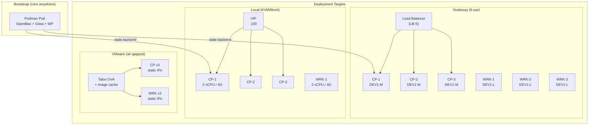

### Provider Abstraction

Each environment directory (`envs/<provider>/`) contains provider-specific infrastructure code that calls the shared `modules/talos-cluster` module:

| Provider | env dir | Infra Provider | API Endpoint | Node Provisioning |
|----------|---------|---------------|-------------|-------------------|
| Scaleway | `envs/scaleway/` | `scaleway/scaleway` | LB flex IP :6443 | cloud-init (user_data) |
| Local | `envs/local/` | `dmacvicar/libvirt` | VIP :6443 | Talos API push |
| VMware | `envs/vmware-airgap/` | Shell scripts | Static IP | OVA deploy + config |

### Scaleway-Specific Deployment Stages

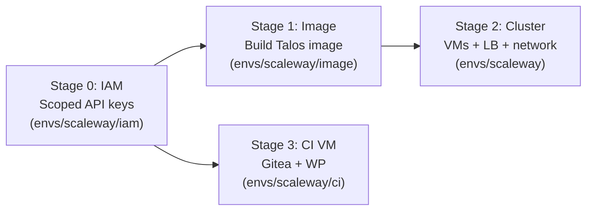

**Image build** is a two-phase process:
1. Phase 1: Start a builder VM with cloud-init that builds the Talos image and uploads it to S3
2. Gate: Poll S3 for `.upload-complete` marker (up to 15 min)
3. Phase 2: Import S3 object as Scaleway snapshot, create bootable image

---

## 10. Observability

### Three Pillars

| Pillar | Tool | Storage | Retention |
|--------|------|---------|-----------|
| Metrics | VictoriaMetrics (vm-k8s-stack) | VMSingle PVC | 30 days |
| Logs | VictoriaLogs | VLogs PVC | 30 days |
| Dashboards | Grafana (bundled with vm-k8s-stack) | ConfigMap sidecar | N/A |

### Metrics Collection

- **VMAgent**: scrapes all Kubernetes endpoints via ServiceMonitor CRDs
- **Cilium metrics**: dns, drop, tcp, flow, icmp, httpV2 (with Hubble)
- **Hubble Relay**: Prometheus metrics endpoint enabled
- **Platform dashboard**: custom ConfigMap auto-loaded by Grafana sidecar (`grafana_dashboard: "1"` label)

### Log Collection

- **VictoriaLogs Collector**: DaemonSet tailing container logs from all nodes
- **Centralized storage**: VictoriaLogs single-node (sufficient for platform scale)

### UI Access

| UI | Access Method | Auth |
|----|--------------|------|
| Headlamp | `make scaleway-headlamp` (port-forward :4466) | ServiceAccount token (48h, copied to clipboard) |
| Grafana | `make scaleway-grafana` (port-forward :3000) | admin / auto-generated password |
| Harbor | `make scaleway-harbor` (port-forward :8080) | admin / auto-generated password |

### SLIs and SLOs

| SLI | SLO | Measurement |
|-----|-----|-------------|
| K8s API latency (p99) | < 1s | VictoriaMetrics apiserver metrics |
| Pod scheduling latency (p99) | < 5s | scheduler_binding_duration_seconds |
| Node availability | 99.9% (3 CP, 3 WRK) | node_conditions metric |
| Cilium CNI readiness | All agents healthy | cilium_agent_health |
| OpenBao sealed status | 0 sealed instances | Manual check / alert |
| Velero backup success | 100% daily | velero_backup_success_total |

---

## 11. Failure Modes and Mitigation

| Failure Mode | Impact | Probability | Mitigation | Detection |
|-------------|--------|-------------|-----------|-----------|
| etcd quorum loss (2/3 CP down) | Cluster API unavailable, no writes | Low | 3 CP nodes, anti-affinity implicit (separate instances) | `etcd_server_has_leader` metric |
| Cilium CNI not ready | All pods stuck in ContainerCreating | Medium (deploy order) | Cilium MUST deploy first; sequential pipeline enforces this | Pod status monitoring |
| OpenBao sealed (in-cluster) | Identity/storage stacks lose secret access | Low | Static seal key in K8s Secret; self-init on restart | `bao status` check |
| vault-backend down | All `tofu` commands fail (no state backend) | Medium | Bootstrap pod auto-restarts; `make bootstrap` to recover | `curl :8080/state/cni` health check |
| Kyverno webhooks persist after uninstall | Block all resource mutations | Medium | `k8s-down` explicitly deletes webhooks before stack teardown | Kubectl operations fail with webhook errors |
| Garage layout not configured | S3 returns 503 | Low (deploy order) | `garage_setup` provisioner handles layout + bucket creation | Garage status check |
| PKI CA key compromise | All internal TLS compromised | Very Low | CA keys stored in encrypted TF state in OpenBao; rotate by rerunning bootstrap | Manual audit |
| Node disk full | Pod evictions, log loss | Medium | local-path-provisioner with bounded PVCs; monitoring alerts | `node_filesystem_avail_bytes` metric |
| Git repo unreachable (Flux) | Day-2 reconciliation stops | Low | Flux retries every 5 min; self-hosted Gitea reduces external deps | `flux_kustomization_ready` metric |
| CI VM down | No automated deployments | Medium | Manual `make` commands still work; CI is convenience, not critical path | WP health endpoint |

---

## 12. Architecture Decision Records (ADRs)

### ADR-001: Talos Linux as Kubernetes OS

**Status:** Accepted

**Context:** Need an immutable, minimal, secure OS for Kubernetes nodes. Traditional distributions (Ubuntu, RHEL) require ongoing patching, SSH hardening, and have large attack surfaces.

**Decision:** Use Talos Linux v1.12, a purpose-built Kubernetes OS with no SSH, no shell, no package manager. Managed entirely via API (gRPC).

**Alternatives Considered:**

| Option | Pros | Cons |
|--------|------|------|
| Talos Linux (chosen) | Immutable, minimal attack surface, API-driven, built-in Kubernetes | No SSH, steep learning curve, limited debugging |
| Flatcar Container Linux | Immutable, familiar systemd | Larger surface than Talos, needs more config |
| Ubuntu + hardening | Flexible, large community | Ongoing patching, SSH exposure, not immutable |

**Consequences:**
- Positive: Immutable OS, zero drift, automated upgrades via Talos API
- Negative: Cannot SSH for debugging; must use `talosctl` and container exec
- Risk: Talos-specific issues require Talos-specific knowledge

**Quality Attributes:** Security, Maintainability

---

### ADR-002: OpenBao over HashiCorp Vault

**Status:** Accepted

**Context:** Need a KMS for TF state storage, secret generation, transit encryption, and PKI. HashiCorp changed Vault to BSL license in 2023.

**Decision:** Use OpenBao (open-source fork of Vault, MPL-2.0 licensed) for all KMS functions. Use OpenBao's self-init feature for zero-touch bootstrap.

**Alternatives Considered:**

| Option | Pros | Cons |
|--------|------|------|
| OpenBao (chosen) | MPL-2.0, Vault API compatible, self-init, active community | Newer project, smaller ecosystem |
| HashiCorp Vault | Mature, large ecosystem | BSL license, sovereignty concern |
| SOPS + age | Simple, Git-friendly | No dynamic secrets, no state backend, no transit |
| AWS KMS / GCP KMS | Managed, HA | Cloud vendor lock-in, not sovereign |

**Consequences:**
- Positive: Full sovereignty, no license risk, Vault provider compatibility
- Negative: Smaller community than Vault, potential edge-case bugs
- Risk: OpenBao diverges from Vault API in future versions

**Quality Attributes:** Security, Cost, Sovereignty

---

### ADR-003: Cilium as CNI with kube-proxy Replacement

**Status:** Accepted

**Context:** Need a CNI that supports network policies, observability (Hubble), and can replace kube-proxy for better performance.

**Decision:** Use Cilium 1.17 in eBPF mode with `kubeProxyReplacement: true`. Disable Talos default CNI (`cni: none`) and kube-proxy (`proxy: disabled`).

**Alternatives Considered:**

| Option | Pros | Cons |
|--------|------|------|
| Cilium (chosen) | eBPF, Hubble observability, kube-proxy replacement, network policies | Complex, large resource footprint |
| Calico | Mature, lighter weight | No built-in observability, iptables-based |
| Flannel | Simplest, lowest overhead | No network policies, no observability |

**Consequences:**
- Positive: Deep observability (Hubble metrics: dns, drop, tcp, flow, http), eBPF performance, single tool for CNI + proxy + policies
- Negative: Must deploy first (before any other pods), ~200m CPU per node
- Risk: Cilium MUST be last to destroy (removing it breaks pod eviction)

**Quality Attributes:** Performance, Security, Observability

---

### ADR-004: OpenTofu State in OpenBao (not S3/Consul/local)

**Status:** Accepted

**Context:** Need a state backend that works across all environments (local, cloud, air-gap), supports locking, and requires no external cloud services.

**Decision:** Use vault-backend as HTTP state proxy, translating OpenTofu HTTP backend requests to OpenBao KV v2 operations. State stored with versioning and locking.

**Alternatives Considered:**

| Option | Pros | Cons |
|--------|------|------|
| OpenBao via vault-backend (chosen) | Self-hosted, works everywhere, locking + versioning, encrypted at rest | Extra component (vault-backend proxy) |
| S3 + DynamoDB | AWS-native, proven | Cloud-dependent, not sovereign |
| Consul | Purpose-built for state | Another service to manage |
| Local files | Simplest | No locking, no sharing, state loss risk |

**Consequences:**
- Positive: Single source of truth, works in air-gap, Raft snapshots for DR
- Negative: vault-backend must be running for any `tofu` command
- Risk: OpenBao pod restart loses in-memory Raft (bootstrap is one-shot; re-run `make bootstrap` to recover)

**Quality Attributes:** Reliability, Sovereignty, Portability

---

### ADR-005: Sequential Pipeline (not Parallel)

**Status:** Accepted

**Context:** Initially used `make -j2` for parallel stack deployment. Encountered race conditions: VMSingle PVC stuck in Pending (StorageClass not ready), Kyverno webhooks blocking other stack deployments.

**Decision:** Deploy all stacks sequentially: `cni -> pki -> monitoring -> identity -> security -> storage -> flux`.

**Alternatives Considered:**

| Option | Pros | Cons |
|--------|------|------|
| Sequential (chosen) | Deterministic, no races | Slower (~10 min total) |
| Parallel (make -j2) | Faster | PVC races, webhook conflicts, non-deterministic failures |
| Dependency DAG (e.g., Terragrunt) | Optimal parallelism with declared deps | Extra tooling, complexity |

**Consequences:**
- Positive: 100% reliable deployment, simple debugging
- Negative: ~10 min total deploy time instead of ~5 min
- Risk: None significant; 10 min is acceptable for infrastructure deployment

**Quality Attributes:** Reliability, Maintainability

---

### ADR-006: Flux v2 for Day-2 GitOps

**Status:** Accepted

**Context:** After initial OpenTofu deployment, stacks need ongoing reconciliation for drift detection, HelmRelease upgrades, and configuration changes.

**Decision:** Deploy Flux v2 with a GitRepository source (SSH to Gitea) and a root Kustomization pointing to `clusters/management/`. OpenTofu handles first deploy, then Flux takes over.

**Alternatives Considered:**

| Option | Pros | Cons |
|--------|------|------|
| Flux v2 (chosen) | Lightweight, composable, Kustomize-native | Less UI than ArgoCD |
| ArgoCD | Powerful UI, large community | Heavier resource footprint, more complex |
| Pure OpenTofu | Single tool | No drift detection, no continuous reconciliation |

**Consequences:**
- Positive: Drift detection, declarative day-2 management, lightweight
- Negative: Flux source-controller uses go-git (no SSH CA support, requires deploy key)
- Risk: Gitea SSH key rotation requires manual update of flux-ssh-identity secret

**Quality Attributes:** Maintainability, Reliability

---

### ADR-007: Self-Hosted Git + CI (Gitea + Woodpecker)

**Status:** Accepted

**Context:** Need Git hosting and CI/CD that work in sovereign/air-gapped environments without depending on GitHub/GitLab SaaS.

**Decision:** Run Gitea (Git) + Woodpecker CI (pipelines) in the bootstrap podman pod. Woodpecker authenticates via Gitea OAuth. Code pushed to Gitea triggers pipeline.

**Consequences:**
- Positive: Full sovereignty, works offline, no SaaS dependency
- Negative: Single point of failure (CI VM), no HA for Gitea
- Risk: Gitea/Woodpecker upgrade path less tested than GitHub Actions

**Quality Attributes:** Sovereignty, Portability

---

## 13. Low-Level Design: Bootstrap

### Component Architecture (C4 Level 3)

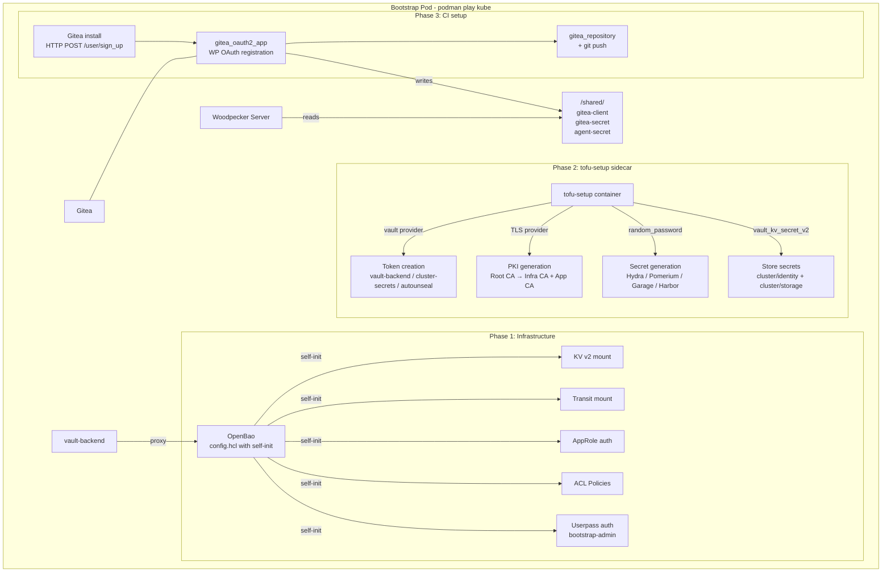

### Bootstrap Sequence Diagram

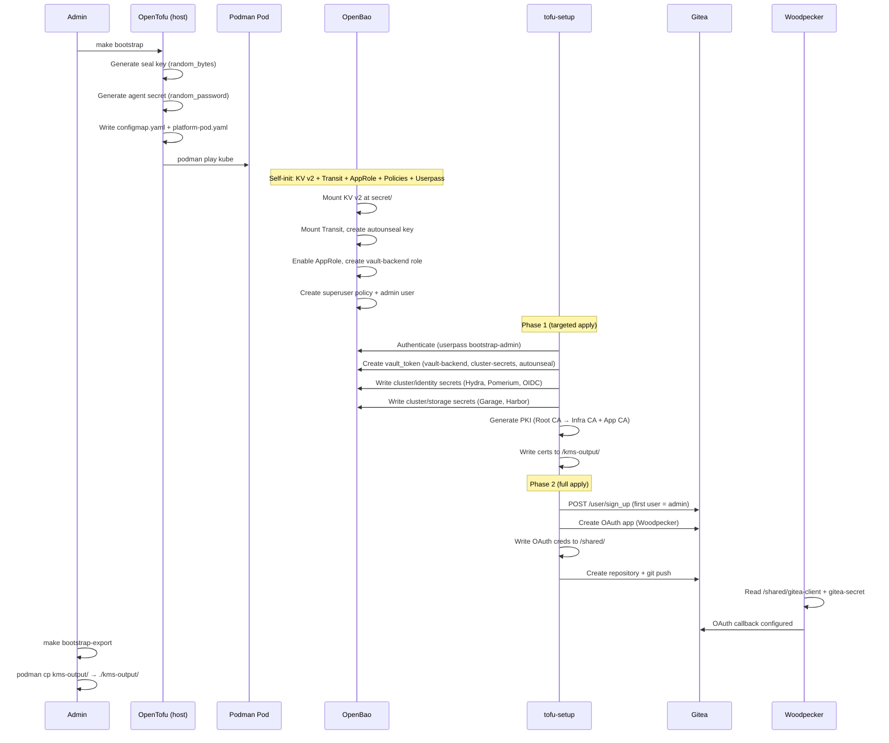

### OpenBao Self-Init Configuration

The `config.hcl` ConfigMap defines four `initialize` blocks that run automatically on first start:

1. **`kv`**: Mounts KV v2 at `secret/` (for TF state + cluster secrets)
2. **`transit`**: Mounts Transit engine, creates `autounseal` key (AES-256-GCM96) for in-cluster OpenBao auto-unseal
3. **`approle`**: Enables AppRole auth, creates `vault-backend` role with `vault-backend` policy (768h token period)
4. **`admin`**: Creates `superuser` policy, enables Userpass auth, creates `bootstrap-admin` user (password from env)
5. **`policies`**: Creates ACL policies:
   - `vault-backend`: RW on `secret/data/tfstate/*`
   - `cluster-secrets-ro`: Read on `secret/data/cluster/*` + token creation
   - `autounseal`: Encrypt/decrypt on `transit/encrypt|decrypt/autounseal`

### Generated Artifacts

| File | Purpose | Consumer |
|------|---------|----------|
| `kms-output/root-ca.pem` | Root CA certificate | pki stack, Scaleway OIDC config |
| `kms-output/infra-ca.pem` | Infra sub-CA cert | pki stack (cert-manager) |
| `kms-output/infra-ca-key.pem` | Infra sub-CA private key | pki stack (cert-manager) |
| `kms-output/infra-ca-chain.pem` | Infra CA + Root CA chain | pki stack (ClusterIssuer) |
| `kms-output/app-ca.pem` | App sub-CA cert | pki stack |
| `kms-output/app-ca-key.pem` | App sub-CA private key | pki stack |
| `kms-output/app-ca-chain.pem` | App CA + Root CA chain | pki stack |
| `kms-output/vault-backend-token.txt` | Token for TF state access | All `tofu` commands (TF_HTTP_PASSWORD) |
| `kms-output/cluster-secrets-token.txt` | Token for secret reads | identity + storage stacks (VAULT_TOKEN) |
| `kms-output/transit-token.txt` | Token for auto-unseal | In-cluster OpenBao transit unseal |
| `kms-output/root-token.txt` | OpenBao root token | `make state-snapshot` |

---

## 14. Low-Level Design: Infrastructure Layer

### Shared Module: `modules/talos-cluster`

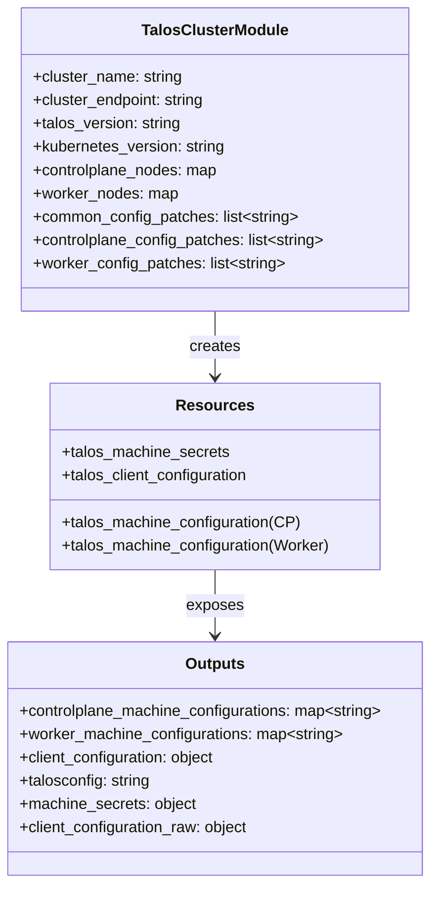

**Key design:** The module is pure configuration generation -- it creates machine secrets and machine configs but does NOT create any infrastructure. Each environment (`envs/<provider>/`) calls this module and uses the outputs as user_data or applies them via Talos API.

### Provider-Specific Sequence: Scaleway

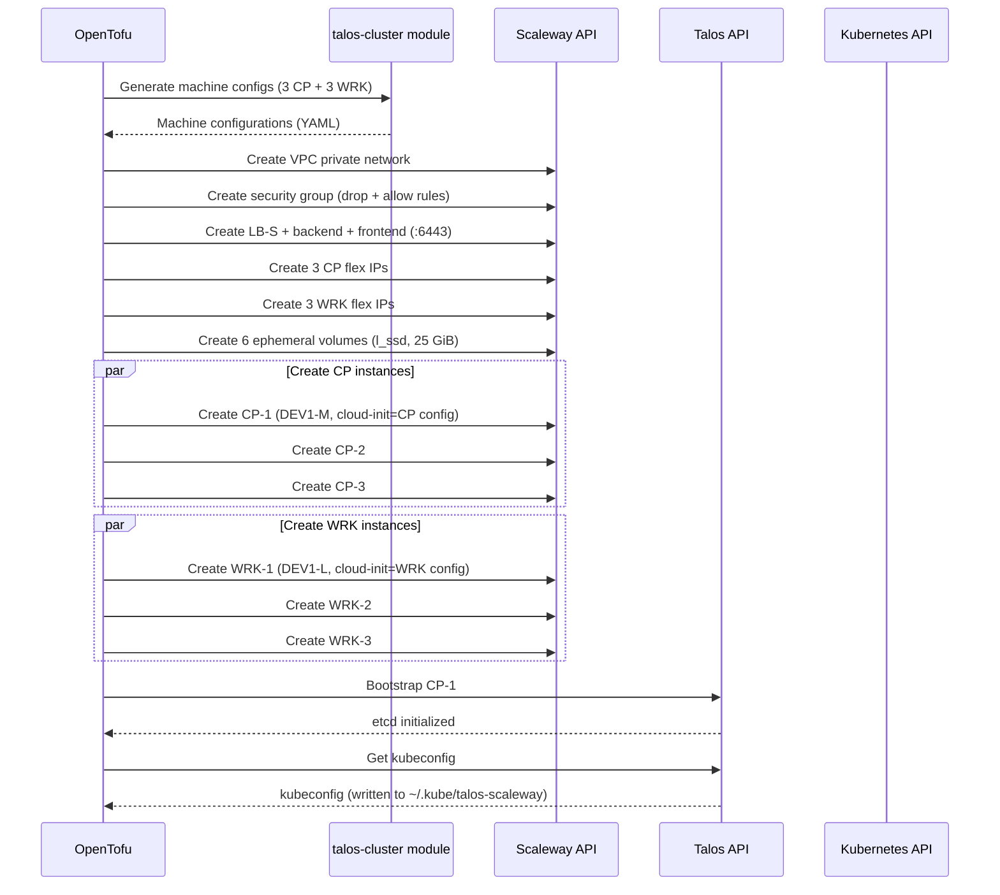

### Provider-Specific Sequence: Local (libvirt)

Key difference from Scaleway: local env uses VIP (`.100`) instead of load balancer, downloads Talos image from Image Factory, converts raw to qcow2, uploads to libvirt pool, and pushes machine config via Talos API (not cloud-init).

### Machine Config Patches

Applied in order via the `talos-cluster` module:

1. **`patches/cilium-cni.yaml`**: Disables default CNI and kube-proxy
   ```yaml
   cluster:
     network:
       cni:
         name: none
     proxy:
       disabled: true
   ```

2. **`patches/registry-mirror.yaml`**: Configures container registry mirrors (Scaleway only)

3. **`volume-config-patch.yaml`**: Configures ephemeral disk on `/dev/vdb` (Scaleway specific)

4. **OIDC patch** (Scaleway CP only): Configures apiServer OIDC flags pointing to `hydra-public.identity.svc:4444`, mounts Root CA cert for OIDC verification

---

## 15. Low-Level Design: K8s Stacks

### Stack Dependency Graph

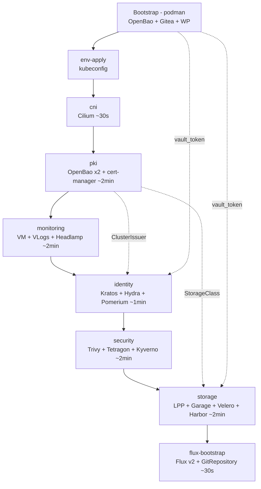

### Stack: CNI (stacks/cni/)

| Component | Chart | Version | Namespace |
|-----------|-------|---------|-----------|
| Cilium | cilium/cilium | var.cilium_version | kube-system |

**Critical configuration:**
- `kubeProxyReplacement: true` -- replaces kube-proxy with eBPF
- `k8sServiceHost: localhost`, `k8sServicePort: 7445` -- Talos-specific API proxy
- `ipam.mode: kubernetes` -- uses K8s-native IPAM
- Hubble enabled with metrics: dns, drop, tcp, flow, icmp, httpV2
- **Must deploy first**: without CNI, CoreDNS and all pods remain in ContainerCreating

### Stack: PKI (stacks/pki/)

| Component | Chart/Resource | Version | Namespace |
|-----------|---------------|---------|-----------|
| OpenBao Infra | openbao/openbao | var.openbao_version | secrets |
| OpenBao App | openbao/openbao | var.openbao_version | secrets |
| cert-manager | jetstack/cert-manager | var.cert_manager_version | cert-manager |
| ClusterIssuer | kubectl_manifest | N/A | cluster-scoped |

**Resource creation sequence:**
1. Create `secrets` namespace (PSS: baseline)
2. Create K8s secrets: pki-root-ca, pki-infra-ca (TLS), pki-app-ca (TLS)
3. Create seal key secret + admin password secret (random)
4. Deploy OpenBao Infra (StatefulSet, uses seal key)
5. Deploy OpenBao App (StatefulSet, uses seal key)
6. Create `cert-manager` namespace
7. Deploy cert-manager (with CRDs)
8. Create intermediate-ca-keypair secret in cert-manager ns
9. Apply ClusterIssuer "internal-ca" (references intermediate-ca-keypair)

### Stack: Monitoring (stacks/monitoring/)

| Component | Chart | Version | Namespace |
|-----------|-------|---------|-----------|
| vm-k8s-stack | victoriametrics/victoria-metrics-k8s-stack | var.vm_k8s_stack_version | monitoring |
| VictoriaLogs | victoriametrics/victoria-logs-single | var.victoria_logs_version | monitoring |
| VLogs Collector | victoriametrics/victoria-logs-collector | var.victoria_logs_collector_version | monitoring |
| Headlamp | kubernetes-sigs/headlamp | var.headlamp_version | monitoring |
| Platform Dashboard | ConfigMap | N/A | monitoring |

### Stack: Identity (stacks/identity/)

| Component | Chart | Version | Namespace |
|-----------|-------|---------|-----------|
| Kratos | ory/kratos | var.kratos_version | identity |
| Hydra | ory/hydra | var.hydra_version | identity |
| Pomerium | pomerium/pomerium | var.pomerium_version | identity |
| Hydra TLS cert | Certificate CRD | N/A | identity |
| OIDC client registration | K8s Job | N/A | identity |

**Secret injection flow:**
1. `identity` stack reads `secret/cluster/identity` from bootstrap OpenBao via vault provider
2. Secrets injected into Helm values via `templatefile()`:
   - Hydra: `system_secret` from vault
   - Pomerium: `client_secret`, `shared_secret`, `cookie_secret` from vault
3. OIDC client registration Job runs after Hydra is ready, creates `kubernetes` OAuth client

### Stack: Security (stacks/security/)

| Component | Chart | Version | Namespace |
|-----------|-------|---------|-----------|
| Trivy Operator | aquasecurity/trivy-operator | var.trivy_operator_version | security |
| Tetragon | cilium/tetragon | var.tetragon_version | security |
| Kyverno | kyverno/kyverno | var.kyverno_version | security |
| Cosign verify policy | ClusterPolicy CRD | N/A | cluster-scoped |

**Kyverno destruction order:** Kyverno webhooks must be deleted before any stack teardown, otherwise they block resource deletion. The `k8s-down` target handles this explicitly.

### Stack: Storage (stacks/storage/)

| Component | Chart | Version | Namespace |
|-----------|-------|---------|-----------|
| local-path-provisioner | containeroo/local-path-provisioner | var.local_path_provisioner_version | storage |
| Garage | Local chart (fetched from upstream) | v2.2.0 | garage |
| Velero | vmware-tanzu/velero | var.velero_version | storage |
| Harbor | goharbor/harbor | var.harbor_version | storage |

**Garage setup sequence (terraform_data provisioner):**
1. Wait for garage-0 pod to be Running
2. Assign layout to all nodes (5G capacity, zone dc1)
3. Apply layout (garage layout apply)
4. Wait for HEALTHY status
5. Create buckets: `velero-backups`, `harbor-registry`
6. Create API keys: `velero-key`, `harbor-key`
7. Grant bucket permissions (read + write + owner)
8. Create K8s secrets: `velero-s3-credentials` (INI format), `harbor-s3-credentials` (plain)

**Harbor S3 integration:** Harbor reads S3 credentials from the K8s secret created by Garage setup, injected into Helm values via `data.kubernetes_secret.harbor_s3`.

### Stack: Flux Bootstrap (stacks/flux-bootstrap/)

| Component | Chart/Resource | Version | Namespace |
|-----------|---------------|---------|-----------|
| Flux v2 | fluxcd-community/flux2 | var.flux_version | flux-system |
| SSH identity | K8s Secret | N/A | flux-system |
| GitRepository | Flux CRD | N/A | flux-system |
| Root Kustomization | Flux CRD | N/A | flux-system |

**GitOps source chain:**
```
Gitea repo (SSH) → GitRepository "management" (5m interval)
                  → Kustomization "management" (10m interval)
                  → path: ./clusters/management/
                  → kustomization.yaml references ../../stacks/*/flux/
```

---

## 16. Low-Level Design: Secrets Flow

### Secret Lifecycle

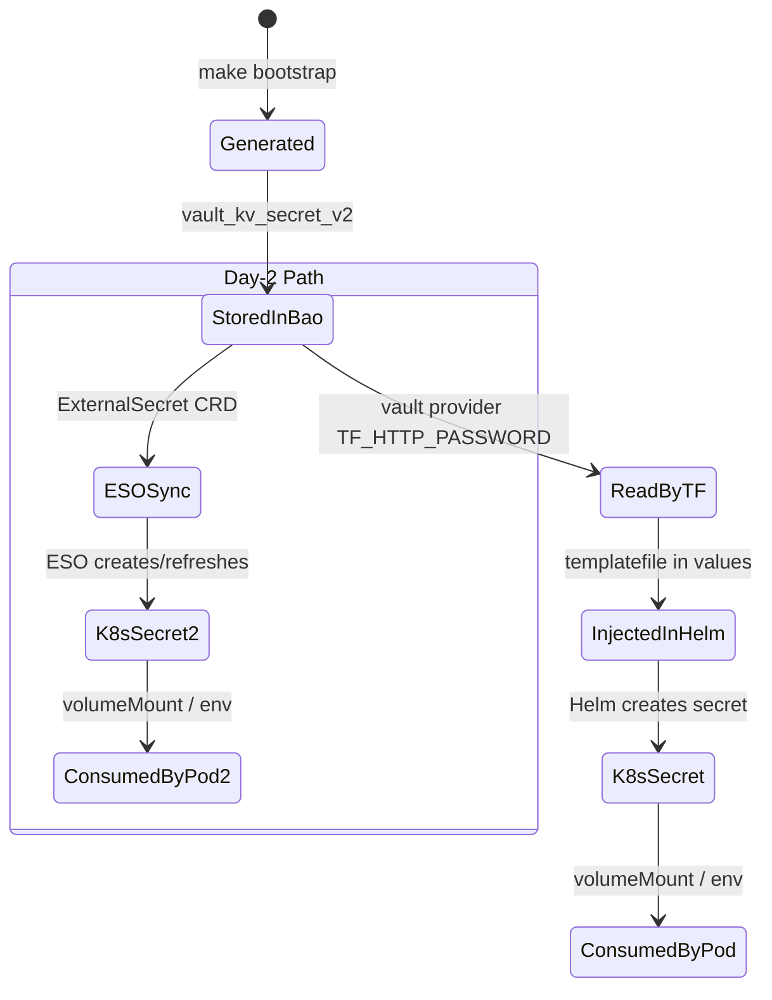

### Secret Inventory

| Secret | Generator | Storage | Consumer | Rotation |
|--------|-----------|---------|----------|----------|
| Hydra system secret | random_password (64 chars) | OpenBao `cluster/identity` | Hydra Helm values | Redeploy bootstrap |
| Pomerium shared secret | random_bytes (32B, base64) | OpenBao `cluster/identity` | Pomerium Helm values | Redeploy bootstrap |
| Pomerium cookie secret | random_bytes (32B, base64) | OpenBao `cluster/identity` | Pomerium Helm values | Redeploy bootstrap |
| Pomerium client secret | random_password (64 chars) | OpenBao `cluster/identity` | Pomerium Helm values | Redeploy bootstrap |
| OIDC client secret | random_password (64 chars) | OpenBao `cluster/identity` | Hydra OIDC registration Job | Redeploy bootstrap |
| Garage RPC secret | random_bytes (32B, hex) | OpenBao `cluster/storage` | Garage Helm values | Redeploy bootstrap |
| Garage admin token | random_password (64 chars) | OpenBao `cluster/storage` | Garage Helm values | Redeploy bootstrap |
| Harbor admin password | random_password (24 chars) | OpenBao `cluster/storage` | Harbor Helm values | Redeploy bootstrap |
| OpenBao seal key (bootstrap) | random_bytes (32B) | ConfigMap (podman) | OpenBao KMS config.hcl | Redeploy bootstrap |
| OpenBao seal key (in-cluster) | random_bytes (32B) | K8s Secret `openbao-seal-key` | In-cluster OpenBao | In TF state |
| OpenBao admin password | random_password (32 chars) | K8s Secret `openbao-admin-password` | In-cluster OpenBao | In TF state |
| vault-backend token | vault_token (768h) | File `kms-output/vault-backend-token.txt` | TF_HTTP_PASSWORD env var | Auto-renew (periodic) |
| cluster-secrets-ro token | vault_token (768h) | File `kms-output/cluster-secrets-token.txt` | VAULT_TOKEN for identity/storage | Auto-renew (periodic) |
| autounseal token | vault_token (768h) | File `kms-output/transit-token.txt` | In-cluster OpenBao | Auto-renew (periodic) |
| Flux SSH key | tls_private_key (Ed25519) | K8s Secret `flux-ssh-identity` | Flux source-controller | In TF state |
| Velero S3 credentials | Garage CLI key create | K8s Secret `velero-s3-credentials` | Velero pod | Garage CLI |
| Harbor S3 credentials | Garage CLI key create | K8s Secret `harbor-s3-credentials` | Harbor pod | Garage CLI |

---

## 17. Low-Level Design: CI/CD Pipeline

### Woodpecker Pipeline (.woodpecker.yml)

```mermaid
graph LR
    VALIDATE["validate<br/>PR + push<br/>tofu validate x10"]
    BUILD1["start-builder<br/>push only<br/>Start VM"]
    WAIT["wait-image-upload<br/>Poll S3 ~15min"]
    BUILD2["build-image<br/>Import snapshot"]
    DEPLOY_C["deploy-cluster<br/>tofu apply envs/scaleway"]
    WAIT_API["wait-api<br/>kubectl get nodes"]
    CNI["deploy-cni"]
    PKI["deploy-pki"]
    MON["deploy-monitoring"]
    IDENT["deploy-identity"]
    SEC["deploy-security"]
    STOR["deploy-storage"]
    FLUX_D["deploy-flux"]

    VALIDATE --> BUILD1 --> WAIT --> BUILD2 --> DEPLOY_C --> WAIT_API
    WAIT_API --> CNI --> PKI --> MON --> IDENT --> SEC --> STOR --> FLUX_D
```

### Pipeline Steps Detail

| Step | Image | Secrets | Key Actions |
|------|-------|---------|-------------|
| validate | opentofu:1.9 | None | `tofu init -backend=false && tofu validate` for all stacks |
| start-builder | opentofu:1.9 | scw_project_id, tf_http_password, scw_image_* | Targeted apply: bucket + IP + builder VM |
| wait-image-upload | opentofu:1.9 | scw_project_id, scw_image_* | Poll S3 endpoint for `.upload-complete` |
| build-image | opentofu:1.9 | scw_project_id, tf_http_password, scw_image_* | Full apply: import snapshot, create image |
| deploy-cluster | opentofu:1.9 | scw_project_id, tf_http_password, scw_cluster_* | `tofu apply envs/scaleway` |
| wait-api | opentofu:1.9 | tf_http_password | Extract kubeconfig, poll `kubectl get nodes` |
| deploy-cni..flux | opentofu:1.9 | tf_http_password [+ vault_token] | Extract kubeconfig, `tofu apply stacks/<stack>` |

### CI State Backend Wiring

All CI steps use the same vault-backend proxy at `host.containers.internal:8080`, passing credentials via `TF_HTTP_PASSWORD` env var. The deploy helper function:

```bash
vb_init() {
  tofu init -input=false \
    -backend-config="address=$VB/state/$1" \
    -backend-config="lock_address=$VB/state/$1" \
    -backend-config="unlock_address=$VB/state/$1"
}
```

### CI VM Provisioning (envs/scaleway/ci/)

The CI VM is a Scaleway instance (Ubuntu Noble) provisioned with:
1. Security group: allow 3000 (Gitea), 2222 (Git SSH), 8000 (WP), 22 (SSH)
2. Cloud-init: SSH key injection
3. Remote-exec: Install podman, copy bootstrap TF module, run `setup.sh`
4. `setup.sh` calls `tofu -chdir=bootstrap apply` with CI-specific variables (public IP, Scaleway API keys)

---

## 18. Low-Level Design: GitOps Day-2

### Flux Reconciliation Architecture

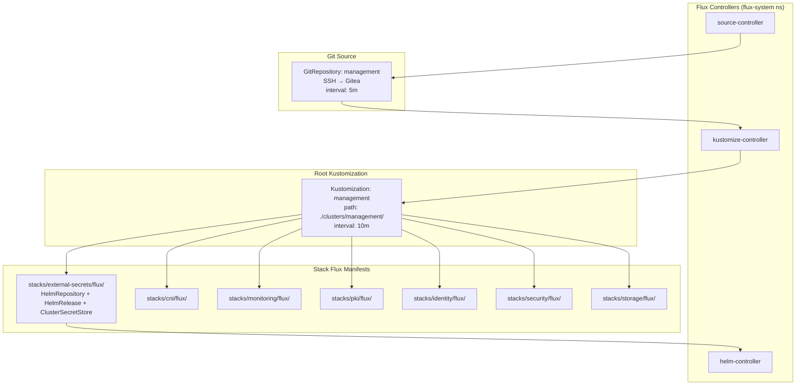

### Day-2 Secret Sync (ESO Path)

Once the External Secrets Operator (deployed by Flux) and the in-cluster OpenBao are both operational:

```
OpenBao Infra (secrets ns)
    ↓ Kubernetes auth (ESO service account)
ClusterSecretStore "openbao-infra"
    ↓ references
ExternalSecret (per namespace)
    ↓ creates/refreshes
K8s Secret (target namespace)
```

Target secrets for ESO sync:

| OpenBao Path | K8s Secret | Namespace |
|-------------|------------|-----------|
| `secret/identity/hydra` | `hydra-secrets` | identity |
| `secret/identity/pomerium` | `pomerium-secrets` | identity |
| `secret/storage/garage` | `garage-secrets` | garage |
| `secret/storage/harbor` | `harbor-secrets` | storage |

### OpenTofu to Flux Handoff

After initial deployment via OpenTofu, the handoff to Flux follows this pattern:

1. OpenTofu deploys the stack (Helm release + CRDs + secrets)
2. Flux reconciles the same stack via HelmRelease CRDs in `stacks/*/flux/`
3. To avoid conflicts: `tofu state rm` removes the resource from TF state
4. Flux becomes the single source of truth for ongoing management
5. Configuration changes go through Git (push to Gitea) → Flux reconciles

---

## 19. Open Questions and Risks

| # | Question/Risk | Status | Notes |
|---|--------------|--------|-------|
| 1 | OpenBao bootstrap data is ephemeral (emptyDir). Pod restart loses all KMS state. | Accepted risk | `make state-snapshot` creates Raft snapshots; `make bootstrap` can recreate from scratch |
| 2 | No HA for Gitea/Woodpecker (single CI VM) | Open | Acceptable for platform CI; not blocking workload availability |
| 3 | Flux source-controller uses go-git (no SSH CA support) | Accepted | Using Ed25519 deploy key instead of SSH CA |
| 4 | Harbor S3 credentials created by Garage CLI provisioner are imperative | Accepted | Idempotent (checks if secret exists before creating) |
| 5 | Kyverno Cosign policy in audit mode only | Open | Move to enforce mode once all images are signed |
| 6 | No automated certificate rotation for Root/Infra/App CAs | Open | 10-year / 5-year validity; manual re-bootstrap to rotate |
| 7 | No network encryption (WireGuard) enabled by default in Cilium | Open | Can be enabled via values.yaml; adds CPU overhead |
| 8 | VMware provider less tested than Scaleway/local | Open | VMware is shell-script based (no Terraform) |
| 9 | Sequential deployment adds ~5 min over theoretical parallel minimum | Accepted | Reliability over speed (ADR-005) |
| 10 | In-cluster OpenBao uses static seal (not transit auto-unseal from KMS) | Open | Transit unseal token is generated but not yet wired to in-cluster OpenBao Helm values |

---

## 20. Appendix

### Glossary

| Term | Definition |
|------|-----------|
| Talos Linux | Immutable Kubernetes OS with API-only management (no SSH, no shell) |
| OpenBao | Open-source fork of HashiCorp Vault (MPL-2.0 licensed) |
| vault-backend | HTTP proxy that translates OpenTofu HTTP backend protocol to Vault/OpenBao KV v2 API |
| Cilium | eBPF-based CNI, network policy, and observability platform |
| Hubble | Cilium's observability layer for network flow visibility |
| Tetragon | Cilium's eBPF-based runtime security observability |
| Ory Kratos | Open-source identity management (user accounts, login flows) |
| Ory Hydra | Open-source OAuth2 and OIDC provider |
| Pomerium | Identity-aware, zero-trust access proxy |
| Garage | Lightweight, self-hosted, S3-compatible object storage |
| Flux v2 | GitOps toolkit for Kubernetes (source, kustomize, helm controllers) |
| ESO | External Secrets Operator -- syncs secrets from external stores to K8s |

### Technology Stack Summary

| Layer | Technology | Version |
|-------|-----------|---------|
| OS | Talos Linux | v1.12.4 |
| Kubernetes | Kubernetes | 1.35.0 |
| IaC | OpenTofu | 1.9 |
| CNI | Cilium | 1.17.13 |
| KMS | OpenBao (bootstrap) | 2.5.1 |
| PKI | cert-manager | v1.19.4 |
| PKI | OpenBao (in-cluster) | 0.25.6 (chart) |
| Metrics | vm-k8s-stack | 0.72.4 |
| Logs | victoria-logs-single | 0.11.28 |
| Logs | victoria-logs-collector | 0.2.11 |
| Dashboard | Headlamp | 0.40.0 |
| Identity | Ory Kratos | 0.60.1 |
| Identity | Ory Hydra | 0.60.1 |
| Identity | Pomerium | 34.0.1 |
| Policy | Kyverno | 3.7.1 |
| Scanning | Trivy Operator | 0.32.0 |
| Runtime | Tetragon | 1.6.0 |
| Storage | Garage | v2.2.0 (app) / 0.9.2 (chart) |
| Storage | local-path-provisioner | 0.0.35 |
| Registry | Harbor | 1.16.2 |
| Backup | Velero | 11.4.0 |
| GitOps | Flux v2 | 2.14.1 |
| Git | Gitea | 1.22-rootless |
| CI | Woodpecker | v3 |

### References

- [Talos Linux Documentation](https://www.talos.dev/v1.12/)
- [OpenBao Documentation](https://openbao.org/docs/)
- [Cilium Documentation](https://docs.cilium.io/en/v1.17/)
- [Flux v2 Documentation](https://fluxcd.io/flux/)
- [C4 Model](https://c4model.com/)
