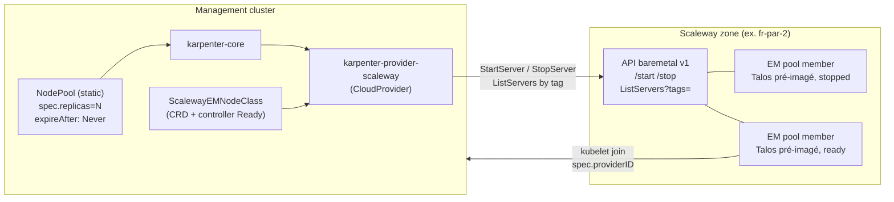

# LLD-002 : karpenter-provider-scaleway — backend pool Elastic Metal

**Date** : 2026-07-11
**Statut** : Prêt pour spike M0
**Entrées** : ADR-024 (autoscaling hybride), ADR-035 (pool EM statique), ADR-036
(où investir), investigations upstream du 2026-07-11 (karpenter-core v1.11.2 /
main post-v1.13 ; API Scaleway baremetal v1 + scaleway-sdk-go).

## 1. Objectif et verdict

Permettre à Karpenter de « consommer » du bare metal Scaleway : un pool de
serveurs Elastic Metal **pré-imagés Talos** (via `modules/em-talos-bootstrap`)
et éteints, où provisionner = power-on (~minutes) et déprovisionner =
power-off. L'abstraction CloudProvider de karpenter-core ne présuppose jamais
destroy-vs-power-off : **le modèle est faisable**, sous trois contraintes :

| # | Contrainte vérifiée | Réponse du design |
|---|---|---|
| C1 | `registrationTimeout = 15 min` — **const non configurable** (`liveness.go`). Create() → Node enregistré doit tenir en 15 min, sinon NodeClaim supprimé + Delete() | Power-on d'un serveur déjà imagé = « quelques minutes » (POST bare metal inclus, pas de SLA publié). **Mesure réelle = critère de sortie M0.** Post-enregistrement, l'initialisation n'a AUCUN timeout — tout le budget risque est sur cette fenêtre |
| C2 | Le core n'a **aucun cache d'indisponibilité d'offering** (le « ICE cache 3 min » est du code AWS). ICE naïf = boucle Create→ICE→Delete→reschedule | Capacité finie modélisée par `Offering.Available=false` quand le pool est épuisé (le scheduler ne nomine que `Available==true`). ICE réservé à la vraie course sur le dernier serveur |
| C3 | Matching Node↔NodeClaim **strictement** `node.spec.providerID == nodeClaim.status.providerID` (field index, jamais le nom). Talos sans CCM ne pose pas de providerID | §4 — deux options, décision en M0 |

Caveat économique assumé (ADR-035/036) : un EM arrêté **reste facturé**
(matériel dédié, facturation livraison→suppression). Le pool donne
l'élasticité de *capacité* pilotée par Karpenter, pas d'économie à l'état
éteint. L'économie se fait au dimensionnement du pool et au passage mensuel
(`MigrateServerToMonthlyOffer`).

## 2. Architecture



- **Pool** = serveurs EM portant un tag dédié (ex. `st4ck.io/karpenter-pool=<name>`),
  pré-imagés par `modules/em-talos-bootstrap` (machineconfig worker appliqué,
  PN attaché + IP bookée IPAM — les deux **persistent aux power cycles**,
  IPv4 flexible stable ⇒ SANs des certs valides).
- **Static NodePool** (`spec.replicas`, design `static-capacity.md`) : exclu
  de la consolidation/emptiness/drift — le scale up/down des replicas
  déclenche Create()/Delete(). Alternative dynamique (NodePool classique +
  `consolidateAfter`) possible plus tard ; le statique est le fit M0.

## 3. Contrat CloudProvider → API Scaleway

| Méthode | Sémantique retenue | Appel Scaleway (`api/baremetal/v1`) |
|---|---|---|
| `Create(nodeClaim)` | Choisir un membre du pool `stopped` ; power-on ; retourner NodeClaim hydraté (**ProviderID, Capacity, Allocatable, labels** — copiés par `launch.go`). Pool vide → `Offering.Available=false` aurait dû l'empêcher ; course résiduelle → `NewInsufficientCapacityError` | `ListServers{Tags, Status}` puis `StartServer{BootType: normal}` ; poll `GetServer` → `status==ready` |
| `Delete(nodeClaim)` | Power-off idempotent ; déjà éteint/absent → `NewNodeClaimNotFoundError` (le core retire le finalizer) | `StopServer` (pas de boot_type) ; poll → `stopped` |
| `Get(providerID)` | Un serveur, mappé providerID→serverID ; éteint → NotFound | `GetServer` |
| `List()` | **Uniquement les serveurs du pool allumés** (`ready`/`starting`). Gotcha GC assumé : un power-off hors bande fait disparaître le serveur de List() → le GC (~2 min) supprime le NodeClaim = comportement voulu (reflète la réalité) | `ListServers{Tags}` + filtre status |
| `GetInstanceTypes(np)` | Shapes **statiques** dérivées de l'offre du pool (ex. EM-A116X-SSD : CPU/RAM depuis `GetOffer`) ; `Offering{Price: flat, Available: nbStopped>0, zone, capacity-type: on-demand}`. **Ne jamais retirer un type utilisé par un NodeClaim vivant** (sinon drift `InstanceTypeNotFound` → remplacement) | `ListOffers`/`GetOffer` (cache long) + état pool |
| `IsDrifted` | `("", nil)` — opt-out provider (les raisons core restent) | — |
| `RepairPolicies` | `[]` en M0 (pas d'auto-repair) | — |
| `GetSupportedNodeClasses` | `[]status.Object{&ScalewayEMNodeClass{}}` | — |

Prix flat sur serveurs identiques ⇒ la consolidation-remplacement (qui exige
strictement moins cher) est neutralisée gratuitement ; seule l'emptiness
resterait sur un NodePool dynamique.

## 4. providerID sur Talos — décision M0

Format : `scaleway-em://<zone>/<server-id>` (stable, dérivable des deux côtés).

- **Option A (préférée, à valider M0)** : `machine.kubelet.extraArgs:
  provider-id: scaleway-em://…` figé par serveur dans le machineconfig au
  pré-imaging. kubelet pose `spec.providerID` à l'enregistrement — pas de
  CCM, pas de taint uninitialized, contrôle total de la chaîne d'octets.
  Talos n'autorise pas certains kubelet args (denylist) — **la présence de
  `provider-id` dans la denylist Talos v1.12 est le premier test M0**.
- **Option B (repli)** : `talos-cloud-controller-manager` (Platform: metal),
  `ProviderID: "scaleway-metal:///{{ .UUID }}"` + `cloud-provider: external`.
  Le CCM dérive l'ID du SMBIOS UUID du nœud, PAS du retour de Create() ⇒
  maintenir une map `{server-id → UUID}` (une fois, au pré-imaging) et
  déclarer le taint `node.cloudprovider.kubernetes.io/uninitialized` en
  `startupTaints` du NodePool.

## 5. Cycle de vie et budget temps

```
NodeClaim créé ──Create()──▶ StartServer ──▶ POST/boot Talos ──▶ kubelet join
     │                          (minutes, à mesurer M0)             │
     │◀————————————— fenêtre registrationTimeout = 15 min ——————————▶│
     └─ raté ⇒ NodeClaim supprimé, Delete() (power-off), reschedule
Ensuite : Registered → Initialized (SANS timeout) → live
Delete : drain (core) → StopServer → stopped → finalizer retiré
```

- Un NodeClaim n'est **jamais réutilisé** — chaque power-on = nouveau
  NodeClaim ; réutiliser le même providerID à un cycle ultérieur est valide
  (l'ancien NodeClaim est entièrement supprimé avant).
- `expireAfter: Never` obligatoire (défaut 720 h = remplacement forcé à 30 j).
- Pas de contrôleur d'interruption à écrire (hors core, spécifique AWS).

## 6. CRD `ScalewayEMNodeClass` (v1alpha1, minimale)

```yaml
apiVersion: karpenter.scaleway.st4ck.io/v1alpha1
kind: ScalewayEMNodeClass
metadata:
  name: metal-pool
spec:
  zone: fr-par-2                  # PN par-AZ (ADR-035)
  poolTag: st4ck.io/karpenter-pool=metal   # sélecteur ListServers
  offerName: EM-A116X-SSD         # shape → GetInstanceTypes
status:
  conditions: [ ... Ready ... ]   # contrat operatorpkg/status.Object
  poolSize: 3
  available: 2                    # stopped = démarrables
```
Contrôleur NodeClass : réconcilie l'inventaire (ListServers by tag), calcule
`Ready` (auth OK + pool non vide + zone joignable). `Create()` renvoie
`NewNodeClassNotReadyError` si `Ready=False`.

## 7. NodePool de référence

```yaml
apiVersion: karpenter.sh/v1
kind: NodePool
metadata:
  name: metal
spec:
  replicas: 0                     # static — scale up = power-on
  template:
    spec:
      nodeClassRef: { group: karpenter.scaleway.st4ck.io, kind: ScalewayEMNodeClass, name: metal-pool }
      taints: [{ key: st4ck.io/pool, value: metal, effect: NoSchedule }]
      expireAfter: Never
      requirements:
        - { key: node.kubernetes.io/instance-type, operator: In, values: [EM-A116X-SSD] }
```
Routage workloads longs : policy Kyverno (ADR-035) mute
toleration/nodeSelector sur annotation. Le scale des replicas est piloté en
M0 à la main, puis par un signal (KEDA/contrôleur) en M1.

## 8. Layout du code et wiring

```
karpenter-provider-scaleway/
├── go.mod                        # module github.com/<org>/karpenter-provider-scaleway
├── cmd/controller/main.go        # ~50 LOC — wiring operator (voir note args)
├── pkg/apis/v1alpha1/            # ScalewayEMNodeClass types + deepcopy
├── pkg/cloudprovider/            # l'implémentation (~300-650 LOC cible)
├── pkg/pool/                     # inventaire: ListServers by tag, cache, comptage
├── pkg/controllers/nodeclass/    # statut Ready + hash
└── charts/                       # Helm chart (après M0)
```

- **Modèles à copier** (sources dans le scratchpad de session :
  `kwok/`, `cluster-api/`, `proxmox/`) : kwok = minimal canonique (302 LOC
  cloudprovider) ; **cluster-api = meilleur template structurel pool fini**
  (665 LOC, single file) ; proxmox = wiring core v1.13 (9 args) + capacity
  accounting.
- **Pin de version core** : la signature `corecontrollers.NewControllers` a
  changé — v1.5.0 = 7 args (`…, cp, clusterState`), main/v1.13 = 9 args
  (`…, cp, undecoratedCP, clusterState, instanceTypeStore`, NodeOverlay).
  Choisir le tag AU MOMENT du scaffold et vérifier `go doc`.
- **SDK Scaleway** : `github.com/scaleway/scaleway-sdk-go/api/baremetal/v1`
  (`NewAPI`, `NewPrivateNetworkAPI`), auth `scw.NewClient(scw.WithEnv())`.
  IAM du contrôleur : `ElasticMetalFullAccess` (+ `IPAMReadOnly` si lecture
  des bookings). Statut opérationnel = **`ready`** (pas `running`) ; power
  states : `ready→stopping→stopped`, `stopped→starting→ready`. Pas de rate
  limit publié → backoff client sur 429, polling ≤ 1 req/10 s/serveur.

## 9. Plan

**M0 — spike (~1 semaine), critères de sortie :**
1. `provider-id` accepté par Talos v1.12 en `kubelet.extraArgs` (Option A) —
   sinon bascule Option B (talos-ccm) documentée.
2. Latence réelle power-on→Ready mesurée sur EM-A116X-SSD (fr-par-2), ×5
   runs : **< 12 min p95** (marge 3 min sur C1) sinon repli : serveurs
   maintenus `ready` + cordon (pool « tiède » au lieu d'éteint) et le
   provider ne fait que uncordon/cordon — à décider aux résultats.
3. Squelette compilant : interface complète, backend Scaleway réel pour
   List/Get, fake in-memory pour tests unitaires (create/delete/ICE/GC).
4. Bout en bout sur cluster dev : NodePool static replicas 0→1 → serveur
   `ready` → Node joined+matched ; 1→0 → drain → `stopped`.

**M1** : chart Helm + intégration stack autoscaling (contexte multi-env),
scale des replicas piloté (KEDA sur pods Pending metal), métriques pool.
PR upstream karpenter-core : `registrationTimeout` const → var (une ligne,
évite le fork si le POST de certaines gammes déborde des 15 min).
**M2** : multi-offres/multi-zones, commande dynamique de serveurs = le
problème d'indisponibilité type AWS **revient** (la comptabilité exacte ne
vaut que pour le pool possédé). `Offer.Stock` est consultatif, pas une
réservation — une commande peut atterrir `out_of_stock` malgré un stock
annoncé. Design hybride, par (offre × zone) :
1. proactif — polling `ListOffers` : `Stock=empty` ⇒ `Available=false`
   avant toute tentative (signal qu'EC2 n'offre pas à AWS) ;
2. réactif — commande `out_of_stock` ⇒ `DeleteServer` du fantôme +
   marquage (offre × zone) indisponible avec TTL courte (le signal Stock
   vient d'être prouvé périmé) — l'équivalent du cache ICE AWS, en filet ;
3. `Stock=low` ⇒ TTL courte aussi (vrai mais fragile).

## 10. Risques

| Risque | Sévérité | Mitigation |
|---|---|---|
| POST bare metal > 15 min sur certaines gammes | Haute (tue le modèle éteint) | Mesure M0 ; repli pool tiède cordon/uncordon (coût identique — EM arrêté facturé) |
| `provider-id` refusé par la denylist kubelet Talos | Moyenne | Option B talos-ccm (validée upstream, Platform: metal) |
| Kubelet certs périmés après longs arrêts | Moyenne | Talos re-bootstrappe le kubelet au boot ; à vérifier explicitement en M0 (arrêt > 7 j simulé par horloge) |
| GC ↔ power-off hors bande (opérateur console) | Basse | Sémantique List() assumée (§3) ; tag `karpenter-managed` pour exclure les serveurs pilotés à la main |
| Churn dernier serveur (C2) | Basse | `Available=false` dès `nbStopped==0` ; ICE en dernier recours |
| M2 : course au stock à la commande (`Stock` consultatif, pas de réservation atomique) | Moyenne (M2 seulement) | Hybride proactif/réactif §9 M2 — polling Stock + cache TTL par (offre × zone) sur `out_of_stock` prouvé |

## Annexe — sources primaires

Rapports d'investigation 2026-07-11 (session), notamment :
`types.go`/`liveness.go`/`nodeclaim.go` (karpenter-core), design
`static-capacity.md`, kwok/cluster-api/proxmox providers, API Scaleway
baremetal v1 + scaleway-sdk-go, talos-cloud-controller-manager config.
