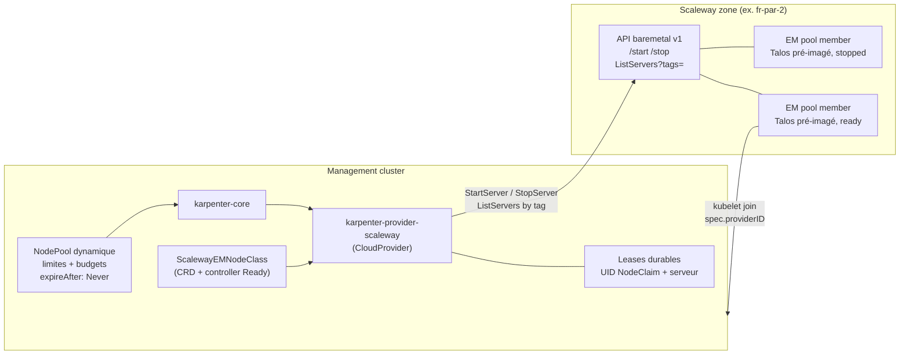

# LLD-002 : karpenter-provider-scaleway — backend pool Elastic Metal

**Date** : 2026-07-11
**Statut** : Backend EM durable intégré au provider hybride, validation matérielle en attente

> Mise en cohérence avec le code local le 2026-09-27 (core épinglé 1.14.0).
> [ADR-044](../adr/044-scaleway-vm-metal-rules.md) précise les blocages
> d'intégration et la politique de transition ; ce document n'atteste pas
> d'un autoscaling VM/métal opérationnel ni d'une chaîne VPA fonctionnelle.
**Entrées** : ADR-024 (autoscaling hybride), ADR-035 (pool EM statique), ADR-036
(où investir), investigations upstream du 2026-07-11 (karpenter-core v1.11.2 /
main post-v1.13 ; API Scaleway baremetal v1 + scaleway-sdk-go).

## 1. Objectif et verdict

Permettre à Karpenter de « consommer » du bare metal Scaleway : un pool de
serveurs Elastic Metal **pré-imagés Talos** (via `modules/em-talos-bootstrap`)
et éteints, où provisionner = power-on (~minutes) et déprovisionner =
power-off. L'abstraction CloudProvider de karpenter-core ne présuppose jamais
destroy-vs-power-off : **le modèle est faisable**, sous trois contraintes :

| # | Contrainte vérifiée | Réponse du design |
|---|---|---|
| C1 | `registrationTimeout = 15 min` — **const non configurable** (`liveness.go`). Create() → Node enregistré doit tenir en 15 min, sinon NodeClaim supprimé + Delete() | Power-on d'un serveur déjà imagé = « quelques minutes » (POST bare metal inclus, pas de SLA publié). **Mesure réelle = critère de sortie M0.** Post-enregistrement, l'initialisation n'a AUCUN timeout — tout le budget risque est sur cette fenêtre |
| C2 | Le core n'a **aucun cache d'indisponibilité d'offering** (le « ICE cache 3 min » est du code AWS). ICE naïf = boucle Create→ICE→Delete→reschedule | Capacité finie modélisée par `Offering.Available=false` quand le pool est épuisé (le scheduler ne nomine que `Available==true`). ICE réservé à la vraie course sur le dernier serveur |
| C3 | Matching Node↔NodeClaim **strictement** `node.spec.providerID == nodeClaim.status.providerID` (field index, jamais le nom). Talos sans CCM ne pose pas de providerID | §4 — deux options, décision en M0 |

Caveat économique assumé (ADR-035/036) : un EM arrêté **reste facturé**
(matériel dédié, facturation livraison→suppression). Le pool donne
l'élasticité de *capacité* pilotée par Karpenter, pas d'économie à l'état
éteint. L'économie se fait au dimensionnement du pool et au passage mensuel
(`MigrateServerToMonthlyOffer`).

## 2. Architecture


```mermaid
flowchart LR
    subgraph mgmt["Management cluster"]
        NP["NodePool dynamique\nlimites + budgets\nexpireAfter: Never"]
        CORE["karpenter-core"]
        CP["karpenter-provider-scaleway\n(CloudProvider)"]
        NC["ScalewayEMNodeClass\n(CRD + controller Ready)"]
        LEASE["Leases durables\nUID NodeClaim + serveur"]
        NP --> CORE --> CP
        NC --> CP
        CP --- LEASE
    end
    subgraph scw["Scaleway zone (ex. fr-par-2)"]
        API["API baremetal v1\n/start /stop\nListServers?tags="]
        P1["EM pool member\nTalos pré-imagé, stopped"]
        P2["EM pool member\nTalos pré-imagé, ready"]
        API --- P1
        API --- P2
    end
    CP -->|"StartServer / StopServer\nListServers by tag"| API
    P2 -->|"kubelet join\nspec.providerID"| mgmt
```

- **Pool** = serveurs EM portant un tag dédié (ex. `st4ck.io/karpenter-pool=<name>`),
  pré-imagés par `modules/em-talos-bootstrap` (machineconfig worker appliqué,
  PN attaché + IP bookée IPAM — les deux **persistent aux power cycles**,
  IPv4 flexible stable ⇒ SANs des certs valides).
- Les exemples maintenus utilisent des **NodePools dynamiques**, limités,
  opt-in, sans expiration forcée. Le prototype M0 utilisait `spec.replicas` ;
  cela ne constitue ni la politique actuelle ni une garantie d'absence de
  drift natif. Le métal n'est jamais acheté/réinstallé par le provider.

## 3. Contrat CloudProvider → API Scaleway

| Méthode | Sémantique retenue | Appel Scaleway (`api/baremetal/v1`) |
|---|---|---|
| `Create(nodeClaim)` | Vérifier requests/requirements ; lier l'UID au serveur de la bonne offre ; réserver par Lease avant power-on. Retour hydraté immédiat, sans attendre le boot. Une issue ambiguë conserve l'intention | `ListServers`, `StartServer{BootType: normal}` ; reprises par réconciliation |
| `Delete(nodeClaim)` | Refuser l'ancien propriétaire ; power-off, jamais destruction. Libérer seulement après arrêt confirmé ; un état `stopped` avec intention `starting` reste ambigu | `StopServer`, puis `GetServer` lors d'une réconciliation ultérieure |
| `Get(providerID)` | Vérifier appartenance/état ; une réservation `starting` conserve la visibilité même si l'API rapporte encore stopped. Dé-taguer n'est pas une preuve de terminaison | `GetServer` |
| `List()` | Inclure les états live/transitoires/dégradés et les réservations durables ; ne pas masquer une machine ambiguë en capacité absente | `ListServers{Tags}`, Leases et hydratation des réservations |
| `GetInstanceTypes(np)` | Shape de l'offre toujours exposée ; `Available` exige un serveur arrêté de cette offre **sans Lease**. CPU/RAM/prix du catalogue, moins réserves et seuil mémoire d'éviction | `ListOffers` (cache positif), inventaire TTL 10 s et Leases non cachées |
| `IsDrifted` | `("", nil)` — opt-out provider (les raisons core restent) | — |
| `RepairPolicies` | `[]` en M0 (pas d'auto-repair) | — |
| `GetSupportedNodeClasses` | `[]status.Object{&ScalewayEMNodeClass{}}` | — |

Prix flat entre EM identiques : pas d'avantage de remplacement entre eux.
Le contrôleur hybride peut toutefois considérer une VM compatible moins chère ;
le prix catalogue n'est pas le coût marginal d'un EM déjà payé.

## 4. Contrat de bootstrap Talos

Format : `scaleway-em://<zone>/<server-id>` (stable, dérivable des deux côtés).

- **Chemin implémenté, à valider sur matériel** : `machine.kubelet.extraArgs:
  provider-id: scaleway-em://…` figé par serveur dans le machineconfig au
  pré-imaging. kubelet pose `spec.providerID` à l'enregistrement — pas de
  CCM, pas de taint uninitialized, contrôle total de la chaîne d'octets.
  Talos n'autorise pas certains kubelet args (denylist) — **la présence de
  `provider-id` dans la denylist Talos v1.12 est le premier test M0**.
- **Option B historique, non implémentée comme repli automatique** : `talos-cloud-controller-manager` (Platform: metal),
  `ProviderID: "scaleway-metal:///{{ .UUID }}"` + `cloud-provider: external`.
  Le CCM dérive l'ID du SMBIOS UUID du nœud, PAS du retour de Create() ⇒
  maintenir une map `{server-id → UUID}` (une fois, au pré-imaging) et
  déclarer le taint `node.cloudprovider.kubernetes.io/uninitialized` en
  `startupTaints` du NodePool.

Pour les nouveaux EM du pool, `karpenter_pool_enabled=true` exige le providerID
et un worker YAML mono-document. Le module valide avant création/provisionnement,
préserve les champs non concernés et impose le même contrat que VM :
`registerWithTaints` contient `karpenter.sh/unregistered:NoExecute`, `maxPods=110`,
`kubeReserved={cpu: 500m, memory: 1Gi}` et `evictionHard.memory.available=100Mi`.
Les seuils disque sont explicites (nodefs 10 %, imagefs 15 %, inodes libres 5 %).
Les overrides contradictoires et évictions soft non modélisées sont refusés.
L'allocatable enlève 500m CPU et 1124Mi mémoire du catalogue ; la RAM réellement
utilisable doit encore être mesurée. Le core retire le taint initial après
synchronisation ; le simulateur KWOK l'injecte lui-même et ne prouve pas Talos.
Ne jamais migrer un serveur installé par une réapplication du module d'imaging
destructif : drainer puis employer un changement de configuration non destructif.

## 5. Cycle de vie et budget temps

```
NodeClaim créé ──Create()──▶ StartServer ──▶ POST/boot Talos ──▶ kubelet join
     │                          (minutes, à mesurer M0)             │
     │◀————————————— fenêtre registrationTimeout = 15 min ——————————▶│
     └─ raté ⇒ NodeClaim supprimé, Delete() (power-off), reschedule
Ensuite : Registered → Initialized (SANS timeout) → live
Delete : drain (core) → StopServer → stopped → finalizer retiré
```

- Un NodeClaim n'est **jamais réutilisé** — chaque power-on = nouveau
  NodeClaim ; réutiliser le même providerID à un cycle ultérieur est valide
  (l'ancien NodeClaim est entièrement supprimé avant).
- `expireAfter: Never` obligatoire (défaut 720 h = remplacement forcé à 30 j).
- Pas de contrôleur d'interruption à écrire (hors core, spécifique AWS).

## 6. CRD `ScalewayEMNodeClass` (v1alpha1, minimale)

```yaml
apiVersion: karpenter.scaleway.st4ck.io/v1alpha1
kind: ScalewayEMNodeClass
metadata:
  name: metal-pool
spec:
  zone: fr-par-2                  # PN par-AZ (ADR-035)
  poolTag: st4ck.io/karpenter-pool=metal   # sélecteur ListServers
  offerName: EM-A116X-SSD         # shape → GetInstanceTypes
status:
  conditions: [ ... Ready ... ]   # contrat operatorpkg/status.Object
  poolSize: 3
  stopped: 2                      # bonne offre, réservations incluses ; pas la capacité libre
```
Contrôleur NodeClass : réconcilie l'inventaire (ListServers by tag), calcule
`Ready` (API joignable + offre supportée + au moins un membre de cette offre).
Le compteur `stopped` remplace l'ancien `available` expérimental ; il ne promet
pas qu'une création puisse réserver ces serveurs. `Create()` renvoie
`NewNodeClassNotReadyError` si `Ready=False`.

## 7. NodePool de référence

```yaml
apiVersion: karpenter.sh/v1
kind: NodePool
metadata:
  name: metal
spec:
  limits: {cpu: "128", memory: 512Gi}
  template:
    spec:
      nodeClassRef: { group: karpenter.scaleway.st4ck.io, kind: ScalewayEMNodeClass, name: metal-pool }
      taints: [{ key: st4ck.io/elastic, value: "true", effect: NoSchedule }]
      expireAfter: Never
      requirements:
        - { key: node.kubernetes.io/instance-type, operator: In, values: [EM-A116X-SSD] }
  disruption:
    consolidationPolicy: WhenEmptyOrUnderutilized
    consolidateAfter: 5m
    budgets: [{nodes: "1"}]
```
Exemple réduit ; reprendre les labels et les deux pools depuis
[hybrid-nodepools.yaml](../../karpenter-provider-scaleway/examples/hybrid-nodepools.yaml).
La policy historique « deux heures puis métal » n'est pas implémentée.

## 8. Layout du code et wiring

```
karpenter-provider-scaleway/
├── go.mod                        # module github.com/st4ck/karpenter-provider-scaleway
├── cmd/controller/main.go        # un core hybride, client de réservation non caché
├── pkg/apis/v1alpha1/            # NodeClasses EM et VM + deepcopy
├── pkg/cloudprovider/            # hybride, durable EM, VM, protection finalizers
├── pkg/pool/                     # inventaire: ListServers by tag, cache, comptage
├── pkg/reservation/              # Leases sans expiration ni ownerReferences
├── pkg/vm/                       # backend Instances
├── pkg/controllers/nodeclass/    # statut Ready + inventaire
└── charts/                       # chart expérimental opt-in + CRD core 1.14.0
```

- **Modèles à copier** (sources dans le scratchpad de session :
  `kwok/`, `cluster-api/`, `proxmox/`) : kwok = minimal canonique (302 LOC
  cloudprovider) ; **cluster-api = meilleur template structurel pool fini**
  (665 LOC, single file) ; proxmox = wiring core v1.13 (9 args) + capacity
  accounting.
- **Pin de version core** : la signature `corecontrollers.NewControllers` a
  changé — v1.5.0 = 7 args (`…, cp, clusterState`), main/v1.13 = 9 args
  (`…, cp, undecoratedCP, clusterState, instanceTypeStore`, NodeOverlay).
  Le code actuel épingle 1.14.0 dans `go.mod` et embarque ses CRD.
- **SDK Scaleway** : `github.com/scaleway/scaleway-sdk-go/api/baremetal/v1`
  (`NewAPI`, `NewPrivateNetworkAPI`), auth `scw.NewClient(scw.WithEnv())`.
  IAM du contrôleur : `ElasticMetalFullAccess` (+ `IPAMReadOnly` si lecture
  des bookings). Statut opérationnel = **`ready`** (pas `running`) ; power
  states : `ready→stopping→stopped`, `stopped→starting→ready`. Pas de rate
  limit garanti ici ; le TTL d'inventaire de 10 s n'est pas un rate limiter
  global. Les transitions sont réconciliées, pas bloquées dans une boucle de polling.

## 9. Plan historique et état de preuve

Le plan ci-dessous conserve les pistes du spike ; M1/M2 ne sont pas des
fonctionnalités acquises. Chart, backend VM et réservations durables sont
maintenant intégrés. Aucun résultat de VPA fonctionnel ou de cycle matériel
n'est produit par les tests locaux. La recette actuelle est dans le
[guide d'activation](../how-to/scaleway-autoscaling.md).

**M0 — spike (~1 semaine), critères de sortie :**
1. `provider-id` accepté par Talos v1.12 en `kubelet.extraArgs` (Option A) —
   sinon bascule Option B (talos-ccm) documentée.
2. Latence réelle power-on→Ready mesurée sur EM-A116X-SSD (fr-par-2), ×5
   runs : **< 12 min p95** (marge 3 min sur C1) sinon repli : serveurs
   maintenus `ready` + cordon (pool « tiède » au lieu d'éteint) et le
   provider ne fait que uncordon/cordon — à décider aux résultats.
3. Squelette compilant : interface complète, backend Scaleway réel pour
   List/Get, fake in-memory pour tests unitaires (create/delete/ICE/GC).
4. Bout en bout sur cluster dev : NodePool static replicas 0→1 → serveur
   `ready` → Node joined+matched ; 1→0 → drain → `stopped`.

**M1** : chart Helm + intégration stack autoscaling (contexte multi-env),
scale des replicas piloté (KEDA sur pods Pending metal), métriques pool.
PR upstream karpenter-core : `registrationTimeout` const → var (une ligne,
évite le fork si le POST de certaines gammes déborde des 15 min).
**M2** : multi-offres/multi-zones, commande dynamique de serveurs = le
problème d'indisponibilité type AWS **revient** (la comptabilité exacte ne
vaut que pour le pool possédé). `Offer.Stock` est consultatif, pas une
réservation — une commande peut atterrir `out_of_stock` malgré un stock
annoncé. Design hybride, par (offre × zone) :
1. proactif — polling `ListOffers` : `Stock=empty` ⇒ `Available=false`
   avant toute tentative (signal qu'EC2 n'offre pas à AWS) ;
2. réactif — commande `out_of_stock` ⇒ `DeleteServer` du fantôme +
   marquage (offre × zone) indisponible avec TTL courte (le signal Stock
   vient d'être prouvé périmé) — l'équivalent du cache ICE AWS, en filet ;
3. `Stock=low` ⇒ TTL courte aussi (vrai mais fragile).

## 10. Risques

| Risque | Sévérité | Mitigation |
|---|---|---|
| POST bare metal > 15 min sur certaines gammes | Haute (tue le modèle éteint) | Mesure M0 ; repli pool tiède cordon/uncordon (coût identique — EM arrêté facturé) |
| `provider-id` refusé par la denylist kubelet Talos | Moyenne | Option B talos-ccm (validée upstream, Platform: metal) |
| Kubelet certs périmés après longs arrêts | Moyenne | Talos re-bootstrappe le kubelet au boot ; à vérifier explicitement en M0 (arrêt > 7 j simulé par horloge) |
| GC ↔ power-off hors bande (opérateur console) | Haute | Conserver les réservations ambiguës ; aucune disparition de Lease n'est une preuve d'arrêt |
| Churn dernier serveur (C2) | Basse | `Available=false` sans candidat de la bonne offre non réservé ; Lease atomique à la création |
| M2 : course au stock à la commande (`Stock` consultatif, pas de réservation atomique) | Moyenne (M2 seulement) | Hybride proactif/réactif §9 M2 — polling Stock + cache TTL par (offre × zone) sur `out_of_stock` prouvé |

## Annexe — sources primaires

Rapports d'investigation 2026-07-11 (session), notamment :
`types.go`/`liveness.go`/`nodeclaim.go` (karpenter-core), design
`static-capacity.md`, kwok/cluster-api/proxmox providers, API Scaleway
baremetal v1 + scaleway-sdk-go, talos-cloud-controller-manager config.
