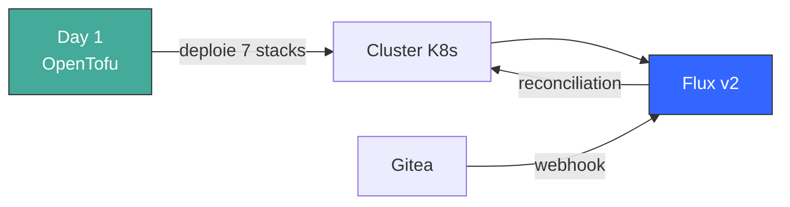
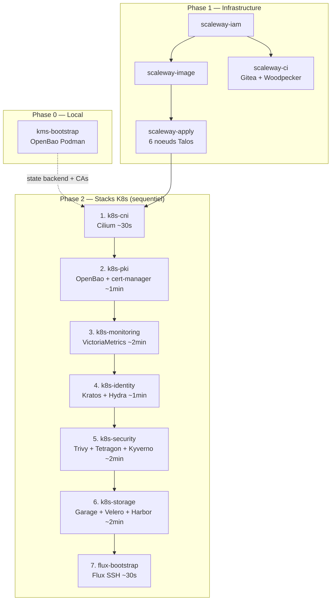
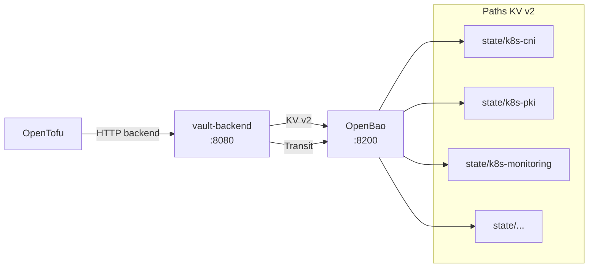
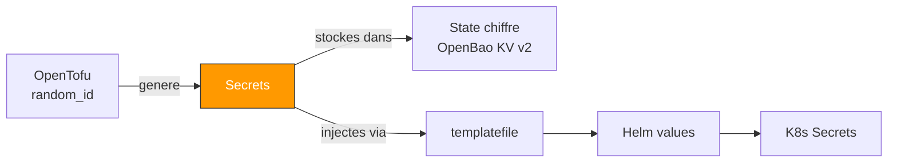
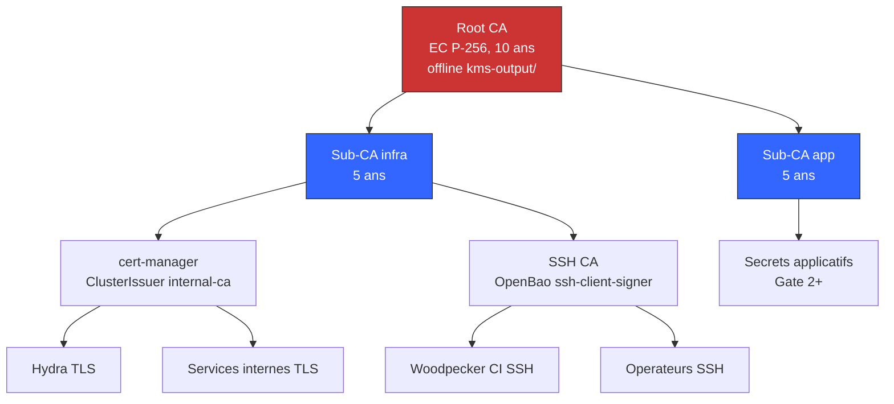
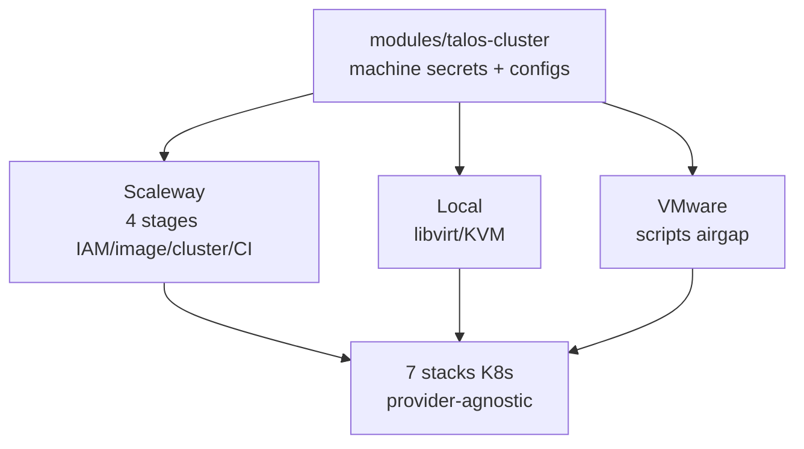
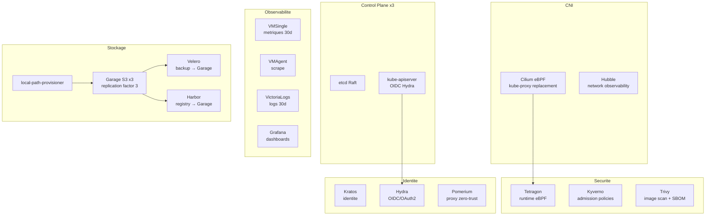
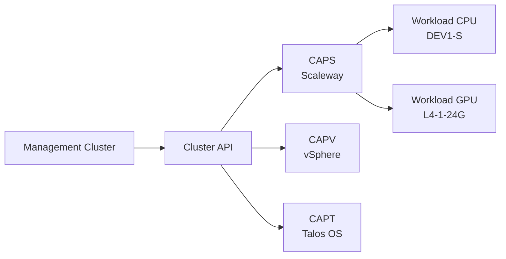

# Architecture

## Vue d'ensemble

La plateforme suit un **modele de deploiement en deux phases** :

1. **Phase 1 — OpenTofu** : Bootstrap l'infrastructure et toutes les stacks K8s en ordre strict de dependances. C'est le chemin "day-1" qui part d'un environnement vierge vers une plateforme operationnelle.

2. **Phase 2 — Flux v2** : Prend le relais pour la reconciliation day-2 via GitOps. HelmReleases et Kustomize overlays assurent la detection de drift et le self-healing.



## Pipeline de deploiement



### Pourquoi cet ordre ?

- **Cilium en premier** : c'est le CNI. Sans lui, aucun pod ne peut etre schedule.
- **PKI avant monitoring** : cert-manager doit etre pret pour les certificats TLS.
- **Identity apres PKI** : Hydra a besoin de certificats TLS signes par cert-manager.
- **Security avant storage** : Kyverno doit etre pret avant de deployer les workloads stateful.
- **Storage apres security** : evite les race conditions (Kyverno webhooks bloquant des pods).
- **Flux en dernier** : il a besoin de toutes les stacks presentes pour les reconcilier.

> **Note** : le pipeline etait initialement parallele (`make -j2`) pour pki+monitoring
> et security+storage, mais les race conditions (VMSingle PVC Pending, Kyverno webhooks)
> ont impose le mode sequentiel. +3 min mais 100% fiable.

## Stockage du state



- **Authentification** : `TF_HTTP_PASSWORD` (token depuis kms-output/)
- **Chiffrement** : Transit engine (aes256-gcm96) + Raft at-rest
- **Locking** : vault-backend cree des cles `-lock` dans KV v2
- **Backup** : `make state-snapshot` cree un snapshot Raft

## Gestion des secrets

Les secrets ne passent jamais par Git.



- `random_id.*.hex` (64 chars) : tokens, passwords, RPC secrets
- `random_id.*.b64_std` (base64) : Pomerium shared/cookie secrets (strict 32 bytes)
- Jamais en clair sur disque — uniquement dans le state Terraform chiffre

## Architecture PKI



La cle privee du Root CA n'existe que dans `kms-output/` (local, gitignore).
Les Sub-CAs sont injectees dans le cluster via `kubernetes_secret`.

## Strategie multi-environnement



| Environnement | Provider | Specificites |
|---|---|---|
| Scaleway | scaleway/scaleway | 4 stages (IAM, image, cluster, CI), Load Balancer, Private Network |
| Local | libvirt | QEMU/KVM VMs, bridge networking |
| VMware | Scripts shell | Pas de Terraform (pas d'API vSphere), OVA + image cache, IPs statiques |

Toutes les stacks K8s sont provider-agnostiques — elles recoivent uniquement un `kubeconfig_path`.

## Limites des stacks

| Stack | Composants | Namespace |
|---|---|---|
| k8s-cni | Cilium + Hubble | kube-system |
| k8s-pki | OpenBao x2, cert-manager, CA secrets | secrets |
| k8s-monitoring | VictoriaMetrics, VictoriaLogs, Grafana, Headlamp | monitoring |
| k8s-identity | Kratos, Hydra, Pomerium | identity |
| k8s-security | Trivy, Tetragon, Kyverno, Cosign policy | security |
| k8s-storage | local-path, Garage, Velero, Harbor | garage, storage |
| flux-bootstrap | Flux v2, GitRepository, root Kustomization | flux-system |

## Cluster K8s — vue composants



## GitOps (Day-2)

Apres le deploiement initial, Flux reconcilie depuis `clusters/management/` :

```
clusters/management/
    kustomization.yaml          # Root : reference toutes les stacks
    k8s-cni/                    # HelmRelease Cilium
    k8s-monitoring/             # HelmReleases monitoring
    k8s-pki/                    # HelmReleases PKI
    k8s-identity/               # HelmReleases identity
    k8s-security/               # HelmReleases security
    k8s-storage/                # HelmReleases storage
```

## Workload Clusters (CAPI)



Le management cluster provisionne des workload clusters via Cluster API :
- **CAPS** (Scaleway) : instances CPU et GPU a la demande
- **CAPV** (vSphere) : VMs avec DHCP + MAC reservations (planifie)
- **CAPT** (Talos) : configure Talos OS sur les machines provisionnees
