# Bootstrap : resoudre les problemes oeuf et poule

Ce document explique les dependances circulaires rencontrees lors du bootstrap
de la plateforme et comment chacune est resolue.

## Vue d'ensemble

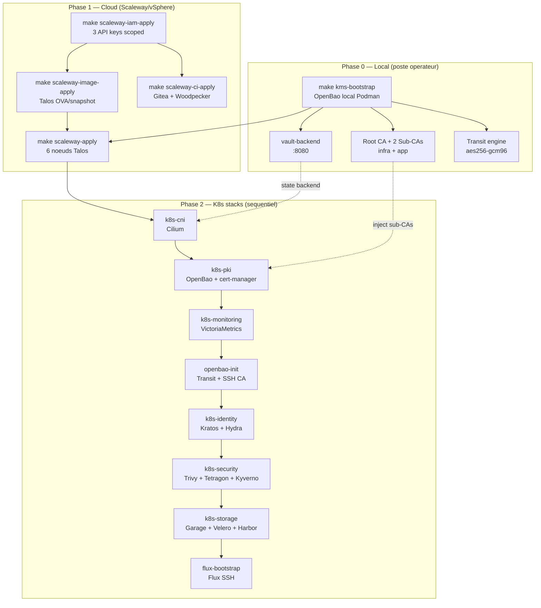

## Les 5 problemes oeuf/poule

### 1. CNI avant tout (mais Flux ne peut pas deployer Cilium)

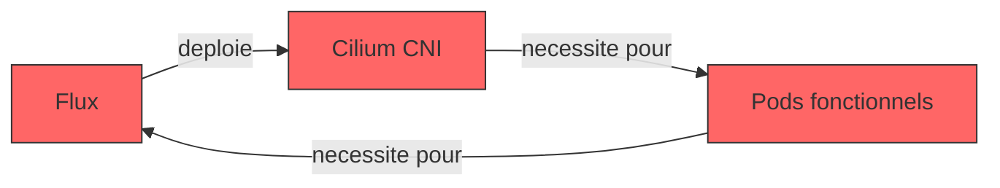

**Probleme** : Flux a besoin du reseau (Cilium) pour tourner.
Mais Cilium est le premier composant a deployer. Sans CNI, aucun pod ne peut
etre schedule — y compris Flux lui-meme.

**Solution** : OpenTofu deploie Cilium directement via `helm_release`,
sans passer par Flux. Flux est deploye en dernier pour le drift detection.

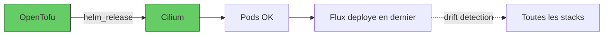

### 2. State backend avant le state (mais le backend a besoin d'infra)

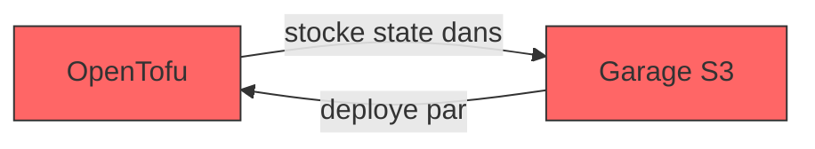

**Probleme** : OpenTofu a besoin d'un backend pour stocker le state.
Le backend naturel serait Garage S3, mais Garage n'existe pas encore
(il est deploye par OpenTofu a l'etape 7).

**Solution** : Un backend HTTP local (vault-backend) qui stocke le state
dans OpenBao KV v2, tournant en Podman sur le poste operateur.

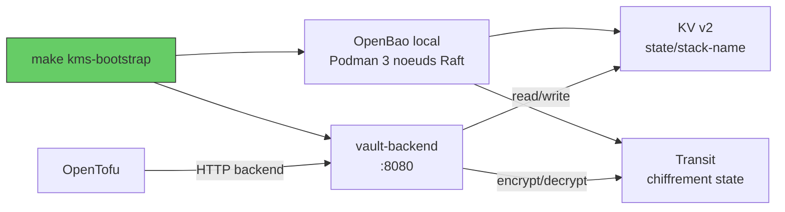

### 3. PKI avant les secrets (mais les CAs doivent exister avant le cluster)

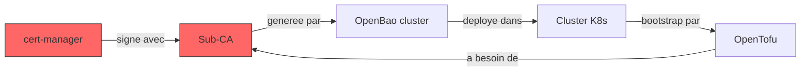

**Probleme** : cert-manager a besoin des CAs pour signer des certificats.
Les CAs doivent etre generees avant le cluster. Mais OpenBao (qui gere les CAs)
tourne dans le cluster.

**Solution** : PKI en deux phases. Le KMS local genere la chaine de confiance
(Root CA + 2 Sub-CAs). Les Sub-CAs sont injectees dans le cluster via
Terraform `kubernetes_secret`.

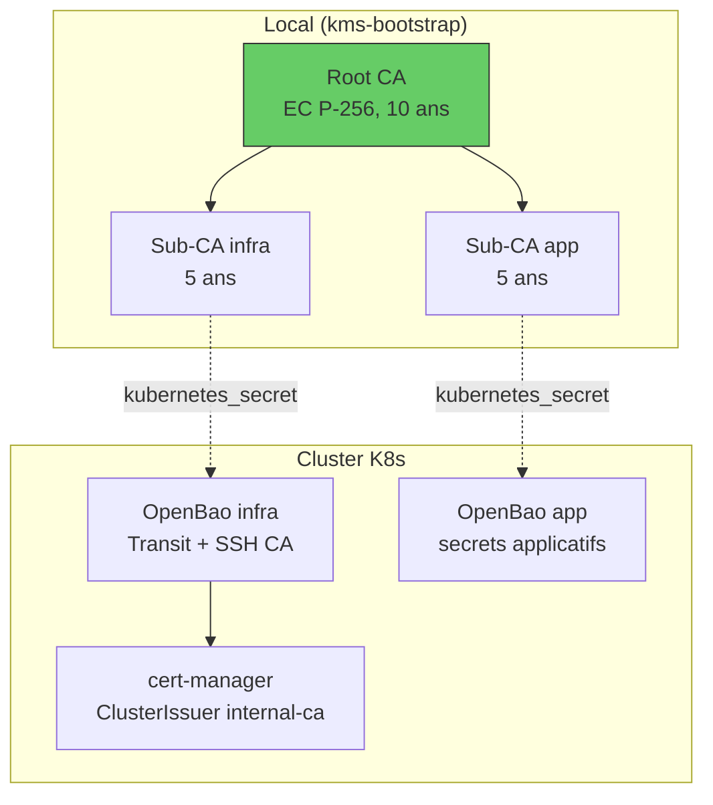

### 4. Gitea avant le pipeline (mais Gitea est deploye par le pipeline)

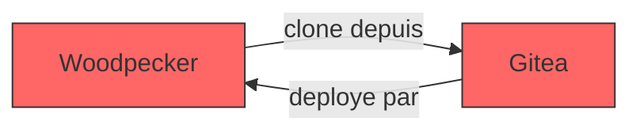

**Probleme** : Woodpecker CI a besoin de Gitea pour cloner le repo.
Mais Gitea est provisionne par l'infra qu'on deploie.

**Solution** : Gitea et Woodpecker tournent sur une VM CI separee (hors cluster),
deployee par OpenTofu via cloud-init. Cette VM est independante du cluster K8s.

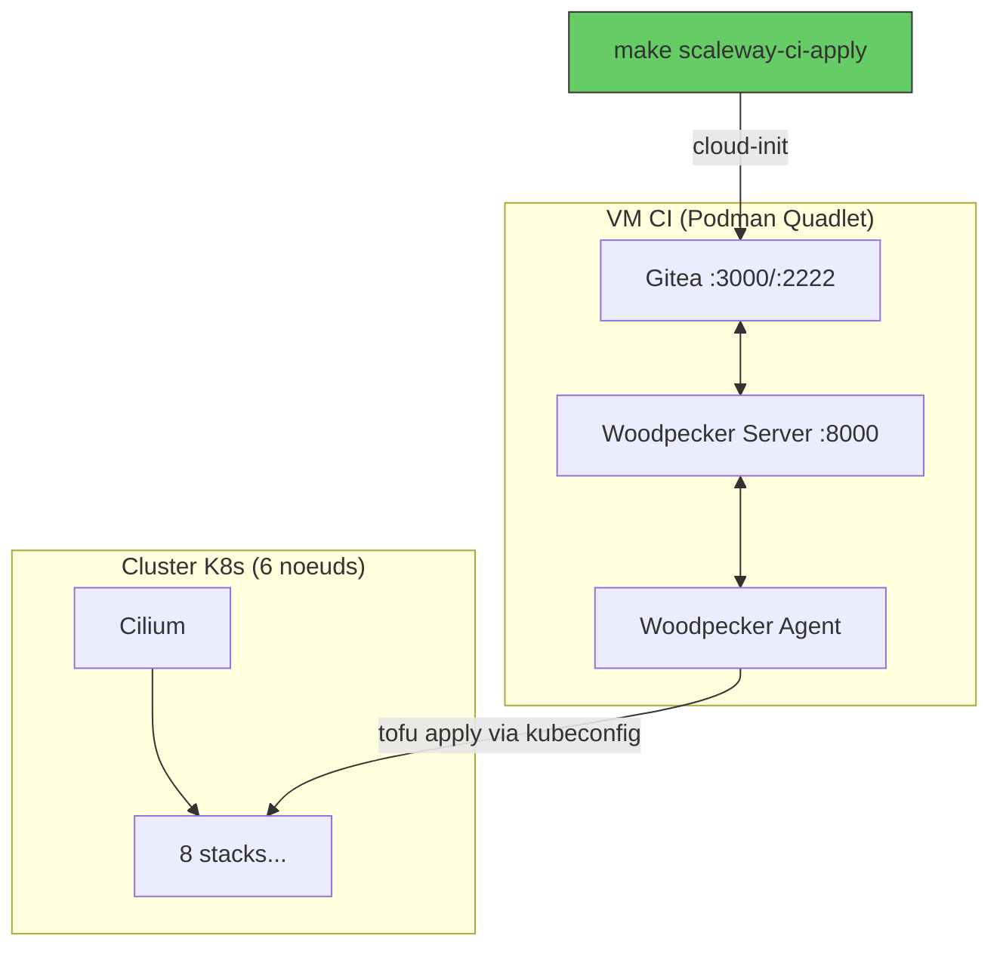

### 5. Flux SSH key avant Gitea (mais la known_hosts depend de Gitea)

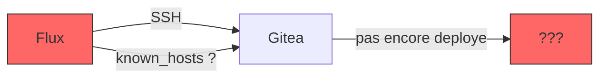

**Probleme** : Flux a besoin de la cle SSH de Gitea pour le `known_hosts`.
Mais Gitea n'est pas encore deploye quand on configure Flux.

**Solution** : Terraform genere une cle ed25519 statique (`tls_private_key`).
Le `known_hosts` contient un placeholder, mis a jour apres le premier deploy
de la VM CI.

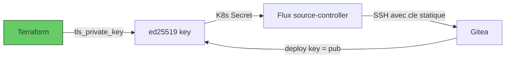

## Sequence complete de bootstrap

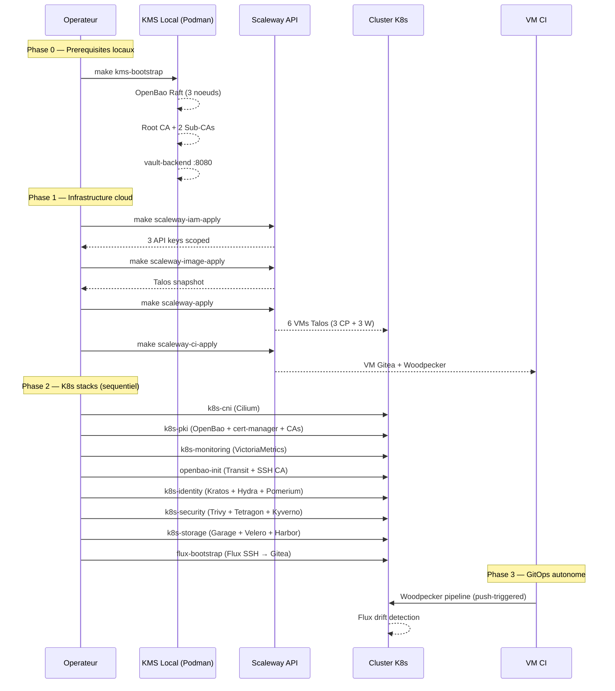

## Resume des solutions

| Probleme oeuf/poule | Solution |
|---|---|
| CNI avant Flux | OpenTofu deploie Cilium directement, Flux en dernier |
| State backend avant S3 | vault-backend local (Podman) → OpenBao KV v2 |
| CAs avant cluster | KMS local genere Root + Sub-CAs, injectees via K8s secrets |
| Gitea avant pipeline | VM CI separee (cloud-init), hors du cluster |
| Flux SSH avant Gitea | Cle statique ed25519 + placeholder known_hosts |
