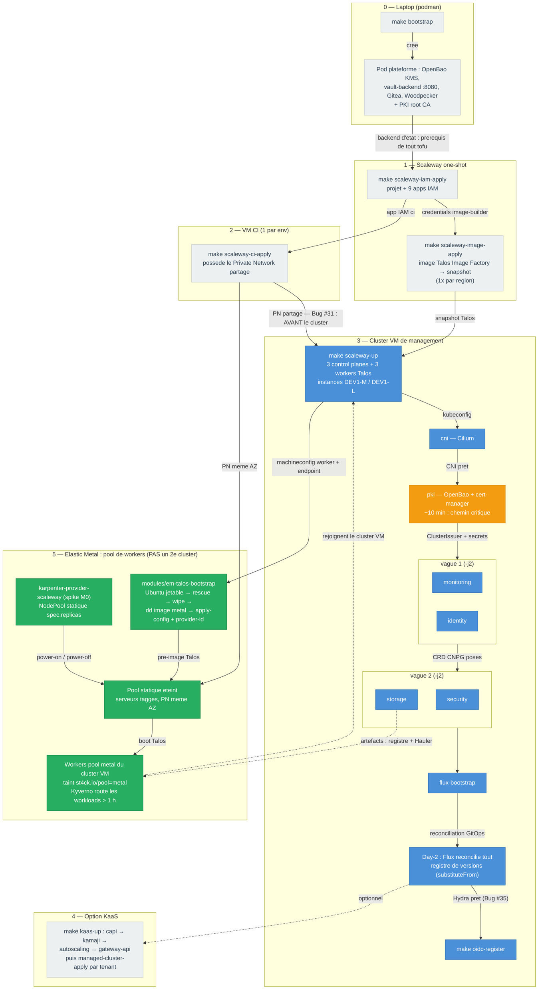

# Ordre de deploiement : du laptop au baremetal

Ce document repond a la question recurrente « on deploie d'abord des VM,
puis du baremetal ? » en montrant l'ordre complet de mise en route de la
plateforme, du poste operateur jusqu'aux serveurs Elastic Metal.

Sources : `Makefile` (cible `k8s-up`, vagues paralleles depuis le
2026-07-12), ADR-035 (pool Elastic Metal statique), ADR-036 (ou investir
l'effort autoscaling), LLD-002 (`docs/design/002-karpenter-scaleway-em.md`),
ADR-034 (Hauler).

## Vue d'ensemble

Lecture des couleurs : gris = preparation one-shot ou optionnelle, bleu =
chemin core du cluster de management, orange = chemin critique (pki,
~10 min incompressibles), vert = pool Elastic Metal.

## Les phases en bref

| Phase | Lieu | Commande | Reference |
|-------|------|----------|-----------|
| 0 | Laptop (podman) | `make bootstrap` | [Bootstrap](bootstrap.md) |
| 1 | Scaleway (1x par org, image 1x par region) | `make scaleway-iam-apply`, `make scaleway-image-apply` | `envs/scaleway/iam`, `envs/scaleway/image` |
| 2 | VM CI (1 par env) | `make scaleway-ci-apply` | Bug #31 (postmortem 2026-04-30) |
| 3 | Cluster VM | `make scaleway-up` (inclut `k8s-up` en vagues), puis `make oidc-register` | `Makefile`, ADR-028 |
| 4 | Cluster VM (option) | `make kaas-up`, puis `make managed-cluster-apply` par tenant | ADR-020, ADR-025 |
| 5 | Elastic Metal | `modules/em-talos-bootstrap`, puis karpenter-provider-scaleway | ADR-035, ADR-036, LLD-002 |

Points d'ordre non negociables :

- La VM CI possede le Private Network partage et DOIT preceder le cluster
  (`make scaleway-ci-apply` avant `make scaleway-up`, Bug #31).
- `oidc-register` s'execute apres la reconciliation Flux : Hydra est
  Flux-owned (ADR-028), son endpoint admin n'existe qu'apres le day-2
  (Bug #35).
- Le registre de versions (`clusters/management/versions-configmap.yaml`)
  est la source unique partagee entre Flux (`postBuild.substituteFrom`),
  les pins OpenTofu et le manifeste Hauler.

## « D'abord des VM, puis du baremetal ? » — trois reponses

1. **Oui, le bootstrap podman vient d'abord.** Le pod plateforme sur le
   laptop (OpenBao KMS + vault-backend) stocke tous les etats OpenTofu et
   genere la PKI root CA : sans lui, aucun `tofu init` ne fonctionne, quel
   que soit le provider.
2. **Oui, le cluster de management tourne sur VM ensuite.** La VM CI (qui
   possede le reseau prive partage) puis le cluster Talos sur instances
   Scaleway (DEV1-M/L) viennent avant tout baremetal. C'est ce cluster VM
   qui heberge Flux, le registre d'artefacts et, en phase 2, le
   karpenter-provider-scaleway qui pilote le metal.
3. **Le baremetal n'est jamais un second cluster.** Les serveurs Elastic
   Metal sont pre-images Talos (`modules/em-talos-bootstrap` : Ubuntu
   jetable → rescue → wipe → dd de l'image metal → `talosctl apply-config`
   avec provider-id), laisses eteints dans un pool statique tagge, puis
   allumes/eteints par karpenter-provider-scaleway. Ils REJOIGNENT le
   cluster VM existant comme workers du pool `metal` (taint
   `st4ck.io/pool=metal`) ; Kyverno y route les workloads soutenus
   (> 1 h). Le baremetal depend donc du cluster VM (il le rejoint) et du
   registre/Hauler pour ses artefacts — jamais l'inverse.
