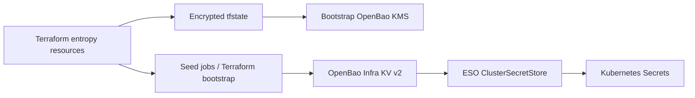

# Security Model

This document explains the security architecture, threat assumptions, and policy enforcement of the Talos platform.

## Threat Model Assumptions

The platform is designed for **sovereign environments** with strong security requirements. The threat model assumes:

1. **Untrusted network**: All inter-node communication may be intercepted. Mitigated by Cilium mTLS and eBPF network policies.
2. **Compromised container images**: Any pulled image may contain vulnerabilities. Mitigated by Trivy scanning, Cosign signature verification, and Harbor as a controlled registry.
3. **Lateral movement after pod compromise**: An attacker who gains code execution in a pod should not be able to escalate. Mitigated by Kyverno admission policies, Tetragon runtime enforcement, and Cilium L7 network policies.
4. **Air-gap integrity**: In air-gapped deployments, all images must be verified before transfer. Harbor mirror + Trivy scan + Cosign verification chain handles this.
5. **Secrets leakage**: No secret should exist in Git, on disk in plaintext, or in environment variables at rest. Mitigated by Terraform-generated entropy, encrypted state through the bootstrap OpenBao KMS, OpenBao Infra as the in-cluster secret source, and ESO reconciliation.

## Immutable OS (Talos Linux)

Talos Linux provides the first layer of defense:

- **No SSH**: There is no SSH daemon. Node access is via `talosctl` only.
- **No shell**: There is no shell (`/bin/sh`, `/bin/bash`). Processes cannot spawn arbitrary commands.
- **No systemd**: System services are managed by machined, not systemd.
- **Read-only root filesystem**: The root filesystem is immutable. Only `/var` and `/etc` are writable, and only by the Talos API.
- **Minimal attack surface**: No package manager, no user accounts, no cron.

This is why Trivy's node-collector is disabled (ADR-011) -- there is nothing to scan on the host.

## PKI Trust Chain

```
Root CA (EC P-384, 10 years, bootstrap kms-output/)
  |
  +-- Infra Intermediate CA (5 years)
  |     |
  |     +-- OpenBao Infra pki_int/ + cert-manager ClusterIssuer "internal-ca"
  |           |
  |           +-- Hydra TLS certificate
  |           +-- Internal service certificates
  |
  +-- App Intermediate CA (5 years, reserved for app boundary)
```

- The Root CA private key exists only in bootstrap state/`kms-output/` and is gitignored.
- Intermediate CAs are generated by the bootstrap Terraform module and exported through `kms-output/`.
- OpenBao Infra is the in-cluster PKI backend for cert-manager.
- Certificate rotation is handled by cert-manager for leaf certificates; CA rotation is explicit and documented in the rotation playbook.

## Secrets Management

### Generation

Secrets are generated at deploy time with the Terraform resource type matching the data format:

- `random_password`: passwords, OAuth/client secrets, admin tokens
- `random_bytes`: binary secrets such as Pomerium shared/cookie secrets, Garage RPC secret, and seal keys
- `tls_private_key`: Root/Sub-CAs, Flux SSH, Cosign
- No manual `secret.tfvars` for application secrets

### Storage and flow



Secrets are never written to Git. Runtime consumers should prefer Kubernetes Secrets reconciled by ESO from OpenBao Infra. Direct Helm value templating is a bootstrap compatibility path, not the target day-2 model.

### Day-2 (ESO)

External Secrets Operator syncs from in-cluster OpenBao Infra:

```
OpenBao Infra KV v2 -> ESO ClusterSecretStore -> ExternalSecret -> K8s Secret
```

ESO intentionally uses the Vault/OpenBao provider (`provider.vault`, KV v2, auth Kubernetes). OpenBao itself is deployed with the official Helm chart; there is no OpenBao operator in the target architecture.

## Network Security (Cilium)

Cilium provides multi-layer network security:

| Layer | Feature | Configuration |
|-------|---------|---------------|
| L3/L4 | Network Policies | CiliumNetworkPolicy CRDs |
| L7 | HTTP/gRPC-aware policies | Protocol parsing in eBPF |
| Encryption | mTLS between pods | Transparent, no sidecars |
| DNS | DNS-aware policies | Block/allow by FQDN |
| Observability | Hubble flow logs | All traffic logged |

`kubeProxyReplacement: true` means kube-proxy is completely replaced by Cilium's eBPF datapath, removing iptables from the networking stack.

## Admission Policies (Kyverno)

Kyverno enforces policies at admission time:

| Policy | Type | Mode | Description |
|--------|------|------|-------------|
| Cosign verifyImages | ClusterPolicy | Audit | Verify image signatures (ready for Enforce) |
| Pod Security Standards | ClusterPolicy | Baseline/Restricted | Prevent privileged pods, host networking |

`failurePolicy: Ignore` is set to prevent Kyverno webhook failures from blocking the entire cluster. This is intentional: in a bootstrap scenario, Kyverno must not block its own deployment.

**Important**: Kyverno webhooks persist after pod deletion. The `k8s-down` target deletes webhooks first to prevent them from blocking resource cleanup.

## Runtime Security (Tetragon)

Tetragon provides eBPF-based runtime security:

- **Process monitoring**: Tracks all process executions in pods
- **Network monitoring**: Tracks all network connections
- **File monitoring**: Tracks filesystem access patterns
- **Enforcement**: Can kill processes or block syscalls in real-time

Talos-specific: Tetragon requires `extraHostPathMounts` for `/sys/kernel/tracing` (tracefs) because Talos mounts it at a non-standard location (ADR-018).

## Image Security (Trivy + Cosign + Harbor)

The image security chain:

```
Build image -> Push to Harbor -> Trivy scans automatically -> Sign with Cosign
                                                                    |
Pull from Harbor -> Kyverno verifyImages (Cosign signature check) -> Allow/Deny
```

- **Trivy Operator** runs in standalone mode. Node-collector is disabled (Talos is already hardened).
- **Cosign** signature verification via Kyverno ClusterPolicy (currently in audit mode).
- **Harbor** acts as the single registry, with S3 backend on Garage.

## OpenBao topology

Three OpenBao domains exist and must not be conflated:

| Instance | Location | Purpose |
|----------|----------|---------|
| `OpenBao KMS` | Podman platform pod, outside cluster | OpenTofu state backend through `vault-backend`, Root/Sub-CA bootstrap material |
| `openbao-infra` | Kubernetes namespace `secrets` | PKI intermediate CA, infra KV v2 source for ESO, Transit, SSH CA, Kubernetes auth |
| `openbao-app` | Kubernetes namespace `secrets` | Application-secret boundary, reserved until a dedicated `ClusterSecretStore openbao-app` is wired |

The in-cluster instances use the OpenBao Helm chart with HA Raft configuration and static seal. Static seal is an accepted non-prod risk tracked in ADR-026; production needs a KMS-wrap/HSM-equivalent before `prod-*` enforcement.

Engines on `openbao-infra`:
- `secret/`: KV v2 for platform secrets consumed by ESO
- `pki_int/`: PKI backend for cert-manager
- `transit/`: infrastructure cryptographic primitives
- `ssh-client-signer/`: SSH CA for certificate signing (Flux, operators)
- `auth/kubernetes`: ServiceAccount authentication for ESO/cert-manager/workloads

## OIDC Integration

```
User -> Pomerium (zero-trust proxy) -> Hydra (OIDC provider) -> Kratos (identity)
                                            |
                                    K8s apiServer (OIDC auth)
```

- Hydra issues OIDC tokens
- K8s apiServer is patched (via `talosctl`) to accept Hydra as an OIDC provider
- Pomerium acts as a reverse proxy, enforcing authentication before forwarding to services

## Relevant ADRs

| ADR | Decision |
|-----|----------|
| [ADR-001](../adr/001-cilium-cni.md) | Cilium over Flannel (eBPF, L7 policies, mTLS) |
| [ADR-007](../adr/007-openbao-secrets-manager.md) | OpenBao as secrets manager |
| [ADR-008](../adr/008-random-id-secrets.md) | Auto-generated secrets via Terraform entropy resources |
| [ADR-009](../adr/009-state-backend-openbao.md) | HTTP state backend via OpenBao KV v2 |
| [ADR-011](../adr/011-trivy-node-collector-disabled.md) | Trivy node-collector disabled for Talos |
| [ADR-018](../adr/018-tetragon-over-falco.md) | Tetragon over Falco (eBPF, Cilium alignment) |
| [ADR-033](../adr/033-openbao-eso-flux-ownership.md) | OpenBao/ESO ownership and Flux boundary |
