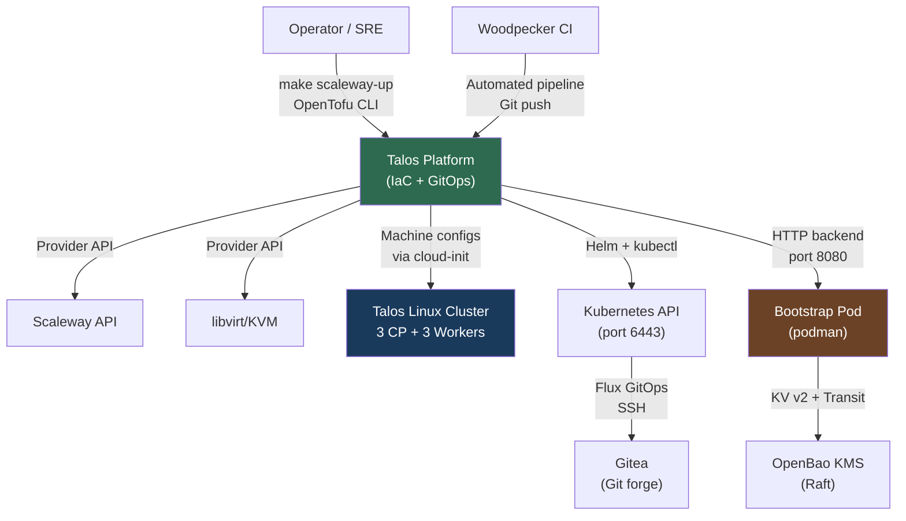
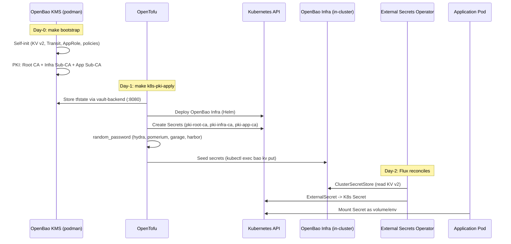
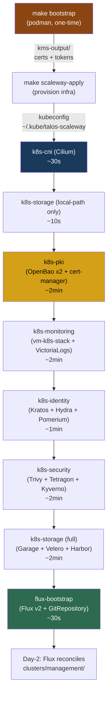
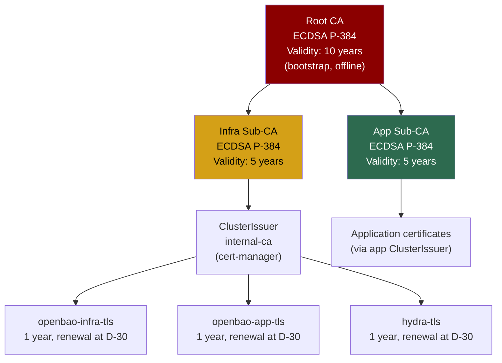

# Talos Linux Multi-Environment Platform -- High-Level Design (HLD)

**Version:** 1.0
**Date:** 2026-03-19
**Status:** Accepted

---

## 1. Executive Summary

The Talos platform is a multi-environment Kubernetes deployment system (Scaleway, local KVM, VMware air-gapped) built on Talos Linux v1.12 -- an immutable, minimal, and secure OS dedicated to Kubernetes. The system is entirely driven by Infrastructure-as-Code (OpenTofu) and GitOps (Flux v2), with zero plaintext secrets in Git.

The architecture relies on three tiers of OpenBao (open-source fork of HashiCorp Vault): a **bootstrap** (podman, off-cluster) for Terraform state storage and root PKI, an **infra** (in-cluster) for infrastructure secrets and auto-unseal, and an **app** (in-cluster) for application secrets. This three-tier model ensures separation of concerns, at-rest encryption for all states, and a hierarchical PKI trust chain (Root CA -> Infra Sub-CA + App Sub-CA).

Key tradeoffs are: higher bootstrap complexity in exchange for full zero-trust on secrets; sequential deployment (not parallel) to avoid race conditions; and a dependency on podman for the bootstrap platform.

---

## 2. Goals and Non-Goals

### Goals

- **G1**: Deploy a Kubernetes cluster with 3 control planes + 3 workers on any provider with a single command (`make scaleway-up`)
- **G2**: Zero secrets in Git -- all secrets are auto-generated (`random_id`/`random_password`) and stored in encrypted state (OpenBao KV v2)
- **G3**: Complete hierarchical PKI chain (Root CA 10 years -> Infra/App Sub-CA 5 years -> leaf certificates 1 year with automatic renewal)
- **G4**: Automated Day-1 (OpenTofu) to Day-2 (Flux GitOps) transition -- `tofu state rm` after first deployment, Flux reconciles afterward
- **G5**: Multi-provider support without code duplication -- K8s stacks are provider-agnostic, only the kubeconfig changes
- **G6**: Backup and restoration of all states via a single Raft snapshot

### Non-Goals

- **NG1**: Multi-cluster federation (out of scope, one cluster per environment)
- **NG2**: High availability of the bootstrap pod (single-node podman, acceptable since used only during initial deployment)
- **NG3**: Support for managed cloud Kubernetes providers (EKS, GKE, AKS) -- the project focuses on Talos bare-metal/IaaS
- **NG4**: Management of business application workloads -- the platform provides infrastructure, not applications

---

## 3. Context and Scope

### Context Diagram (C4 Level 1)



### Actors

| Actor | Role | Interface |
|-------|------|-----------|
| Operator / SRE | Deploys and operates the platform | `make`, `tofu`, `kubectl` |
| Woodpecker CI | Executes CI/CD pipelines | Gitea API (webhook), podman |
| Flux v2 | Reconciles desired state (GitOps Day-2) | SSH to Gitea, K8s API |

### System Scope

**Included:** bootstrap (OpenBao + Gitea + WP), cluster provisioning (Talos), 7 K8s stacks (CNI, PKI, monitoring, identity, security, storage, flux), GitOps Day-2.

**Excluded:** business applications, external DNS management, CDN, application databases.

---

## 4. System Architecture (C4 Level 2 -- Container Diagram)

### 4.1 Overview


### 4.2 Container Inventory

| Container | Technology | Responsibility | Deployment |
|-----------|------------|----------------|------------|
| OpenBao KMS | OpenBao 2.5.1 (Raft) | tfstate storage, Root CA PKI, Transit auto-unseal | Podman pod (off-cluster) |
| vault-backend | gherynos/vault-backend | HTTP proxy for `tofu` backend -> OpenBao KV v2 | Podman pod |
| Gitea | Gitea 1.22 (rootless) | Git forge, CI webhook | Podman pod |
| Woodpecker | Woodpecker v3 | CI/CD pipeline | Podman pod |
| OpenBao Infra | OpenBao (Helm 0.25.6) | Infrastructure secrets, Transit engine, ESO source | K8s StatefulSet (ns: secrets) |
| OpenBao App | OpenBao (Helm 0.25.6) | Application secrets | K8s StatefulSet (ns: secrets) |
| Cilium | Cilium 1.17.13 | CNI, kube-proxy replacement (eBPF) | K8s DaemonSet |
| cert-manager | cert-manager v1.19.4 | Automatic TLS issuance/renewal | K8s Deployment |
| vm-k8s-stack | VictoriaMetrics stack | Metrics, Grafana dashboards | K8s Helm release |
| Flux v2 | FluxCD | GitOps Day-2 reconciliation | K8s Deployment |
| ESO | External Secrets Operator | Sync OpenBao -> K8s Secrets | K8s Deployment |

---

## 5. Capacity Estimations

This system is a **sovereign infrastructure platform** (category "Defense/sovereign" -- 1K-100K users), not a high-traffic SaaS service.

| Metric | Value | Assumption |
|--------|-------|------------|
| Concurrent users | 5-20 | SRE/DevOps team |
| Active clusters | 1-3 | One per environment (local, scaleway) |
| Nodes per cluster | 6 | 3 CP + 3 workers |
| Pods per cluster | 100-300 | Infrastructure stacks only |
| Secrets in OpenBao | ~50 | Identity + storage + infra |
| Total tfstate size | ~10-50 MB | 8 stacks x ~2-6 MB each |
| Raft storage (OpenBao) | < 1 GB | States + secrets + KV versions |
| Raft snapshot (backup) | ~10-50 MB | Compressed |
| K8s API bandwidth | < 1 Mbps | Deployment and reconciliation |
| Full deployment time | ~15-20 min | Bootstrap (2min) + cluster (5min) + 7 stacks (10min) |

**Conclusion:** Sizing is modest. A single OpenBao Raft node (bootstrap) is sufficient. The architecture is sized for security and robustness, not for throughput.

---

## 6. Data Architecture

### 6.1 Three-Tier OpenBao Architecture


### 6.2 Secrets Flow



### 6.3 State Storage (tfstate)

| State | OpenBao KV v2 Path | HTTP Backend |
|-------|-------------------|--------------|
| Scaleway cluster | `secret/data/tfstate/scaleway` | `http://localhost:8080/state/scaleway` |
| k8s-cni | `secret/data/tfstate/cni` | `http://localhost:8080/state/cni` |
| k8s-pki | `secret/data/tfstate/pki` | `http://localhost:8080/state/pki` |
| k8s-monitoring | `secret/data/tfstate/monitoring` | `http://localhost:8080/state/monitoring` |
| k8s-identity | `secret/data/tfstate/identity` | `http://localhost:8080/state/identity` |
| k8s-security | `secret/data/tfstate/security` | `http://localhost:8080/state/security` |
| k8s-storage | `secret/data/tfstate/storage` | `http://localhost:8080/state/storage` |
| flux-bootstrap | `secret/data/tfstate/flux-bootstrap` | `http://localhost:8080/state/flux-bootstrap` |

**Authentication:** AppRole (role-id + secret-id) exported in `kms-output/`. Each `tofu` command sends credentials via `TF_HTTP_USERNAME` / `TF_HTTP_PASSWORD`.

**Locking:** vault-backend creates `-lock` secrets in KV v2 to prevent concurrent operations.

**State encryption:**
- Initial stacks (envs, cni, pki): PBKDF2 (passphrase)
- Post-init stacks (identity, security, storage): OpenBao Infra Transit (key `state-encryption`)

---

## 7. Deployment Pipeline

### 7.1 Sequencing



### 7.2 Day-1 vs Day-2

| Aspect | Day-1 (OpenTofu) | Day-2 (Flux GitOps) |
|--------|-------------------|----------------------|
| **Trigger** | `make k8s-up` (operator) | Git commit in `clusters/management/` |
| **Tool** | OpenTofu `apply` | Flux Kustomization + HelmRelease |
| **State** | tfstate in OpenBao KV v2 | Desired state = Git, current state = cluster |
| **Secrets** | `random_password` -> tfstate | ESO: OpenBao Infra -> K8s Secret |
| **Rollback** | `tofu destroy` + `tofu apply` | `git revert` + Flux reconciles |
| **Idempotence** | Yes (Terraform) | Yes (Flux prune + wait) |
| **Transition** | `tofu state rm` after first deploy | Flux takes over |

### 7.3 Ordering Constraints

| Invariant | Reason |
|-----------|--------|
| Cilium deployed FIRST | Without CNI, no pod can be scheduled |
| Cilium destroyed LAST | Removing the CNI breaks pod eviction |
| k8s-pki before k8s-identity | ClusterIssuer required for Hydra certificates |
| local-path-provisioner before OpenBao | StatefulSets need PVCs |
| Sequential deployment (not parallel) | Race conditions: PVC Pending, Kyverno webhooks |
| Kyverno webhooks deleted before stack destruction | Webhooks block deletions |

---

## 8. Security Architecture

### 8.1 PKI Hierarchy



### 8.2 Security Model

| Layer | Mechanism | Detail |
|-------|-----------|--------|
| **OS authentication** | Talos mTLS | Talos API protected by mutual client certificates |
| **K8s authentication** | OIDC (Hydra) | apiServer configured with `--oidc-issuer-url` at boot |
| **Encryption at rest** | Raft (OpenBao) | Native encrypted storage for all states |
| **Encryption in transit** | TLS (cert-manager) | All internal services use TLS via ClusterIssuer |
| **Secrets** | Zero secrets in Git | `random_id`/`random_password` -> encrypted tfstate -> OpenBao KV v2 |
| **Network** | Cilium eBPF | kube-proxy replacement, network policies, VXLAN overlay |
| **Network segmentation** | Security Group | `inbound_default_policy = drop`, explicit whitelist |
| **Vulnerability scanning** | Trivy | Container image scanning |
| **Runtime security** | Tetragon | eBPF runtime observability |
| **Policies** | Kyverno | Admission controller, policy enforcement |
| **Supply chain** | Cosign | Image signature verification |
| **Bootstrap images** | Pinned by SHA256 digest | All bootstrap pod images pinned by digest |

### 8.3 Secrets Management (Full Flow)

```
Generation (Day-1)                     Distribution (Day-2)
random_password/random_bytes           ESO ClusterSecretStore
        |                                     |
        v                                     v
   tfstate (encrypted)               OpenBao Infra KV v2
   in OpenBao KMS                    secret/identity/hydra
        |                            secret/identity/pomerium
        v                            secret/storage/garage
   kubectl exec                      secret/storage/harbor
   bao kv put                              |
   (idempotent seed)                       v
                                    ExternalSecret
                                           |
                                           v
                                     K8s Secret
                                    (mounted in pods)
```

---

## 9. Deployment Architecture

### 9.1 Cluster Topology


### 9.2 Multi-Environment

| Environment | Provider | Specifics |
|-------------|----------|-----------|
| **Scaleway** | `scaleway/scaleway` | 4 stages: IAM -> Image -> Cluster -> CI VM |
| **Local** | `dmacvicar/libvirt` | QEMU/KVM, fast dev/test |
| **VMware air-gapped** | Shell scripts (no Terraform) | Pre-built OVA, zero Internet access |

All K8s stacks are **identical** regardless of provider. Only the `kubeconfig_path` variable changes:
```
~/.kube/talos-scaleway
~/.kube/talos-local
```

---

## 10. Observability

### 10.1 Monitoring Stack

| Pillar | Tool | Namespace | Retention |
|--------|------|-----------|-----------|
| **Metrics** | VictoriaMetrics (vm-k8s-stack v0.72.4) | monitoring | Configurable |
| **Logs** | VictoriaLogs + Collector | monitoring | Configurable |
| **Dashboards** | Grafana (bundled with vm-k8s-stack) | monitoring | N/A |
| **Cluster UI** | Headlamp | monitoring | N/A |
| **Runtime** | Tetragon (eBPF) | security | N/A |

### 10.2 Target SLIs / SLOs

| SLI | SLO | Measurement Method |
|-----|-----|--------------------|
| K8s API availability | 99.9% (8.76h/year) | TCP health check :6443 via LB |
| K8s API latency p99 | < 1s | VictoriaMetrics apiserver_request_duration |
| OpenBao sealed | 0 occurrences | Periodic `bao status` |
| Flux reconciliation | < 10 min | `kustomization.status.lastAppliedRevision` |
| Certificate expiration | > 30 days | cert-manager metrics |

---

## 11. Failure Modes and Mitigation

| Failure Mode | Impact | Probability | Mitigation | Detection |
|-------------|--------|-------------|-----------|-----------|
| Bootstrap pod stopped | No `tofu` possible | Medium | `make bootstrap` or `podman pod start platform` | `curl :8080` fails |
| OpenBao KMS sealed | No `tofu` possible | Low | Static seal (file), automatic restart | `/v1/sys/health` != 200 |
| OpenBao Infra sealed | ESO can no longer sync | Low | Seal key in K8s Secret `openbao-seal-key` | `bao status` alert |
| Cilium DaemonSet down | No pod connectivity | Low | DaemonSet with automatic restart | Pods in ContainerCreating |
| Orphaned Kyverno webhooks | Deletion blocking | Medium | `make k8s-down` deletes webhooks first | kubectl delete timeout |
| Raft snapshot lost | All states lost | Low | Regular `make state-snapshot` | N/A (operational) |
| tfstate corruption | Stack cannot be applied | Very low | KV v2 versioning (version rollback) | `tofu plan` fails |
| VPC network partition | Cluster split-brain | Very low | 3 CP (etcd quorum 2/3), restrictive Security Group | NotReady node alerts |

---

## 12. Architecture Decision Records (ADRs)

### ADR-001: Three-Tier OpenBao (bootstrap / infra / app)

**Status:** Accepted

**Context:**
Terraform secrets (tfstate) must be stored securely before the cluster even exists. In-cluster secrets (identity, storage) require a secrets management system accessible from pods. Using a single OpenBao for both roles would create a circular dependency (the cluster needs OpenBao to exist, but OpenBao needs the cluster).

**Decision:**
Three separate OpenBao instances:
1. **Bootstrap (podman)** -- off-cluster, stores tfstates and root PKI
2. **Infra (in-cluster)** -- infrastructure secrets, Transit engine for state encryption
3. **App (in-cluster)** -- application secrets (separation of concerns)

**Alternatives considered:**

| Option | Pros | Cons |
|--------|------|------|
| Three-tier OpenBao (chosen) | No circular dependency, clear separation, auto-unseal via Transit | Setup complexity, 3 instances to maintain |
| Single OpenBao (off-cluster) | Simple, single management point | Network dependency for pods, SPOF |
| SOPS + age | Zero additional infra | Secrets in Git (encrypted), manual rotation |
| Kubernetes Secrets only | Native, zero dependency | No at-rest encryption by default, no versioning |

**Consequences:**
- Positive: Separation of concerns, zero circular dependency, auto-unseal
- Negative: Higher initial complexity
- Risk: If bootstrap is lost without a snapshot, all states are lost

---

### ADR-002: Talos Linux as Cluster OS

**Status:** Accepted

**Context:**
The node OS must be secure, immutable, and minimal for a hardened Kubernetes cluster.

**Decision:**
Talos Linux v1.12 -- immutable OS dedicated to Kubernetes, with no SSH, no shell, entirely driven by mTLS API.

**Alternatives considered:**

| Option | Pros | Cons |
|--------|------|------|
| Talos Linux (chosen) | Immutable, no SSH, mTLS, minimal, provider-agnostic | Learning curve, harder debugging |
| Flatcar / Bottlerocket | Immutable, large community | SSH present, larger attack surface |
| Ubuntu + kubeadm | Familiar, large community | Mutable, config drift, attack surface |
| RKE2 / k3s | Simple to deploy | Mutable underlying OS, less secure |

**Consequences:**
- Positive: Minimal attack surface, declarative configuration, no drift
- Negative: Debugging via `talosctl` only, no emergency `ssh`

---

### ADR-003: Cilium as kube-proxy Replacement (eBPF)

**Status:** Accepted

**Context:**
The cluster needs a performant CNI with network policy and network observability capabilities.

**Decision:**
Cilium 1.17 in `cni: none` + `proxy: disabled` mode in the Talos machine config. Cilium fully replaces kube-proxy via eBPF.

**Alternatives considered:**

| Option | Pros | Cons |
|--------|------|------|
| Cilium eBPF (chosen) | High performance, L3-L7 network policies, Hubble observability | Must be deployed first |
| Calico | Mature, native BGP | Less performant than eBPF, no built-in observability |
| Flannel | Simple, lightweight | No network policies, no observability |

---

### ADR-004: vault-backend as HTTP Proxy for Terraform State

**Status:** Accepted

**Context:**
OpenTofu needs an HTTP-accessible state backend. OpenBao does not natively provide an API compatible with the Terraform HTTP backend.

**Decision:**
`vault-backend` (open-source project) translates HTTP operations (`GET`/`POST`/`LOCK`/`UNLOCK`) to KV v2 operations on OpenBao. Each stack has its own path (`/state/<stack>`).

**Alternatives considered:**

| Option | Pros | Cons |
|--------|------|------|
| vault-backend (chosen) | OpenBao KV v2 compatible, native locking, versioning | Additional component in bootstrap |
| S3 backend (MinIO) | Standard Terraform | S3 infrastructure to deploy and maintain |
| Local backend (files) | Zero dependency | No locking, no sharing, no encryption |
| Consul backend | Mature, HA | Heavy additional component |

---

### ADR-005: Sequential Stack Deployment (No Parallelism)

**Status:** Accepted

**Context:**
Initial parallel deployment (`make -j2`) caused race conditions: PVCs stuck in `Pending` (local-path-provisioner not ready), Kyverno webhooks blocking deployments of other stacks.

**Decision:**
Strictly sequential pipeline: CNI -> local-path -> PKI -> monitoring -> identity -> security -> storage -> flux.

**Consequences:**
- Positive: Reproducible, deterministic, zero race conditions
- Negative: Slower initial deployment (~15-20 min instead of ~10 min)

---

### ADR-006: Flux v2 for Day-2 (GitOps)

**Status:** Accepted

**Context:**
After the first deployment by OpenTofu, updates must be driven by Git (GitOps) to ensure auditability and reproducibility.

**Decision:**
Flux v2 with a root Kustomization pointing to `clusters/management/`. OpenTofu performs the first deployment then `tofu state rm` lets Flux take over.

**Alternatives considered:**

| Option | Pros | Cons |
|--------|------|------|
| Flux v2 (chosen) | Lightweight, pull-based, native CRDs | Less UI than ArgoCD |
| ArgoCD | Rich UI, granular RBAC | Heavier, push-based by default |
| OpenTofu only | Already in place | No continuous reconciliation, possible drift |

---

## 13. Open Questions and Risks

| # | Question / Risk | Owner | Status |
|---|-----------------|-------|--------|
| 1 | The bootstrap pod is a SPOF -- consider an HA mode or a cloud-native bootstrap (off-cluster StatefulSet) | Architecture | Open |
| 2 | The Day-1 -> Day-2 transition (`tofu state rm`) is manual -- risk of oversight | Operations | Open |
| 3 | VMware air-gapped uses shell scripts (not Terraform) -- divergence from other providers | Architecture | Accepted (air-gap constraint) |
| 4 | No cross-region DR solution (Raft snapshot is local) | Operations | Open |
| 5 | OpenBao major version upgrade (2.x) may break backward compatibility with self-init `initialize` blocks | Architecture | Monitoring |

---

## 14. Appendix

### Glossary

| Term | Definition |
|------|-----------|
| **Talos Linux** | Immutable, minimal OS dedicated to Kubernetes, with no SSH |
| **OpenBao** | Open-source fork of HashiCorp Vault (secrets management) |
| **vault-backend** | HTTP proxy that translates Terraform operations to OpenBao KV v2 |
| **OpenTofu** | Open-source fork of Terraform (IaC) |
| **Flux v2** | GitOps operator for Kubernetes (continuous reconciliation) |
| **ESO** | External Secrets Operator -- syncs external secrets to K8s |
| **Cilium** | eBPF-based Kubernetes CNI |
| **Raft** | Distributed consensus algorithm (used by OpenBao for storage) |
| **Static seal** | OpenBao mechanism where the decryption key is a local file (not Shamir) |
| **Auto-unseal** | Mechanism where OpenBao uses an external Transit engine to decrypt itself at startup |

### References

- [Talos Linux Documentation](https://www.talos.dev/v1.12/)
- [OpenBao Documentation](https://openbao.org/docs/)
- [Flux v2 Documentation](https://fluxcd.io/flux/)
- [Cilium Documentation](https://docs.cilium.io/en/v1.17/)
- [cert-manager Documentation](https://cert-manager.io/docs/)
- [C4 Model](https://c4model.com/)

### Versions

| Component | Version |
|-----------|---------|
| Talos Linux | v1.12.4 |
| Kubernetes | 1.35.0 |
| Cilium | 1.17.13 |
| OpenBao (bootstrap) | 2.5.1 |
| OpenBao Helm chart | 0.25.6 |
| cert-manager | v1.19.4 |
| OpenTofu | 1.9 |
| Gitea | 1.22 |
| Woodpecker CI | v3 |
