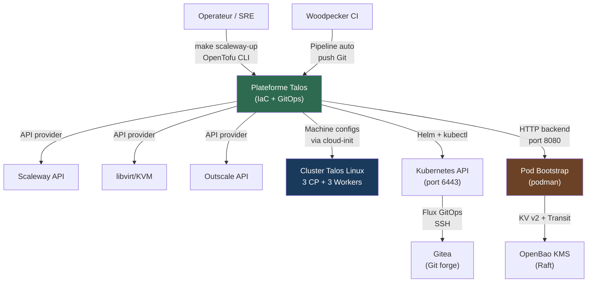
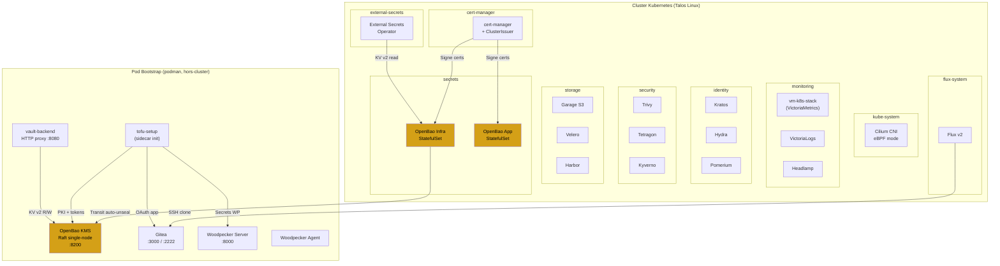
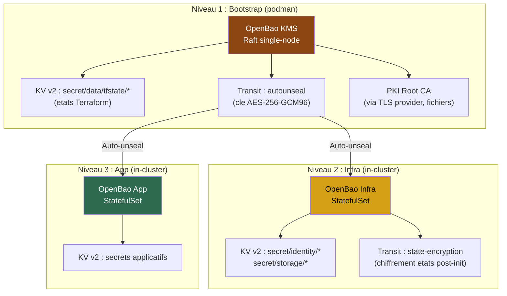
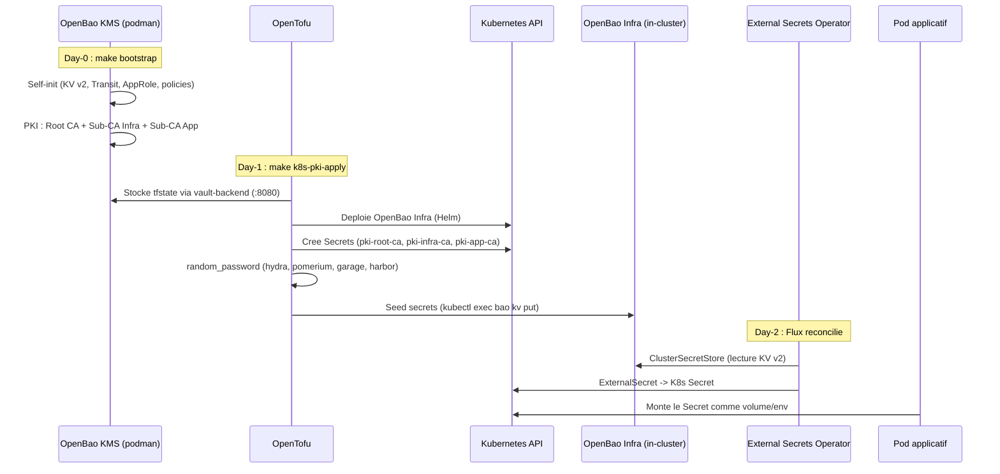
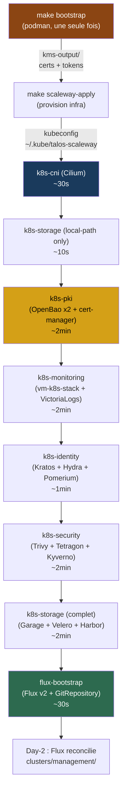
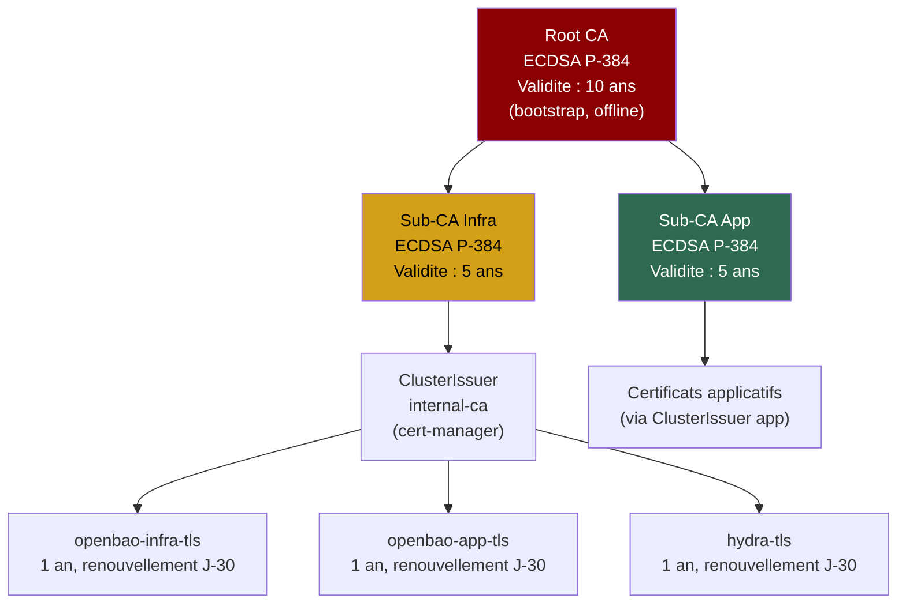
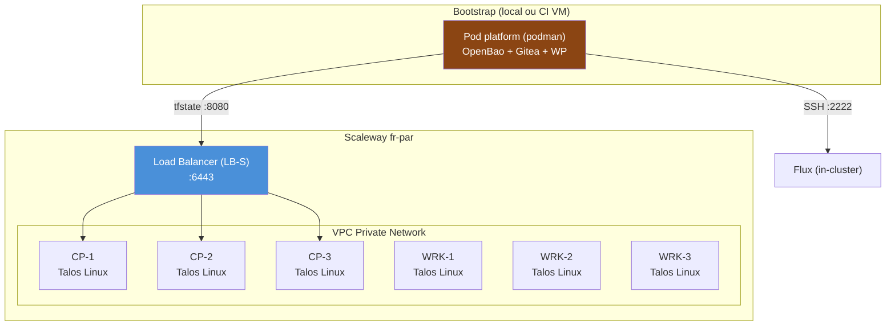

# Talos Linux Multi-Environment Platform -- High-Level Design (HLD)

**Version:** 1.0
**Date:** 2026-03-19
**Statut:** Accepted

---

## 1. Resume executif

La plateforme Talos est un systeme de deploiement Kubernetes multi-environnement (Scaleway, local KVM, Outscale, VMware airgap) fonde sur Talos Linux v1.12 -- un OS immutable, minimal et securise dedie a Kubernetes. Le systeme est entierement pilote par Infrastructure-as-Code (OpenTofu) et GitOps (Flux v2), avec zero secret en clair dans Git.

L'architecture repose sur trois niveaux d'OpenBao (fork open-source de HashiCorp Vault) : un **bootstrap** (podman, hors-cluster) pour le stockage d'etat Terraform et la PKI racine, un **infra** (in-cluster) pour les secrets d'infrastructure et l'auto-unseal, et un **app** (in-cluster) pour les secrets applicatifs. Ce modele a trois etages assure la separation des responsabilites, le chiffrement au repos de tous les etats, et une chaine de confiance PKI hierarchique (Root CA -> Sub-CA Infra + Sub-CA App).

Les compromis cles sont : complexite de bootstrap plus elevee en echange d'un zero-trust complet sur les secrets ; deploiement sequentiel (et non parallele) pour eviter les conditions de course ; et une dependance a podman pour la plateforme de bootstrap.

---

## 2. Objectifs et non-objectifs

### Objectifs

- **G1** : Deployer un cluster Kubernetes 3 CP + 3 workers sur n'importe quel provider en une seule commande (`make scaleway-up`)
- **G2** : Zero secret dans Git -- tous les secrets sont auto-generes (`random_id`/`random_password`) et stockes dans un etat chiffre (OpenBao KV v2)
- **G3** : Chaine PKI hierarchique complete (Root CA 10 ans -> Sub-CA Infra/App 5 ans -> certificats leaf 1 an avec renouvellement automatique)
- **G4** : Transition Day-1 (OpenTofu) vers Day-2 (Flux GitOps) automatisee -- `tofu state rm` apres premier deploiement, Flux reconcilie ensuite
- **G5** : Support multi-provider sans duplication de code -- les stacks K8s sont provider-agnostic, seul le kubeconfig change
- **G6** : Sauvegarde et restauration de l'ensemble des etats via snapshot Raft unique

### Non-objectifs

- **NG1** : Multi-cluster federation (hors perimetre, un cluster par environnement)
- **NG2** : Haute disponibilite du pod bootstrap (single-node podman, acceptable car utilise uniquement au deploiement initial)
- **NG3** : Support de providers cloud managed Kubernetes (EKS, GKE, AKS) -- le projet est axe sur Talos bare-metal/IaaS
- **NG4** : Gestion des workloads applicatifs metier -- la plateforme fournit l'infrastructure, pas les applications

---

## 3. Contexte et perimetre

### Diagramme de contexte (C4 Niveau 1)



### Acteurs

| Acteur | Role | Interface |
|--------|------|-----------|
| Operateur / SRE | Deploie et opere la plateforme | `make`, `tofu`, `kubectl` |
| Woodpecker CI | Execute les pipelines CI/CD | API Gitea (webhook), podman |
| Flux v2 | Reconcilie l'etat desire (GitOps Day-2) | SSH vers Gitea, API K8s |

### Perimetre systeme

**Inclus :** bootstrap (OpenBao + Gitea + WP), provisioning cluster (Talos), 7 stacks K8s (CNI, PKI, monitoring, identity, security, storage, flux), GitOps Day-2.

**Exclus :** applications metier, gestion DNS externe, CDN, bases de donnees applicatives.

---

## 4. Architecture systeme (C4 Niveau 2 -- Diagramme de conteneurs)

### 4.1 Vue d'ensemble



### 4.2 Inventaire des conteneurs

| Conteneur | Technologie | Responsabilite | Deploiement |
|-----------|-------------|----------------|-------------|
| OpenBao KMS | OpenBao 2.5.1 (Raft) | Stockage tfstate, PKI Root CA, Transit auto-unseal | Pod podman (hors-cluster) |
| vault-backend | gherynos/vault-backend | Proxy HTTP pour backend `tofu` -> OpenBao KV v2 | Pod podman |
| Gitea | Gitea 1.22 (rootless) | Forge Git, webhook CI | Pod podman |
| Woodpecker | Woodpecker v3 | CI/CD pipeline | Pod podman |
| OpenBao Infra | OpenBao (Helm 0.25.6) | Secrets infra, Transit engine, ESO source | StatefulSet K8s (ns: secrets) |
| OpenBao App | OpenBao (Helm 0.25.6) | Secrets applicatifs | StatefulSet K8s (ns: secrets) |
| Cilium | Cilium 1.17.13 | CNI, remplacement kube-proxy (eBPF) | DaemonSet K8s |
| cert-manager | cert-manager v1.19.4 | Emission/renouvellement automatique TLS | Deployment K8s |
| vm-k8s-stack | VictoriaMetrics stack | Metriques, dashboards Grafana | Helm release K8s |
| Flux v2 | FluxCD | Reconciliation GitOps Day-2 | Deployment K8s |
| ESO | External Secrets Operator | Sync OpenBao -> K8s Secrets | Deployment K8s |

---

## 5. Estimations de capacite

Ce systeme est une **plateforme d'infrastructure souveraine** (categorie "Defense/sovereign" -- 1K-100K utilisateurs), pas un service SaaS a forte charge.

| Metrique | Valeur | Hypothese |
|----------|--------|-----------|
| Utilisateurs simultanes | 5-20 | Equipe SRE/DevOps |
| Clusters actifs | 1-3 | Un par environnement (local, scaleway, outscale) |
| Noeuds par cluster | 6 | 3 CP + 3 workers |
| Pods par cluster | 100-300 | Stacks infra uniquement |
| Secrets dans OpenBao | ~50 | Identite + stockage + infra |
| Taille tfstate total | ~10-50 MB | 8 stacks x ~2-6 MB chacun |
| Stockage Raft (OpenBao) | < 1 GB | Etats + secrets + versions KV |
| Snapshot Raft (backup) | ~10-50 MB | Compresse |
| Bande passante API K8s | < 1 Mbps | Deploiement et reconciliation |
| Temps deploiement complet | ~15-20 min | Bootstrap (2min) + cluster (5min) + 7 stacks (10min) |

**Conclusion :** Le dimensionnement est modeste. Un seul noeud OpenBao Raft (bootstrap) suffit. L'architecture est dimensionnee pour la securite et la robustesse, pas pour le debit.

---

## 6. Architecture des donnees

### 6.1 Architecture OpenBao a 3 niveaux



### 6.2 Flux de secrets



### 6.3 Stockage d'etat (tfstate)

| Etat | Chemin OpenBao KV v2 | Backend HTTP |
|------|---------------------|--------------|
| Scaleway cluster | `secret/data/tfstate/scaleway` | `http://localhost:8080/state/scaleway` |
| k8s-cni | `secret/data/tfstate/cni` | `http://localhost:8080/state/cni` |
| k8s-pki | `secret/data/tfstate/pki` | `http://localhost:8080/state/pki` |
| k8s-monitoring | `secret/data/tfstate/monitoring` | `http://localhost:8080/state/monitoring` |
| k8s-identity | `secret/data/tfstate/identity` | `http://localhost:8080/state/identity` |
| k8s-security | `secret/data/tfstate/security` | `http://localhost:8080/state/security` |
| k8s-storage | `secret/data/tfstate/storage` | `http://localhost:8080/state/storage` |
| flux-bootstrap | `secret/data/tfstate/flux-bootstrap` | `http://localhost:8080/state/flux-bootstrap` |

**Authentification :** AppRole (role-id + secret-id) exportes dans `kms-output/`. Chaque commande `tofu` envoie les credentials via `TF_HTTP_USERNAME` / `TF_HTTP_PASSWORD`.

**Verrouillage :** vault-backend cree des secrets `-lock` dans KV v2 pour empecher les operations concurrentes.

**Chiffrement etat :**
- Stacks initiales (envs, cni, pki) : PBKDF2 (passphrase)
- Stacks post-init (identity, security, storage) : Transit OpenBao Infra (cle `state-encryption`)

---

## 7. Pipeline de deploiement

### 7.1 Sequencement



### 7.2 Day-1 vs Day-2

| Aspect | Day-1 (OpenTofu) | Day-2 (Flux GitOps) |
|--------|-------------------|----------------------|
| **Declencheur** | `make k8s-up` (operateur) | Commit Git dans `clusters/management/` |
| **Outil** | OpenTofu `apply` | Flux Kustomization + HelmRelease |
| **Etat** | tfstate dans OpenBao KV v2 | Etat desire = Git, etat actuel = cluster |
| **Secrets** | `random_password` -> tfstate | ESO : OpenBao Infra -> K8s Secret |
| **Rollback** | `tofu destroy` + `tofu apply` | `git revert` + Flux reconcilie |
| **Idempotence** | Oui (Terraform) | Oui (Flux prune + wait) |
| **Transition** | `tofu state rm` apres premier deploy | Flux prend le relais |

### 7.3 Contraintes d'ordre

| Invariant | Raison |
|-----------|--------|
| Cilium deploye en PREMIER | Sans CNI, aucun pod ne peut etre schedule |
| Cilium detruit en DERNIER | Supprimer le CNI casse l'eviction des pods |
| k8s-pki avant k8s-identity | ClusterIssuer requis pour les certificats Hydra |
| local-path-provisioner avant OpenBao | Les StatefulSets ont besoin de PVC |
| Deploiement sequentiel (pas parallele) | Race conditions PVC Pending, webhooks Kyverno |
| Webhooks Kyverno supprimes avant destruction des stacks | Les webhooks bloquent les suppressions |

---

## 8. Architecture de securite

### 8.1 Hierarchie PKI



### 8.2 Modele de securite

| Couche | Mecanisme | Detail |
|--------|-----------|--------|
| **Authentification OS** | Talos mTLS | API Talos protegee par certificats client mutuels |
| **Authentification K8s** | OIDC (Hydra) | apiServer configure avec `--oidc-issuer-url` des le boot |
| **Chiffrement au repos** | Raft (OpenBao) | Stockage natif chiffre pour tous les etats |
| **Chiffrement en transit** | TLS (cert-manager) | Tous les services internes en TLS via ClusterIssuer |
| **Secrets** | Zero secret en Git | `random_id`/`random_password` -> tfstate chiffre -> OpenBao KV v2 |
| **Reseau** | Cilium eBPF | Remplacement kube-proxy, network policies, VXLAN overlay |
| **Segmentation reseau** | Security Group | `inbound_default_policy = drop`, whitelist explicite |
| **Scanning vulnerabilites** | Trivy | Scan images conteneurs |
| **Runtime security** | Tetragon | Observabilite runtime eBPF |
| **Policies** | Kyverno | Admission controller, enforcement des politiques |
| **Supply chain** | Cosign | Verification de signature des images |
| **Images bootstrap** | Pin par digest SHA256 | Toutes les images du pod bootstrap epinglees par digest |

### 8.3 Gestion des secrets (flux complet)

```
Generation (Day-1)                     Distribution (Day-2)
random_password/random_bytes           ESO ClusterSecretStore
        |                                     |
        v                                     v
   tfstate (chiffre)              OpenBao Infra KV v2
   dans OpenBao KMS               secret/identity/hydra
        |                          secret/identity/pomerium
        v                          secret/storage/garage
   kubectl exec                    secret/storage/harbor
   bao kv put                            |
   (seed idempotent)                     v
                                  ExternalSecret
                                         |
                                         v
                                   K8s Secret
                                  (monte dans pods)
```

---

## 9. Architecture de deploiement

### 9.1 Topologie cluster



### 9.2 Multi-environnement

| Environnement | Provider | Specificite |
|---------------|----------|-------------|
| **Scaleway** | `scaleway/scaleway` | 4 stages : IAM -> Image -> Cluster -> CI VM |
| **Local** | `dmacvicar/libvirt` | QEMU/KVM, dev/test rapide |
| **Outscale** | `outscale/outscale` | Cloud souverain francais (FCU) |
| **VMware airgap** | Scripts shell (pas Terraform) | OVA pre-construite, zero acces Internet |

Toutes les stacks K8s sont **identiques** quel que soit le provider. Seule la variable `kubeconfig_path` change :
```
~/.kube/talos-scaleway
~/.kube/talos-local
~/.kube/talos-outscale
```

---

## 10. Observabilite

### 10.1 Stack monitoring

| Pilier | Outil | Namespace | Retention |
|--------|-------|-----------|-----------|
| **Metriques** | VictoriaMetrics (vm-k8s-stack v0.72.4) | monitoring | Configurable |
| **Logs** | VictoriaLogs + Collector | monitoring | Configurable |
| **Dashboards** | Grafana (integre vm-k8s-stack) | monitoring | N/A |
| **Cluster UI** | Headlamp | monitoring | N/A |
| **Runtime** | Tetragon (eBPF) | security | N/A |

### 10.2 SLIs / SLOs cibles

| SLI | SLO | Methode de mesure |
|-----|-----|-------------------|
| API K8s disponibilite | 99.9% (8.76h/an) | Health check TCP :6443 via LB |
| Latence API K8s p99 | < 1s | VictoriaMetrics apiserver_request_duration |
| OpenBao sealed | 0 occurrence | `bao status` periodique |
| Flux reconciliation | < 10 min | `kustomization.status.lastAppliedRevision` |
| Certificats expiration | > 30 jours | cert-manager metrics |

---

## 11. Modes de defaillance et mitigation

| Mode de defaillance | Impact | Probabilite | Mitigation | Detection |
|---------------------|--------|-------------|-----------|-----------|
| Pod bootstrap arrete | Aucun `tofu` possible | Moyenne | `make bootstrap` ou `podman pod start platform` | `curl :8080` echoue |
| OpenBao KMS sealed | Aucun `tofu` possible | Faible | Static seal (fichier), redemarrage auto | `/v1/sys/health` != 200 |
| OpenBao Infra sealed | ESO ne peut plus syncer | Faible | Seal key dans K8s Secret `openbao-seal-key` | `bao status` alerte |
| Cilium DaemonSet down | Aucune connectivite pod | Faible | DaemonSet avec restart auto | Pods ContainerCreating |
| Kyverno webhooks orphelins | Blocage des suppressions | Moyenne | `make k8s-down` supprime les webhooks avant | Timeout kubectl delete |
| Perte du snapshot Raft | Perte de tous les etats | Faible | `make state-snapshot` regulier | N/A (operationnel) |
| Corruption tfstate | Stack inapplicable | Tres faible | KV v2 versioning (rollback version) | `tofu plan` echoue |
| Network partition VPC | Cluster split-brain | Tres faible | 3 CP (quorum etcd 2/3), Security Group restrictif | Alertes noeud NotReady |

---

## 12. Architecture Decision Records (ADRs)

### ADR-001 : OpenBao a 3 niveaux (bootstrap / infra / app)

**Statut :** Accepted

**Contexte :**
Les secrets Terraform (tfstate) doivent etre stockes de facon securisee avant meme que le cluster existe. Les secrets in-cluster (identite, stockage) necessitent un systeme de gestion de secrets accessible depuis les pods. Utiliser un seul OpenBao pour les deux roles creerait une dependance circulaire (le cluster a besoin d'OpenBao pour exister, mais OpenBao a besoin du cluster).

**Decision :**
Trois instances OpenBao separees :
1. **Bootstrap (podman)** -- hors-cluster, stocke les tfstates et la PKI racine
2. **Infra (in-cluster)** -- secrets d'infrastructure, Transit engine pour chiffrement etat
3. **App (in-cluster)** -- secrets applicatifs (separation des responsabilites)

**Alternatives considerees :**

| Option | Avantages | Inconvenients |
|--------|-----------|---------------|
| OpenBao 3 niveaux (choisi) | Pas de dependance circulaire, separation claire, auto-unseal via Transit | Complexite de setup, 3 instances a maintenir |
| OpenBao unique (hors-cluster) | Simple, un seul point de gestion | Dependance reseau pour les pods, SPOF |
| SOPS + age | Zero infra additionnelle | Secrets en clair dans Git (chiffres), rotation manuelle |
| Kubernetes Secrets seuls | Natif, zero dependance | Pas de chiffrement au repos par defaut, pas de versioning |

**Consequences :**
- Positif : Separation des responsabilites, zero dependance circulaire, auto-unseal
- Negatif : Complexite initiale plus elevee
- Risque : Si le bootstrap est perdu sans snapshot, tous les etats sont perdus

---

### ADR-002 : Talos Linux comme OS de cluster

**Statut :** Accepted

**Contexte :**
L'OS des noeuds doit etre securise, immutable et minimal pour un cluster Kubernetes durci.

**Decision :**
Talos Linux v1.12 -- OS immutable dedie a Kubernetes, sans SSH, sans shell, pilote entierement par API mTLS.

**Alternatives considerees :**

| Option | Avantages | Inconvenients |
|--------|-----------|---------------|
| Talos Linux (choisi) | Immutable, pas de SSH, mTLS, minimal, provider-agnostic | Courbe d'apprentissage, debug plus difficile |
| Flatcar / Bottlerocket | Immutable, communaute large | SSH present, surface d'attaque plus large |
| Ubuntu + kubeadm | Familier, large communaute | Mutable, drift de config, surface d'attaque |
| RKE2 / k3s | Simple a deployer | OS sous-jacent mutable, moins securise |

**Consequences :**
- Positif : Surface d'attaque minimale, configuration declarative, pas de drift
- Negatif : Debugging via `talosctl` uniquement, pas de `ssh` en urgence

---

### ADR-003 : Cilium en remplacement de kube-proxy (eBPF)

**Statut :** Accepted

**Contexte :**
Le cluster doit avoir un CNI performant avec capacites de network policy et d'observabilite reseau.

**Decision :**
Cilium 1.17 en mode `cni: none` + `proxy: disabled` dans la machine config Talos. Cilium remplace entierement kube-proxy via eBPF.

**Alternatives considerees :**

| Option | Avantages | Inconvenients |
|--------|-----------|---------------|
| Cilium eBPF (choisi) | Haute performance, network policies L3-L7, Hubble observabilite | Deploiement en premier obligatoire |
| Calico | Mature, BGP natif | Moins performant qu'eBPF, pas d'observabilite integree |
| Flannel | Simple, leger | Pas de network policies, pas d'observabilite |

---

### ADR-004 : vault-backend comme proxy HTTP pour les etats Terraform

**Statut :** Accepted

**Contexte :**
OpenTofu a besoin d'un backend d'etat accessible par HTTP. OpenBao ne fournit pas nativement une API compatible avec le backend HTTP de Terraform.

**Decision :**
`vault-backend` (projet open-source) traduit les operations HTTP (`GET`/`POST`/`LOCK`/`UNLOCK`) vers des operations KV v2 sur OpenBao. Chaque stack a son propre chemin (`/state/<stack>`).

**Alternatives considerees :**

| Option | Avantages | Inconvenients |
|--------|-----------|---------------|
| vault-backend (choisi) | Compatible OpenBao KV v2, locking natif, versioning | Composant additionnel dans le bootstrap |
| Backend S3 (MinIO) | Standard Terraform | Infrastructure S3 a deployer et maintenir |
| Backend local (fichiers) | Zero dependance | Pas de locking, pas de partage, pas de chiffrement |
| Backend Consul | Mature, HA | Composant lourd supplementaire |

---

### ADR-005 : Deploiement sequentiel des stacks (pas de parallelisme)

**Statut :** Accepted

**Contexte :**
Le deploiement initial en parallele (`make -j2`) causait des race conditions : PVC en `Pending` (local-path-provisioner pas pret), webhooks Kyverno bloquant les deployments d'autres stacks.

**Decision :**
Pipeline strictement sequentiel : CNI -> local-path -> PKI -> monitoring -> identity -> security -> storage -> flux.

**Consequences :**
- Positif : Reproductible, deterministe, zero race condition
- Negatif : Deploiement initial plus lent (~15-20 min au lieu de ~10 min)

---

### ADR-006 : Flux v2 pour le Day-2 (GitOps)

**Statut :** Accepted

**Contexte :**
Apres le premier deploiement par OpenTofu, les mises a jour doivent etre pilotees par Git (GitOps) pour assurer l'auditabilite et la reproductibilite.

**Decision :**
Flux v2 avec une Kustomization racine pointant vers `clusters/management/`. OpenTofu fait le premier deploiement puis `tofu state rm` laisse Flux prendre le relais.

**Alternatives considerees :**

| Option | Avantages | Inconvenients |
|--------|-----------|---------------|
| Flux v2 (choisi) | Leger, pull-based, CRDs natifs | Moins d'UI que ArgoCD |
| ArgoCD | UI riche, RBAC granulaire | Plus lourd, push-based par defaut |
| OpenTofu seul | Deja en place | Pas de reconciliation continue, drift possible |

---

## 13. Questions ouvertes et risques

| # | Question / Risque | Responsable | Statut |
|---|-------------------|-------------|--------|
| 1 | Le bootstrap pod est un SPOF -- envisager un mode HA ou un bootstrap cloud-native (StatefulSet hors-cluster) | Architecture | Ouvert |
| 2 | La transition Day-1 -> Day-2 (`tofu state rm`) est manuelle -- risque d'oubli | Operations | Ouvert |
| 3 | VMware airgap utilise des scripts shell (pas Terraform) -- divergence avec les autres providers | Architecture | Accepte (contrainte airgap) |
| 4 | Pas de solution de DR cross-region (snapshot Raft est local) | Operations | Ouvert |
| 5 | Montee en version OpenBao (2.x) peut casser la retrocompatibilite avec les self-init `initialize` blocks | Architecture | A surveiller |

---

## 14. Annexe

### Glossaire

| Terme | Definition |
|-------|-----------|
| **Talos Linux** | OS immutable et minimal dedie a Kubernetes, sans SSH |
| **OpenBao** | Fork open-source de HashiCorp Vault (gestion de secrets) |
| **vault-backend** | Proxy HTTP qui traduit les operations Terraform vers OpenBao KV v2 |
| **OpenTofu** | Fork open-source de Terraform (IaC) |
| **Flux v2** | Operateur GitOps pour Kubernetes (reconciliation continue) |
| **ESO** | External Secrets Operator -- synchronise des secrets externes vers K8s |
| **Cilium** | CNI Kubernetes base sur eBPF |
| **Raft** | Algorithme de consensus distribue (utilise par OpenBao pour le stockage) |
| **Static seal** | Mecanisme OpenBao ou la cle de dechiffrement est un fichier local (pas Shamir) |
| **Auto-unseal** | Mecanisme ou OpenBao utilise un Transit engine externe pour se dechiffrer au demarrage |

### References

- [Talos Linux Documentation](https://www.talos.dev/v1.12/)
- [OpenBao Documentation](https://openbao.org/docs/)
- [Flux v2 Documentation](https://fluxcd.io/flux/)
- [Cilium Documentation](https://docs.cilium.io/en/v1.17/)
- [cert-manager Documentation](https://cert-manager.io/docs/)
- [C4 Model](https://c4model.com/)

### Versions

| Composant | Version |
|-----------|---------|
| Talos Linux | v1.12.4 |
| Kubernetes | 1.35.0 |
| Cilium | 1.17.13 |
| OpenBao (bootstrap) | 2.5.1 |
| OpenBao Helm chart | 0.25.6 |
| cert-manager | v1.19.4 |
| OpenTofu | 1.9 |
| Gitea | 1.22 |
| Woodpecker CI | v3 |
