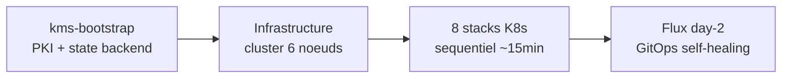

# Talos Linux Multi-Environment Deployment Platform

A sovereign, air-gap-capable Kubernetes platform built on [Talos Linux](https://www.talos.dev/) v1.12. It deploys a production-grade management cluster with full observability, PKI, zero-trust identity, runtime security, S3-compatible storage, and GitOps -- all orchestrated by a single Makefile.

## What problem does it solve?

Deploying a hardened Kubernetes platform in defense/sovereign contexts requires dozens of components with strict dependency ordering, certificate chains, secrets management, and air-gap compatibility. This project automates the entire stack from bare metal (or cloud VMs) to a fully operational platform in under 15 minutes.

## Who is it for?

- **Platform engineers** deploying Kubernetes in regulated or air-gapped environments
- **DevOps teams** needing a reproducible, multi-cloud Kubernetes foundation
- **Security teams** requiring ANSSI/SecNumCloud-aligned infrastructure

## How it works



## Supported environments

| Environment | Provider | Method |
|------------|----------|--------|
| Scaleway | scaleway/scaleway | OpenTofu (4 stages: IAM, image, cluster, CI) |
| Local dev | libvirt/KVM | OpenTofu (QEMU VMs) |
| Outscale | outscale/outscale | OpenTofu |
| VMware airgap | vSphere (no API) | Shell scripts (OVA + static IPs) |

## Quick start

```bash
# 1. Bootstrap local KMS (once, needs podman)
make kms-bootstrap

# 2. Deploy a cluster (pick your provider)
make scaleway-up        # Cloud
make ENV=local local-up # Local VMs

# 3. Access dashboards
make scaleway-headlamp  # Kubernetes UI
make scaleway-grafana   # Metrics & logs
```

See [Getting Started](tutorials/getting-started.md) for a detailed walkthrough.

## Documentation map

| Need | Go to |
|------|-------|
| First deployment, step by step | [Getting Started](tutorials/getting-started.md) |
| Deploy to a specific environment | [How to Deploy](how-to/deploy.md) |
| Understand the architecture | [Architecture](explanation/architecture.md) |
| Bootstrap chicken-and-egg | [Bootstrap Mechanics](explanation/bootstrap.md) |
| All Makefile targets and config options | [Command Reference](reference/commands.md) |
| Troubleshoot a problem | [Troubleshooting](how-to/troubleshoot.md) |
| Why a specific technology was chosen | [ADRs](adr/) |
| Full component inventory | [Technology Stack](techno.md) |
| Implementation timeline | [Roadmap](roadmap.md) |
| How to contribute | [CONTRIBUTING.md](../CONTRIBUTING.md) |
