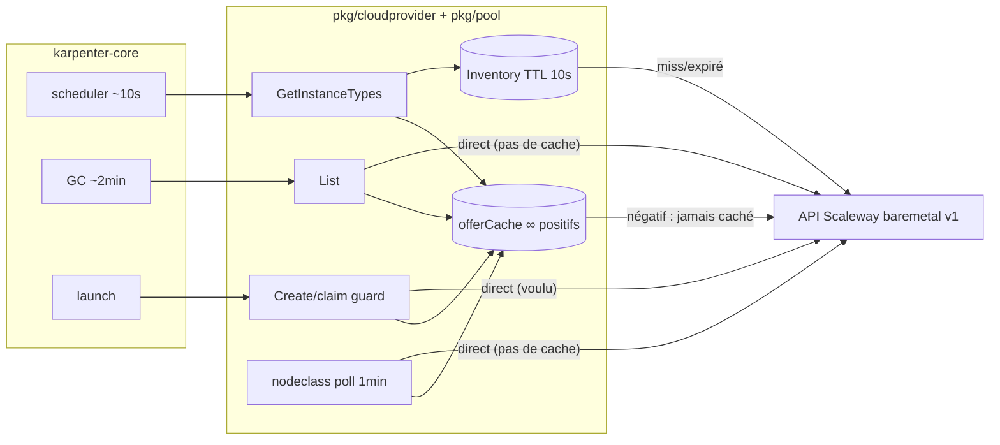

# Audit X-Ray sémantique — karpenter-provider-scaleway

**Cible** : `karpenter-provider-scaleway/pkg/` — chemins chauds `Create`/`List`/`GetInstanceTypes` du cloudprovider + `pool.Backend`/`pool.Inventory` (cache TTL 10 s, claim guard)
**Langage** : Go 1.26 (karpenter-core v1.14.0) | **Date** : 2026-07-12
**Tier de scope** : M | **Candidats** : 6 (+2 écartés)

> Audit statique : aucun code modifié. Chaque candidat est une hypothèse falsifiable
> avec invariants requis et méthode de validation. Les gains ne sont prouvés qu'après
> mesure (compteurs `FakeBackend` ou télémétrie réelle).

## Résumé exécutif

- **Structure cachée révélée** : le code a *un* cache d'inventaire (TTL 10 s) mais
  *quatre* consommateurs de `ListServers` — seul `GetInstanceTypes` passe par le cache.
  `List()` (GC ~2 min), le contrôleur nodeclass (1/min) et `Create()` (volontaire)
  attaquent l'API en direct. La politique de fraîcheur est implicite et différente
  par chemin, sans contrat écrit.
- **Candidat au plus fort levier** : XRAY-001 — les résolutions d'offre *négatives*
  ne sont jamais cachées : un `OfferName` invalide déclenche un `ListOffers`
  (toutes pages) à **chaque** boucle de scheduling + chaque `List()` + chaque poll
  nodeclass, indéfiniment. Seul cas de croissance non bornée d'appels API du module.
- **Hypothèse la plus risquée** : le claim guard (`claimed` map) est process-local —
  il ne tient que si une seule réplique du contrôleur est active (leader election).
  Invariant nulle part écrit. Idem pour la slice retournée par `Inventory.Snapshot`,
  partagée par référence avec le cache : « aucun consommateur ne mute » est un
  invariant implicite.
- **Prochaine étape de preuve** : tests à compteurs sur `FakeBackend`
  (`ListCalls` existe déjà ; ajouter `OfferCalls`) — validation déterministe,
  zéro réseau, pas de benchmark temporel nécessaire.

## Budget API — état statique estimé

Budget LLD §8 : **≤ 1 req/10 s** par pool. Estimation en régime établi (1 nodeclass,
scheduler actif), avant toute mesure :

| Source | Chemin | Fréquence | req/10 s |
|---|---|---|---|
| `Inventory.Snapshot` | `GetInstanceTypes` (boucles provisioning + disruption) | bornée par TTL 10 s | ≤ 1,00 |
| `List()` direct | GC karpenter-core (~2 min) | 1/120 s | 0,08 |
| Contrôleur nodeclass | poll statut (1 min) | 1/60 s | 0,17 |
| `claimStoppedServer` | `Create()` (voulu, données fraîches) | sporadique | — |
| **Total** | | | **~1,25** |

Le budget est nominalement dépassé de ~25 % en régime établi, et croît linéairement
avec le nombre de nodeclasses. Ce n'est pas une mesure : c'est l'argument statique
qui motive XRAY-003 (et rend XRAY-001 critique quand l'offre ne résout pas).

## Carte sémantique

### Dataflow

- **Entrées** : `NodeClaim`/`NodePool` (kube API, cache informer — lectures peu
  coûteuses) ; `ScalewayEMNodeClass.Spec{Zone, PoolTag, OfferName}` = clé de pool.
- **Canonicalisation** : clé de cache `zone + "/" + tag` (`inventory.go:37`) et
  `zone + "/" + name` (`scaleway.go:101`) ; providerID canonique
  `scaleway-em://<zone>/<id>` (`providerid.go:14-28`), égalité stricte octet à octet
  (contrainte C3 — aucun candidat ne doit toucher ce format).
- **Transformations** : `baremetal.Server → pool.Server` (`scaleway.go:129-138`) ;
  `Offer → InstanceType` (`instancetype.go:38-68`, 1 type statique par pool) ;
  `Server + InstanceType → NodeClaim` (`cloudprovider.go:318-351`).
- **Caches** : `offerCache` (∞, **positifs seulement**, `scaleway.go:21`) ;
  `Inventory` (TTL 10 s + `Invalidate` post-transition) ; cache informer kube.
- **Recomputation** : `GetOfferByName` est appelé sur chaque chemin
  (`instancetype.go:27`, `cloudprovider.go:309`, `nodeclass/controller.go:79`) mais
  mémoïsé côté positif — coût = mutex + map hit après la première résolution.

### Control flow

- **Create** (`cloudprovider.go:69-99`) : resolve nodeclass → gate `Ready` →
  `buildInstanceType` (offre cachée) → `claimStoppedServer` (list *fraîche* + verrou)
  → `StartServer` → `Invalidate`. Compensation propre : échec `StartServer` → `unclaim`.
  Ordre correct : toutes les validations précèdent la prise de claim.
- **List** (`cloudprovider.go:160-193`) : boucle nodeclasses × serveurs, dédup par
  providerID (`seen`), dégradation contrôlée si l'offre ne résout pas (claims
  minimaux, la capacité vivante n'est jamais cachée au GC — bon réflexe).
- **Retries** : aucun retry provider-side (SDK sans retry, assumé M0-REPORT §2) ;
  le retry vient des boucles core (scheduler, GC) → **amplification** de toute
  erreur persistante (c'est le vecteur de XRAY-001).
- **Async** : `StartServer`/`StopServer` sont des acquittements ; la progression
  s'observe par statut (`stopped→starting→ready`). `List()` inclut `starting`
  (`backend.go:28-30`) — protège le boot contre un GC intempestif.

### Resource flow

- **Verrous** : `c.mu` (claim map) — bien scopé, le `ListServers` réseau est fait
  *avant* la prise de verrou (`cloudprovider.go:239-245`) ; `inventory.mu` relâché
  pendant le fetch (`inventory.go:44-49`) → fenêtre de troupeau (XRAY-002) ;
  `offerMu` — map hit, contention négligeable.
- **Allocations** : slices serveurs fraîches par appel backend (OK), maps
  labels/annotations par NodeClaim (trivial), `InstanceType` frais par appel
  (négligeable devant le réseau). Rien de significatif hors réseau.
- **Frontière réseau** : les 5 méthodes `Backend` — c'est le seul coût qui compte
  ici ; toutes les optimisations utiles sont des optimisations de *placement de
  cache et de fréquence d'appel*, pas de CPU.



### Frontières de confiance / sécurité

- Créds `SCW_*` env (`scw.WithEnv`), IAM `ElasticMetalFullAccess` — aucun candidat
  ne déplace, ne cache ni ne déduplique un contrôle d'auth.
- Le providerID est l'ancre d'identité du nœud (matching NodeClaim↔Node par égalité
  stricte) : hors périmètre de toute réécriture.
- Le gate `Ready` de `Create()` (`cloudprovider.go:77-79`) est une validation de
  frontière : le déplacer plus tard serait une régression — aucun candidat n'y touche.

## Invariants cachés

| Invariant | Preuve / évidence | Manquant ? | Usage aval |
|---|---|---|---|
| Une seule réplique active du contrôleur (leader election) — sinon le claim guard process-local ne protège plus du double power-on | Implicite (map en mémoire, `cloudprovider.go:49-51`) ; nulle part documenté | **Oui** | Bloque tout HA du contrôleur ; à promouvoir en contrat + garde-fou déploiement (replicas: 1) |
| Transition `stopped→starting` visible dans l'API < `claimTTL` (2 min) après acquittement `StartServer` | Commentaire `cloudprovider.go:38-41` | Partiellement (pas de mesure terrain) | Si faux : double power-on possible après expiration du claim |
| La slice retournée par `Snapshot` n'est jamais mutée par les consommateurs | Aucune — aliasing silencieux (`inventory.go:39-42,51`) | **Oui** | XRAY-005 ; toute future `sort`/mutation d'un snapshot = data race |
| Le GC et `PoolReady` tolèrent une staleness ≤ TTL (10 s) de l'inventaire | Aucune — aujourd'hui ils lisent l'API en direct | **Oui** | Précondition de XRAY-003 |
| Les offres Scaleway sont immuables (cache ∞ côté positif) | Commentaire `backend.go:70-72` | Non (mais le cas négatif n'est pas couvert → XRAY-001) | XRAY-001 |
| `Create` doit choisir sur données fraîches (bypass cache) | Commentaire `inventory.go:12-13` + `cloudprovider.go:237-238` | Non | Contrainte : XRAY-003 ne doit PAS router `Create` par le cache |
| providerID stable, égalité octet à octet (C3) | `providerid.go` + M0-REPORT §3.1 | Non | Interdit toute normalisation « intelligente » du format |
| Un type d'instance utilisé par un NodeClaim vivant ne disparaît jamais ; seul `Offering.Available` bascule | Commentaire `cloudprovider.go:195-198` | Non | Contraint XRAY-006 (jouer sur Available, jamais sur l'existence du type) |

## Candidats d'optimisation

### Optimization Card XRAY-001 — Cache négatif d'offres absent : `ListOffers` non borné

**Location**
`karpenter-provider-scaleway/pkg/pool/scaleway.go:100-127`

**Structure observée**
`GetOfferByName` mémoïse les résolutions *réussies* pour toujours (`offerCache`),
mais une résolution échouée (`ErrOfferNotFound` ou erreur API) retourne sans rien
écrire dans le cache. Trois chemins l'appellent en boucle : `GetInstanceTypes`
(chaque boucle de scheduling via `instancetype.go:27`), `List()` (par nodeclass,
~2 min), contrôleur nodeclass (1/min, `controller.go:79`).

**Vue sémantique**
Mémoïsation partielle : `f: (zone, name) → Offer ∪ Err` n'est cachée que sur
`dom(Offer)`. Le point fixe d'erreur est recalculé à chaque appel, et chaque
recalcul est un `ListOffers` **toutes pages** (`scw.WithAllPages`), l'endpoint le
plus lourd utilisé par le module.

**Problème opérationnel**
Un `spec.offerName` invalide (typo, offre retirée du catalogue) = appels API non
bornés, indéfiniment : ~1 `ListOffers`/boucle scheduling + 1/min (nodeclass)
+ 1/2 min (List). L'erreur de `GetInstanceTypes` fait en plus échouer/re-tenter la
boucle core (amplification par retry). Budget LLD pulvérisé précisément dans le
scénario de misconfiguration où on voudrait que le système soit calme.

**Réécriture candidate**
Cacher aussi le résultat négatif avec un TTL court (ex. 5 min) :
`offerCache[key] = entry{offer, err, fetchedAt}` ; servir l'erreur cachée tant que
`age < negativeTTL`. Les positifs restent cachés à vie.

**Invariants requis**
- Une offre absente du catalogue le reste « au moins negativeTTL » — acceptable :
  si Scaleway ajoute l'offre, récupération retardée d'au plus TTL ; si l'opérateur
  corrige `spec.offerName`, la clé change → résolution immédiate.
- Le message d'erreur caché reste représentatif (pas de perte de diagnostic).
- Les erreurs *transitoires* (réseau, 5xx) ne doivent pas être cachées aussi
  longtemps qu'un `ErrOfferNotFound` franc — distinguer les deux, ou n'appliquer le
  TTL négatif qu'à `ErrOfferNotFound`.

**Méthode de validation**
- Test unitaire : `FakeBackend` + compteur `OfferCalls` (à ajouter, symétrique de
  `ListCalls`) — N appels `GetInstanceTypes` avec offre absente ⇒ 1 seul appel
  backend par fenêtre TTL.
- Test de récupération : offre ajoutée après coup ⇒ résolue après expiration du TTL.

**Impact attendu**
Latence : faible | Mémoire : nulle | Coût cloud/API : **élevé** (borne un
comportement aujourd'hui non borné) | Sécurité/correction : faible

**Risque**
Faible — le cache négatif ne change la sémantique que dans la fenêtre TTL, sur un
chemin déjà en échec.

**Statut** : provable_under_assumptions
**Confiance** : 0.85 — évidence exacte multi-fichiers (3 chemins d'appel confirmés) ;
seul le choix du TTL demande un jugement produit.
**Next owner** : patch direct + `cli-audit-test` (test compteur)

---

### Optimization Card XRAY-002 — `Snapshot` sans single-flight : troupeau à l'expiration du TTL

**Location**
`karpenter-provider-scaleway/pkg/pool/inventory.go:36-54`

**Structure observée**
`Snapshot` fait check-then-fetch : verrou relâché entre la détection d'expiration
(l.39-44) et l'écriture du résultat (l.50-52). N appels concurrents sur une entrée
expirée (ou après `Invalidate`) déclenchent N `ListServers` parallèles ; le dernier
écrit gagne.

**Vue sémantique**
`read-through cache` sans coalescence de requêtes : la propriété « ≤ 1 fetch par
clé par fenêtre TTL » n'est vraie qu'en accès séquentiel. karpenter-core appelle
`GetInstanceTypes` pour plusieurs NodePools dans une même passe de provisioning,
potentiellement en parallèle — des NodePools partageant la même nodeclass (ou des
nodeclasses partageant `(zone, tag)`) frappent la même clé au même instant.

**Problème opérationnel**
Rafale d'appels API au réveil du scheduler juste après expiration/invalidation —
précisément le moment où `Create` vient de consommer du budget. Rafale ∝ nombre de
NodePools sur le même pool.

**Réécriture candidate**
Coalescer les fetchs par clé : `golang.org/x/sync/singleflight.Group` autour du
`backend.ListServers`, ou une goroutine de fetch par clé avec attente des lecteurs.
Sémantiquement neutre : mêmes données, moins d'appels.

**Invariants requis**
- Les lecteurs coalescés acceptent de partager le même résultat (déjà vrai : ils
  partagent l'entrée de cache l'instant d'après).
- L'annulation de contexte d'un lecteur ne doit pas annuler le fetch partagé des
  autres (attention au `ctx` passé au fetch — utiliser le ctx du premier appelant
  ou un ctx détaché borné).
- `Invalidate` pendant un fetch en vol : le résultat en vol ne doit pas réintroduire
  une donnée pré-invalidation (single-flight naïf peut servir un résultat obsolète —
  versionner l'entrée ou re-vérifier après `Do`).

**Méthode de validation**
- Test de concurrence : M goroutines × `Snapshot` simultanés sur cache froid ⇒
  `FakeBackend.ListCalls == 1`.
- Test d'invalidation croisée : `Invalidate` pendant fetch ⇒ pas de résurrection.
- `go test -race` (déjà exigé par le Makefile ? à vérifier en CI).

**Impact attendu**
Latence : faible | Mémoire : nulle | Coût cloud/API : moyen (écrête les rafales) |
Sécurité/correction : faible

**Risque**
Moyen-faible — le piège classique est l'interaction single-flight × Invalidate
(3e invariant) ; sans lui la réécriture serait triviale.

**Statut** : benchmarkable (le gain réel dépend du nombre de NodePools et de la
concurrence effective du scheduler — mesurable par compteur, pas par chrono)
**Confiance** : 0.75 — pattern exact, gain dépendant de la charge.
**Next owner** : `cli-forge-perf` (protocole compteur A/B sur fake) ou patch direct
si XRAY-003 est retenu (le single-flight devient plus rentable avec plus de lecteurs).

---

### Optimization Card XRAY-003 — Placement de cache : 2 lecteurs périodiques sur 4 contournent l'Inventory

**Location**
`karpenter-provider-scaleway/pkg/cloudprovider/cloudprovider.go:169` (List),
`karpenter-provider-scaleway/pkg/controllers/nodeclass/controller.go:65` (poll),
`karpenter-provider-scaleway/pkg/pool/inventory.go` (le cache existant)

**Structure observée**
Quatre consommateurs de `ListServers` : `GetInstanceTypes` → cache (TTL 10 s) ;
`Create` → direct (voulu, invariant documenté) ; `List()` → direct ; contrôleur
nodeclass → direct. `List()` re-liste en plus une fois **par nodeclass**, sans
dédup par `(zone, tag)` : deux nodeclasses partageant un pool = deux appels API
identiques dans la même invocation.

**Vue sémantique**
Même fonction pure-de-l'extérieur `(zone, tag) → []Server` matérialisée par 3
canaux d'accès avec 3 politiques de fraîcheur implicites (10 s / temps réel / temps
réel). Le budget LLD est défini par pool, mais seul un canal le comptabilise.

**Problème opérationnel**
Budget agrégé ~1,25 req/10 s par pool en régime établi (tableau supra), croissant
linéairement avec le nombre de nodeclasses. Triple source de vérité sur « l'état du
pool » avec des fenêtres d'incohérence non spécifiées entre elles.

**Réécriture candidate**
Router `List()` et le contrôleur nodeclass par `Inventory.Snapshot` (injecter
`*pool.Inventory` au lieu de `pool.Backend` brut). `Create` reste en direct
(invariant documenté). Effet secondaire gratuit : la dédup `(zone, tag)` intra-`List()`
devient automatique via le cache. Plafond agrégé résultant : ≤ 1 req/10 s par pool,
quel que soit le nombre de lecteurs.

**Invariants requis**
- **Le GC karpenter-core tolère une staleness ≤ 10 s de `List()`** : un serveur
  éteint puis rallumé hors bande dans la fenêtre TTL peut manquer à un cycle de GC.
  Fenêtre aujourd'hui non nulle (course entre GC et power-off), élargie à ≤ 10 s.
  À confronter à la logique GC de core v1.14 (grâce `registrationTimeout` 15 min
  côté création ; côté suppression, le NodeClaim absent de List est GC'é — vérifier
  qu'un raté de 10 s est rattrapé au cycle suivant, ce que le requeue ~2 min suggère).
- **`PoolReady`/`available` tolèrent ≤ 10 s de staleness** (poll actuel : 60 s —
  trivialement vrai).
- Les invalidations post-transition (`Create`, `Delete`) restent en place pour
  garder la latence de bascule d'`Offering.Available`.
- Précondition : XRAY-005 réglé (plus de lecteurs sur la slice partagée = plus
  d'occasions de mutation accidentelle).

**Méthode de validation**
- Promotion des deux invariants de staleness en contrat (CONTRACTS.md inexistant à
  ce jour) — c'est le blocage principal.
- Test compteur : scénario « GC + poll nodeclass + GetInstanceTypes sur 10 s » ⇒
  `ListCalls == 1`.
- Test e2e critère 4 du M0-REPORT (power-off console → GC ~2 min) rejoué avec le
  cache en place : la sémantique observable ne doit pas changer.

**Impact attendu**
Latence : faible | Mémoire : nulle | Coût cloud/API : moyen-élevé (−~60 % d'appels
périodiques par pool, plafond dur) | Sécurité/correction : moyen (unification des
fenêtres de fraîcheur = moins d'états incohérents entre lecteurs)

**Risque**
Moyen — toucher au flux du GC demande l'invariant de staleness écrit et testé ;
sans lui, ne pas appliquer.

**Statut** : needs_invariant
**Confiance** : 0.70 — structure et comptage certains ; la tolérance GC est le fait
manquant.
**Next owner** : `cli-audit-drift` (créer/promouvoir le contrat de fraîcheur), puis
patch.

---

### Optimization Card XRAY-004 — `invalidateInventoryFor` sur-invalide et ignore son paramètre `server`

**Location**
`karpenter-provider-scaleway/pkg/cloudprovider/cloudprovider.go:271-282`

**Structure observée**
Après un `Delete`, la fonction liste toutes les nodeclasses et invalide le snapshot
de **tous les pools de la zone**. Le paramètre `server pool.Server` n'est pas
utilisé : les tags du serveur (qui identifient ses pools d'appartenance) sont
ignorés.

**Vue sémantique**
Invalidation `∀ pool ∈ zone` au lieu de `∀ pool ∋ server`. Sur-approximation
correcte mais coûteuse : chaque pool invalidé à tort paiera un `ListServers` de
re-remplissage au prochain `GetInstanceTypes`.

**Problème opérationnel**
Un `Delete` dans une zone à K pools coûte K−1 refetchs inutiles. Marginal
aujourd'hui (peu de pools), mais c'est aussi un smell de correction : le paramètre
mort suggère une intention non aboutie.

**Réécriture candidate**
```go
if nc.Spec.Zone == zone && slices.Contains(server.Tags, nc.Spec.PoolTag) {
    c.inventory.Invalidate(nc.Spec.Zone, nc.Spec.PoolTag)
}
```

**Invariants requis**
- `server.Tags` est complet au moment du `Delete` (le `GetServer` de
  `cloudprovider.go:112` vient de le rafraîchir — vrai).
- Un serveur ne peut pas appartenir à un pool sans porter son tag (définition même
  du pool, `backend.go:60-62` — vrai par construction).

**Méthode de validation**
- Test unitaire : 2 nodeclasses même zone, tags différents ; `Delete` sur un serveur
  du pool A ⇒ snapshot du pool B toujours servi du cache (`ListCalls` stable).

**Impact attendu**
Latence : faible | Mémoire : nulle | Coût cloud/API : faible | Sécurité/correction :
faible (mais lève l'ambiguïté du paramètre mort)

**Risque**
Faible.

**Statut** : provable_under_assumptions
**Confiance** : 0.85 — évidence exacte, invariants vérifiables localement.
**Next owner** : patch direct

---

### Optimization Card XRAY-005 — `Snapshot` retourne la slice cachée par référence (aliasing latent)

**Location**
`karpenter-provider-scaleway/pkg/pool/inventory.go:39-42` (hit) et `:51` (fill)

**Structure observée**
Le hit de cache retourne `e.servers` — la slice stockée — sans copie. Tous les
appelants d'une même fenêtre TTL partagent le même backing array, également
partagé avec le cache lui-même.

**Vue sémantique**
Donnée « immuable par convention » sans mécanisme : l'invariant « aucun consommateur
ne mute un snapshot » n'est ni écrit, ni vérifié. Aujourd'hui les consommateurs sont
read-only (`CountByStatus`, itérations) et `claimStoppedServer` trie une liste
*fraîche* du backend, pas un snapshot — le code est sain **par accident de
topologie**, pas par contrat.

**Problème opérationnel**
Le jour où un futur lecteur trie ou filtre in-place un snapshot (le précédent
existe : `sort.Slice` dans `claimStoppedServer`, `cloudprovider.go:243`), c'est une
data race silencieuse entre goroutines du scheduler + corruption du cache. XRAY-003
multiplierait les lecteurs et donc l'exposition.

**Réécriture candidate**
Copie défensive au retour du hit : `return slices.Clone(e.servers), nil` (et
idem au fill). Coût O(n) sur des pools de quelques dizaines d'éléments —
négligeable devant l'appel réseau évité. Alternative zéro coût : documenter
l'invariant sur `Snapshot` (« la slice retournée est partagée, lecture seule ») —
moins robuste.

**Invariants requis**
- (Si copie) aucun : la copie rend l'invariant inutile — c'est son intérêt.
- (Si doc seule) tous les consommateurs présents et futurs respectent la
  lecture seule — invérifiable statiquement en Go.

**Méthode de validation**
- Test : deux `Snapshot` successifs sur cache chaud ⇒ backing arrays distincts
  (`&a[0] != &b[0]`), ou mutation du retour n'affecte pas le hit suivant.
- `go test -race` sur un scénario lecteur-muteur concurrent.

**Impact attendu**
Latence : négligeable (coût ajouté, volontairement) | Mémoire : négligeable |
Coût cloud : nul | Sécurité/correction : **moyen-élevé** (supprime une classe
entière de bug latent)

**Risque**
Faible — la copie est strictement plus sûre ; seul « coût » : une allocation O(n)
par lecture cachée.

**Statut** : needs_invariant (ou provable trivialement si l'option copie est retenue)
**Confiance** : 0.75 — le danger est latent, pas actuel ; l'évidence d'aliasing est
exacte.
**Next owner** : patch direct (copie) + `cli-audit-drift` si l'option contrat est
préférée

---

### Optimization Card XRAY-006 — `Offering.Available` ignore les claims en vol

**Location**
`karpenter-provider-scaleway/pkg/cloudprovider/instancetype.go:31-34` (calcul) vs
`cloudprovider.go:49-51, 236-261` (claim guard)

**Structure observée**
`available = CountByStatus(servers, stopped) > 0` : un serveur déjà réclamé par un
`Create` en vol (claim < TTL, statut API encore `stopped`) compte comme disponible.
Le scheduler peut donc lancer un `Create` voué à l'`InsufficientCapacityError`
(course du dernier serveur, LLD C2 — assumée et testée).

**Vue sémantique**
Deux vues de la disponibilité non réconciliées : la vue API (statuts) et la vue
locale (claims). La disponibilité effective est
`stopped − |claims actifs sur des serveurs stopped| > 0`.

**Problème opérationnel**
Churn d'ICE résiduels sur le dernier serveur : cycles core retry/backoff évitables.
Pas un bug — un bruit opérationnel.

**Réécriture candidate**
Exposer depuis le CloudProvider un décompte des claims actifs par `(zone, tag)` et
le soustraire dans `buildInstanceType`. Ne joue que sur `Available` — jamais sur
l'existence du type (invariant « le type ne disparaît jamais » préservé).

**Invariants requis**
- La map de claims reste process-locale et le contrôleur mono-réplique (même
  invariant que le claim guard lui-même).
- Un claim expiré ou compensé (`unclaim`) redevient disponible sans délai
  supplémentaire (sinon capacité gelée à tort).
- Couplage `pool` ← `cloudprovider` inversé proprement (la claim map vit dans
  `cloudprovider`, le calcul dans `instancetype.go` — il faut passer l'info sans
  cycle d'import).

**Méthode de validation**
- Test : pool de 1 serveur, `Create` en vol (Transitional) ⇒ `GetInstanceTypes`
  retourne `Available=false` avant même la bascule de statut API.
- Test de libération : `unclaim` ⇒ `Available=true` au snapshot suivant.

**Impact attendu**
Latence : faible | Mémoire : nulle | Coût cloud : faible | Sécurité/correction :
faible (réduction de churn, la course reste couverte par l'ICE)

**Risque**
Moyen — couplage nouveau entre claim guard et calcul d'offering ; la course
résiduelle est déjà correctement gérée, le gain est du confort opérationnel.

**Statut** : needs_invariant — et décision d'architecture (le LLD C2 assume
explicitement la course actuelle)
**Confiance** : 0.60
**Next owner** : décision humaine / `cli-audit-drift` si retenu

---

### Candidats examinés et écartés

| Piste | Localisation | Raison de l'écart |
|---|---|---|
| `sort.Slice` complet pour prendre le min | `cloudprovider.go:243` | O(n log n) vs O(n) sur n ≈ dizaines : gain nul, lisibilité actuelle supérieure ; le tri garantit aussi un ordre de parcours déterministe pour le nettoyage des claims |
| Allocation d'`InstanceType`/`Requirements` frais par appel `GetInstanceTypes` | `instancetype.go:38-68` | Négligeable devant le coût réseau ; karpenter-core (overlay/InstanceTypeStore) consomme des objets frais sans hypothèse de stabilité de pointeur documentée — mutualiser créerait un risque d'aliasing pour rien |
| Entrées `claimed` orphelines (serveur retagué/retiré du pool jamais nettoyé) | `cloudprovider.go:248-256` | Fuite bornée par le churn du pool (octets) ; le nettoyage opportuniste actuel suffit en M0 — à revoir si les pools deviennent dynamiques |

## Handoffs

| Skill cible | Scope | Raison |
|---|---|---|
| `cli-audit-drift` | Invariants « staleness GC ≤ TTL », « mono-réplique du claim guard », « snapshot lecture seule » | Aucun CONTRACTS.md n'existe ; XRAY-003/005/006 sont bloqués par des invariants non écrits — les promouvoir en contrat avant tout patch |
| `cli-audit-test` | `pkg/pool` + `pkg/cloudprovider` | Tests compteurs (ajout `OfferCalls` au fake), test de concurrence Snapshot, test d'aliasing — la validation de XRAY-001/002/004/005 est entièrement testable sans réseau |
| `cli-forge-perf` | XRAY-002/003 en conditions réelles (M1) | Si la télémétrie M1 (métriques pool prévues au M0-REPORT §4) montre un dépassement de budget effectif, dérouler le protocole A/B par compteurs d'appels API |

Considérer `/cli-audit-drift` en premier : trois candidats sur six ont pour seul
blocage un invariant non écrit, et le projet n'a pas encore de CONTRACTS.md côté
provider.

## Plan de validation

| Candidat | Méthode | Outillage existant |
|---|---|---|
| XRAY-001 | Test compteur : N boucles avec offre absente ⇒ 1 appel backend/TTL | `FakeBackend` (ajouter `OfferCalls`, symétrique de `ListCalls`) |
| XRAY-002 | Test concurrence : M goroutines, cache froid ⇒ `ListCalls == 1` ; `-race` | `FakeBackend.ListCalls` existant |
| XRAY-003 | 1) Contrat de staleness (drift) ; 2) test compteur multi-lecteurs sur 10 s ; 3) rejouer critère 4 M0 (power-off console → GC) | `inventory_test.go` existant + e2e M0-REPORT §3.3 |
| XRAY-004 | Test : Delete pool A ⇒ cache pool B intact | `FakeBackend.ListCalls` |
| XRAY-005 | Test backing-array distinct + `-race` lecteur/muteur | — |
| XRAY-006 | Test pool=1 + Create en vol ⇒ `Available=false` | `FakeBackend.Transitional` existant |

Aucun candidat ne requiert de benchmark temporel : tous les gains sont des
*fréquences d'appels réseau*, observables par compteurs déterministes — la voie de
preuve la plus robuste disponible ici.

## Points forts relevés (à préserver)

- Séparation `Backend`/`Inventory`/`FakeBackend` exemplaire : toute la validation
  ci-dessus est possible sans réseau grâce aux compteurs du fake.
- Ordre des opérations de `Create` correct (validations → claim → side effect →
  compensation) ; verrou du claim jamais tenu pendant une I/O.
- Dégradation contrôlée de `List()` quand l'offre ne résout pas : la capacité
  vivante n'est jamais masquée au GC.
- Les invariants *documentés* le sont bien (bypass cache de Create, PoweredOn et
  GC hors bande, offres immuables) — le travail restant est d'écrire ceux qui ne
  le sont pas.
